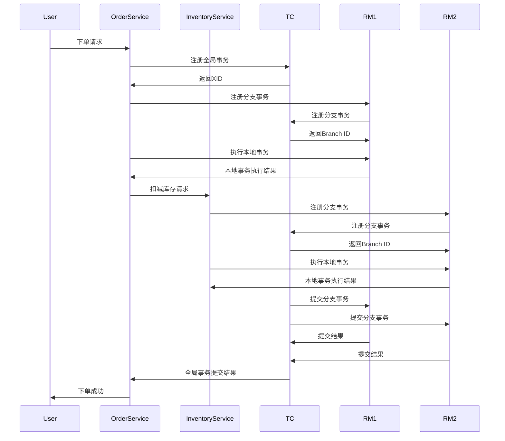

# Seata RM分支事务

## 介绍

在分布式系统中，事务管理是一个复杂的问题。Seata（Simple Extensible Autonomous Transaction Architecture）是一个开源的分布式事务解决方案，它通过全局事务和分支事务的机制来确保数据的一致性。资源管理器（Resource Manager, RM）是Seata中的一个关键组件，负责管理分支事务的执行和提交。

分支事务是全局事务的一部分，每个分支事务对应一个本地事务。RM通过与事务协调器（TC）的交互，确保分支事务的提交或回滚与全局事务的状态保持一致。

## 分支事务的工作原理

### 1. 分支事务的注册

当一个全局事务开始时，TC会为该事务生成一个全局事务ID（XID）。RM在执行本地事务时，会向TC注册分支事务，并将XID传递给TC。注册成功后，TC会为该分支事务分配一个分支事务ID（Branch ID）。

```java
// 示例：分支事务注册
BranchRegisterRequest request = new BranchRegisterRequest();
request.setXid("全局事务ID");
request.setResourceId("资源ID");
request.setLockKey("锁定键");
BranchRegisterResponse response = rmClient.branchRegister(request);
```

### 2. 分支事务的执行

在分支事务注册成功后，RM会执行本地事务。本地事务的执行结果（成功或失败）会被记录在本地数据库中。

```java
// 示例：本地事务执行
try {
    // 执行本地事务操作
    executeLocalTransaction();
    // 提交本地事务
    commitLocalTransaction();
} catch (Exception e) {
    // 回滚本地事务
    rollbackLocalTransaction();
}
```

### 3. 分支事务的提交或回滚

当全局事务需要提交或回滚时，TC会通知RM执行相应的操作。RM会根据TC的指令，提交或回滚本地事务。

```java
// 示例：分支事务提交
BranchCommitRequest commitRequest = new BranchCommitRequest();
commitRequest.setXid("全局事务ID");
commitRequest.setBranchId("分支事务ID");
rmClient.branchCommit(commitRequest);

// 示例：分支事务回滚
BranchRollbackRequest rollbackRequest = new BranchRollbackRequest();
rollbackRequest.setXid("全局事务ID");
rollbackRequest.setBranchId("分支事务ID");
rmClient.branchRollback(rollbackRequest);
```

## 实际应用场景

假设我们有一个电商系统，用户在下单时需要同时扣减库存和生成订单。这两个操作分别由库存服务和订单服务处理，属于不同的本地事务。通过Seata的RM分支事务机制，我们可以确保这两个操作要么同时成功，要么同时回滚。



## 总结

Seata的RM分支事务机制通过将全局事务分解为多个分支事务，确保了分布式系统中数据的一致性。每个分支事务对应一个本地事务，RM通过与TC的交互，确保分支事务的提交或回滚与全局事务的状态保持一致。

在实际应用中，RM分支事务机制可以有效地解决分布式事务的一致性问题，特别是在涉及多个服务的复杂业务场景中。

## 附加资源

- [Seata官方文档](https://seata.io/zh-cn/docs/overview/what-is-seata.html)
- [分布式事务解决方案](https://dubbo.apache.org/zh/docs/v2.7/user/examples/distributed-transaction/)

## 练习

1. 尝试在一个简单的分布式系统中实现Seata的RM分支事务机制。
2. 编写一个包含两个本地事务的全局事务，并观察分支事务的提交和回滚过程。
