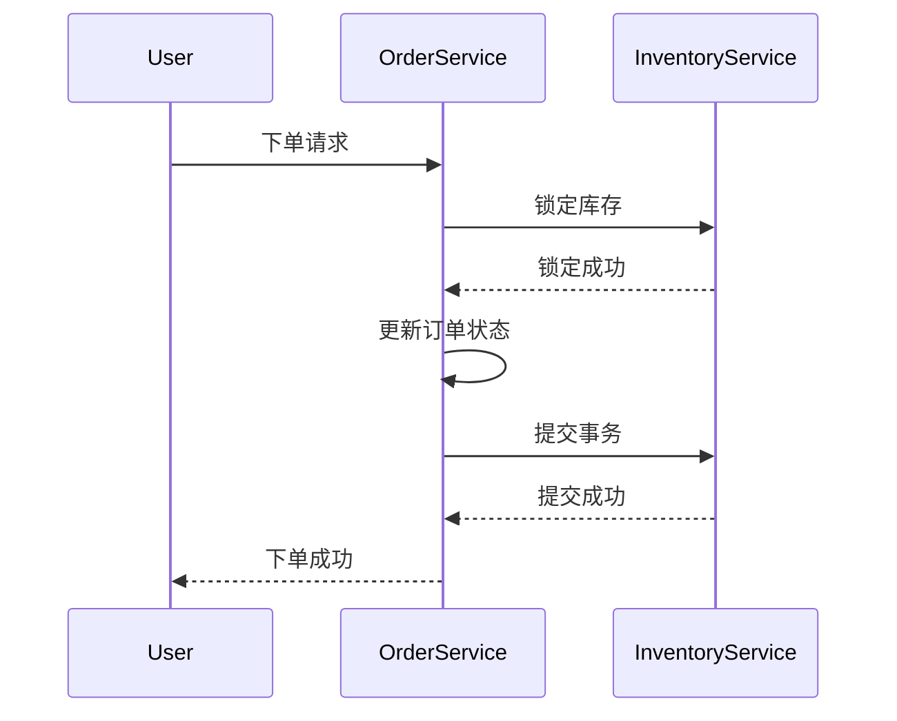

# Seata RM 资源锁定

在分布式系统中，确保事务的一致性是一个复杂的问题。Seata 是一个开源的分布式事务解决方案，它通过资源管理器（Resource Manager, RM）来管理事务中的资源。资源锁定是 Seata RM 的核心机制之一，用于确保在分布式事务中，资源不会被多个事务同时修改，从而避免数据不一致的问题。

## 什么是资源锁定？

资源锁定是指在分布式事务中，当一个事务对某个资源进行操作时，Seata RM 会锁定该资源，防止其他事务同时修改该资源。这种锁定机制确保了事务的隔离性，从而保证了数据的一致性。

### 资源锁定的类型

Seata 支持两种类型的资源锁定：

1. **排他锁（X Lock）**：当一个事务对资源进行写操作时，会获取排他锁。其他事务无法对该资源进行任何操作，直到锁被释放。
2. **共享锁（S Lock）**：当一个事务对资源进行读操作时，会获取共享锁。其他事务可以同时获取共享锁，但不能获取排他锁。

## 资源锁定的实现

Seata RM 通过以下步骤实现资源锁定：

1. **事务开始**：当一个分布式事务开始时，Seata RM 会为该事务分配一个全局唯一的事务 ID（XID）。
2. **资源锁定**：当事务对某个资源进行操作时，Seata RM 会尝试锁定该资源。如果资源已被其他事务锁定，当前事务会等待，直到锁被释放。
3. **事务提交或回滚**：当事务提交或回滚时，Seata RM 会释放所有锁定的资源。

### 代码示例

以下是一个简单的代码示例，展示了如何在 Seata 中使用资源锁定：

```java
// 假设我们有一个订单服务，需要更新订单状态
public void updateOrderStatus(String orderId, String newStatus) {
    // 获取全局事务 ID
    String xid = RootContext.getXID();
    
    // 开始事务
    try {
        // 锁定订单资源
        ResourceManager resourceManager = DefaultResourceManager.get();
        resourceManager.lockResource(orderId, xid);
        
        // 更新订单状态
        orderService.updateStatus(orderId, newStatus);
        
        // 提交事务
        GlobalTransactionContext.reload(xid).commit();
    } catch (Exception e) {
        // 回滚事务
        GlobalTransactionContext.reload(xid).rollback();
    } finally {
        // 释放资源锁定
        resourceManager.unlockResource(orderId, xid);
    }
}
```

:::note
在实际应用中，Seata 会自动处理资源锁定和释放，开发者无需手动调用 `lockResource` 和 `unlockResource` 方法。
:::

## 实际应用场景

假设我们有一个电商系统，用户下单后需要同时更新库存和订单状态。这两个操作可能分布在不同的服务中，因此需要使用分布式事务来确保数据的一致性。

1. **用户下单**：订单服务接收到用户的下单请求，开始一个分布式事务。
2. **锁定库存**：库存服务尝试锁定库存资源，确保库存不会被其他事务修改。
3. **更新订单状态**：订单服务更新订单状态为“已下单”。
4. **提交事务**：如果所有操作成功，事务提交，库存和订单状态同时更新。
5. **回滚事务**：如果任何操作失败，事务回滚，库存和订单状态保持不变。



## 总结

资源锁定是 Seata RM 中确保分布式事务一致性的关键机制。通过锁定资源，Seata 可以防止多个事务同时修改同一资源，从而避免数据不一致的问题。在实际应用中，Seata 会自动处理资源锁定和释放，开发者只需关注业务逻辑的实现。

## 附加资源

- [Seata 官方文档](https://seata.io/zh-cn/docs/overview/what-is-seata.html)
- [分布式事务原理与实践](https://book.douban.com/subject/27665177/)

## 练习

1. 尝试在本地环境中搭建一个简单的 Seata 分布式事务示例，模拟订单和库存的更新操作。
2. 修改代码，使其在事务失败时能够正确回滚，并观察资源锁定的行为。