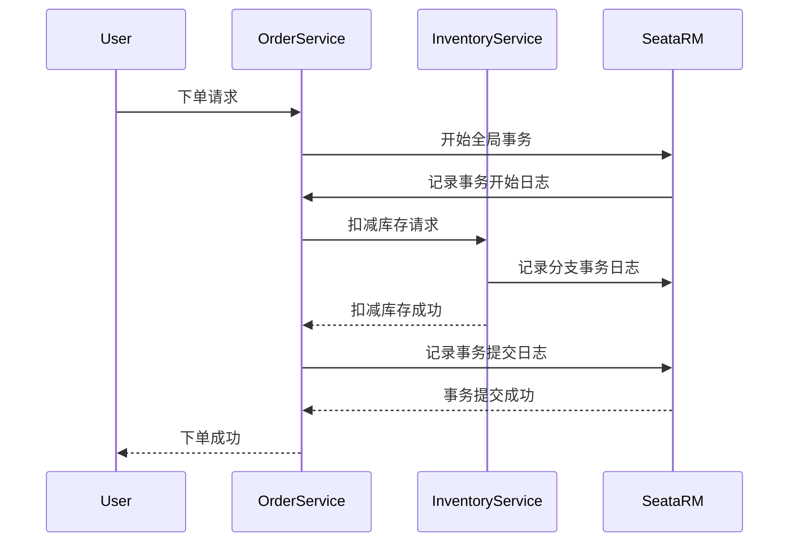

# Seata RM日志管理

## 介绍

在分布式事务中，Seata（Simple Extensible Autonomous Transaction Architecture）是一个流行的解决方案。Seata的资源管理器（Resource Manager，简称RM）负责管理本地资源（如数据库）的事务操作。为了确保事务的可靠性和一致性，RM需要记录事务日志。本文将详细介绍Seata RM中的日志管理机制，帮助初学者理解其工作原理和实际应用。

## 日志管理的作用

日志管理在分布式事务中至关重要。它记录了事务的每一步操作，确保在系统崩溃或网络故障时，事务能够恢复到一致的状态。Seata RM通过日志管理来跟踪事务的状态，确保事务的原子性和持久性。

## 日志管理的工作原理

Seata RM的日志管理主要涉及以下几个步骤：

1. **事务开始**：当分布式事务开始时，RM会记录事务的开始状态。
2. **分支事务注册**：RM会为每个分支事务注册，并记录分支事务的状态。
3. **事务提交或回滚**：根据全局事务的结果，RM会记录事务的提交或回滚状态。
4. **日志持久化**：所有的事务日志都会被持久化到存储介质中，确保在系统崩溃后能够恢复。

### 日志记录示例

以下是一个简单的代码示例，展示如何在Seata RM中记录事务日志：

```java
// 假设我们有一个分支事务
BranchTransaction branchTransaction = new BranchTransaction();
branchTransaction.setXid("全局事务ID");
branchTransaction.setBranchId("分支事务ID");
branchTransaction.setResourceId("资源ID");
branchTransaction.setStatus(TransactionStatus.BEGIN);

// 记录事务开始日志
transactionLogService.logBegin(branchTransaction);

// 执行事务操作
try {
    // 执行业务逻辑
    businessService.execute();

    // 记录事务提交日志
    transactionLogService.logCommit(branchTransaction);
} catch (Exception e) {
    // 记录事务回滚日志
    transactionLogService.logRollback(branchTransaction);
}
```

在这个示例中，`transactionLogService` 负责记录事务的开始、提交和回滚状态。这些日志信息将被持久化，以便在需要时进行恢复。

## 实际应用场景

假设我们有一个电商系统，用户下单后需要扣减库存并生成订单。这两个操作分别由不同的服务处理，且需要保证事务的一致性。通过Seata RM的日志管理，我们可以在每个服务中记录事务日志，确保在系统崩溃或网络故障时，事务能够恢复到一致的状态。



在这个场景中，Seata RM通过日志管理确保了订单和库存操作的一致性。

## 总结

Seata RM的日志管理是确保分布式事务可靠性和一致性的关键机制。通过记录事务的开始、提交和回滚状态，RM能够在系统崩溃或网络故障时恢复事务到一致的状态。本文介绍了日志管理的工作原理，并通过代码示例和实际应用场景展示了其重要性。

## 附加资源

- [Seata官方文档](https://seata.io/zh-cn/docs/overview/what-is-seata.html)
- [分布式事务理论与实践](https://www.oreilly.com/library/view/distributed-systems-principles/9781492043432/)

## 练习

1. 尝试在本地环境中配置Seata，并实现一个简单的分布式事务。
2. 修改上述代码示例，增加日志记录的详细程度，例如记录事务的执行时间。
3. 研究Seata RM的日志持久化机制，了解其如何确保日志的可靠性。

通过本文的学习，你应该对Seata RM的日志管理有了初步的了解。希望你能通过实践进一步掌握这一重要概念。