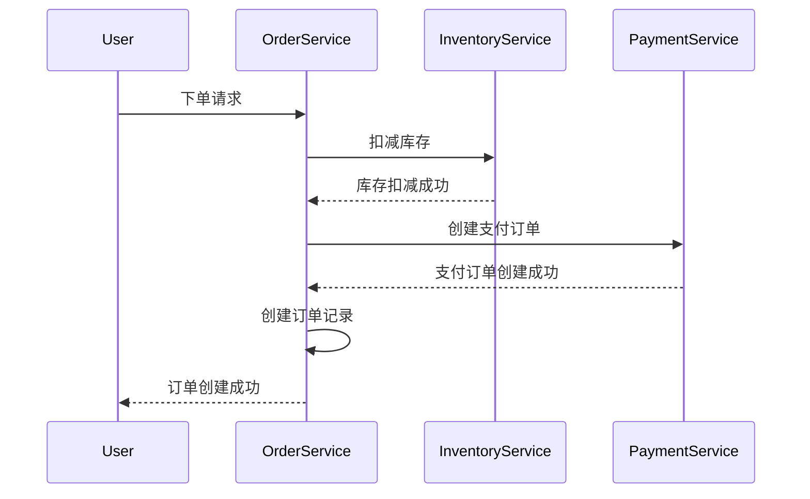

# Seata RM 数据代理

## 介绍

在分布式系统中，事务管理是一个复杂且关键的问题。Seata 是一个开源的分布式事务解决方案，它通过资源管理器（Resource Manager, RM）来管理分布式事务中的资源。Seata RM 数据代理是 Seata 中的一个重要机制，它允许 Seata 在事务执行过程中拦截和修改数据库操作，从而确保事务的一致性。

本文将详细介绍 Seata RM 数据代理的工作原理、实现方式以及实际应用场景。

## Seata RM 数据代理的工作原理

Seata RM 数据代理的核心思想是通过代理数据库操作，拦截并记录事务的执行过程。具体来说，Seata RM 数据代理会在事务开始时创建一个全局事务上下文，并在事务执行过程中拦截所有的数据库操作。这些操作会被记录在事务日志中，以便在事务提交或回滚时进行相应的处理。

### 数据代理的拦截机制

Seata RM 数据代理通过以下步骤实现数据库操作的拦截：

1. **事务开始**：当全局事务开始时，Seata RM 会创建一个全局事务上下文，并将其与当前线程绑定。
2. **操作拦截**：在事务执行过程中，Seata RM 会拦截所有的数据库操作（如 `INSERT`、`UPDATE`、`DELETE` 等），并将这些操作记录在事务日志中。
3. **事务提交或回滚**：当事务提交时，Seata RM 会根据事务日志中的记录，执行相应的提交操作。如果事务回滚，Seata RM 则会根据日志中的记录，执行回滚操作。

### 代码示例

以下是一个简单的代码示例，展示了如何使用 Seata RM 数据代理来拦截数据库操作：

```java
// 假设我们有一个简单的数据库操作类
public class UserService {

    @GlobalTransactional
    public void updateUser(User user) {
        // 这里执行数据库更新操作
        userDao.update(user);
    }
}
```

在这个示例中，`@GlobalTransactional` 注解表示该方法是一个全局事务。当 `updateUser` 方法被调用时，Seata RM 会拦截 `userDao.update(user)` 操作，并将其记录在事务日志中。

## 实际应用场景

Seata RM 数据代理在实际应用中有广泛的使用场景，特别是在需要确保分布式事务一致性的系统中。以下是一个典型的应用场景：

### 电商系统中的订单处理

在电商系统中，订单处理通常涉及多个服务，如库存服务、支付服务和订单服务。假设用户在电商平台上下单，系统需要执行以下操作：

1. 扣减库存
2. 创建支付订单
3. 创建订单记录

这些操作需要在一个分布式事务中完成，以确保数据的一致性。通过使用 Seata RM 数据代理，系统可以在事务执行过程中拦截并记录这些操作，从而在事务提交或回滚时确保数据的一致性。



在这个场景中，Seata RM 数据代理会拦截并记录每个服务的数据库操作，从而确保在事务提交或回滚时，所有操作都能正确执行。

## 总结

Seata RM 数据代理是 Seata 分布式事务解决方案中的一个关键机制，它通过拦截和记录数据库操作，确保分布式事务的一致性。通过本文的介绍，你应该对 Seata RM 数据代理的工作原理、实现方式以及实际应用场景有了初步的了解。

### 附加资源

- [Seata 官方文档](https://seata.io/zh-cn/docs/overview/what-is-seata.html)
- [分布式事务解决方案比较](https://dzone.com/articles/distributed-transaction-solutions-comparison)

### 练习

1. 尝试在一个简单的 Spring Boot 项目中集成 Seata，并使用 Seata RM 数据代理来管理分布式事务。
2. 修改上述电商系统的示例代码，添加更多的服务（如物流服务），并确保所有操作在一个分布式事务中完成。

通过实践，你将更深入地理解 Seata RM 数据代理的工作原理和应用场景。