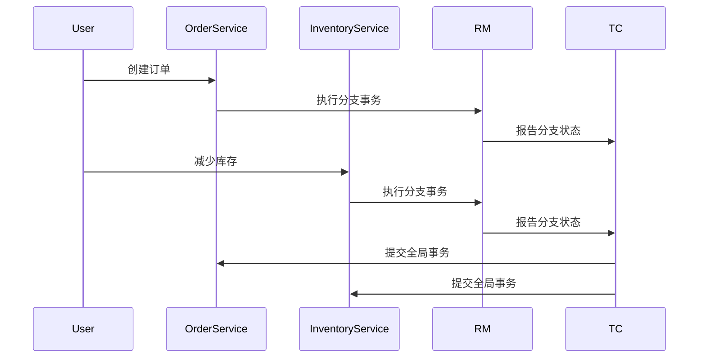

# Seata RM 分支报告

## 介绍

在分布式事务中，Seata 的资源管理器（Resource Manager, RM）负责管理分支事务的状态。分支报告（Branch Report）是 RM 向事务协调器（Transaction Coordinator, TC）报告分支事务状态的重要机制。通过分支报告，TC 可以了解每个分支事务的执行情况，从而决定全局事务的提交或回滚。

本文将详细介绍 Seata RM 分支报告的概念、工作原理以及实际应用场景，帮助初学者深入理解这一机制。

## 分支报告的工作原理

在 Seata 中，每个分支事务在执行完成后，都需要向 TC 报告其状态。分支报告的主要目的是让 TC 知道分支事务的执行结果，以便 TC 能够根据全局事务的状态做出相应的决策。

分支报告的过程可以分为以下几个步骤：

1. **分支事务执行**：分支事务在本地执行，并记录其执行结果（成功或失败）。
2. **生成分支报告**：RM 根据分支事务的执行结果生成分支报告。
3. **发送分支报告**：RM 将分支报告发送给 TC。
4. **TC 处理分支报告**：TC 根据接收到的分支报告更新全局事务的状态。

## 代码示例

以下是一个简单的代码示例，展示了如何在 Seata 中实现分支报告。

```java
// 假设我们有一个分支事务
public class BranchTransaction {
    public boolean execute() {
        // 模拟分支事务的执行
        boolean success = true; // 假设事务执行成功
        return success;
    }
}

// RM 类负责管理分支事务
public class ResourceManager {
    public void reportBranchStatus(String xid, long branchId, boolean success) {
        // 生成分支报告
        BranchStatusReport report = new BranchStatusReport(xid, branchId, success);
        
        // 发送分支报告给 TC
        sendReportToTC(report);
    }

    private void sendReportToTC(BranchStatusReport report) {
        // 模拟发送分支报告给 TC
        System.out.println("Sending branch report to TC: " + report);
    }
}

// 分支报告类
public class BranchStatusReport {
    private String xid;
    private long branchId;
    private boolean success;

    public BranchStatusReport(String xid, long branchId, boolean success) {
        this.xid = xid;
        this.branchId = branchId;
        this.success = success;
    }

    @Override
    public String toString() {
        return "BranchStatusReport{" +
                "xid='" + xid + '\'' +
                ", branchId=" + branchId +
                ", success=" + success +
                '}';
    }
}

// 主程序
public class Main {
    public static void main(String[] args) {
        ResourceManager rm = new ResourceManager();
        BranchTransaction branchTransaction = new BranchTransaction();

        // 执行分支事务
        boolean success = branchTransaction.execute();

        // 报告分支事务状态
        rm.reportBranchStatus("12345", 1, success);
    }
}
```

**输出：**
```
Sending branch report to TC: BranchStatusReport{xid='12345', branchId=1, success=true}
```

## 实际应用场景

假设我们有一个电商系统，用户在购买商品时，系统需要同时更新库存和订单状态。这两个操作分别由两个不同的服务处理，因此需要使用分布式事务来保证数据的一致性。

1. **库存服务**：减少商品库存。
2. **订单服务**：创建订单。

在这两个服务中，每个服务都是一个分支事务。当库存服务和订单服务都执行成功后，RM 会向 TC 发送分支报告，TC 根据这些报告决定是否提交全局事务。



## 总结

Seata RM 分支报告是分布式事务中至关重要的一环，它确保了 TC 能够及时了解每个分支事务的执行状态，从而做出正确的全局事务决策。通过本文的介绍和示例，你应该对 Seata RM 分支报告有了初步的了解。

## 附加资源

- [Seata 官方文档](https://seata.io/zh-cn/docs/overview/what-is-seata.html)
- [分布式事务理论与实践](https://www.oreilly.com/library/view/distributed-systems-principles/9781492043015/)

## 练习

1. 修改上述代码示例，模拟分支事务失败的情况，并观察分支报告的输出。
2. 尝试在 Seata 中实现一个简单的分布式事务，包含两个分支事务，并观察分支报告的发送过程。