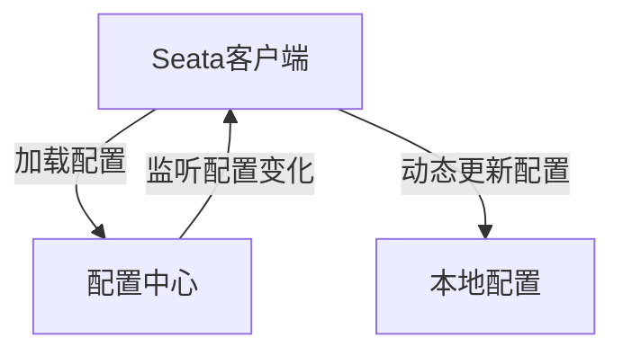

# Seata 配置中心概述

## 介绍

Seata（Simple Extensible Autonomous Transaction Architecture）是一款开源的分布式事务解决方案，旨在解决微服务架构下的分布式事务问题。Seata配置中心是Seata框架中的一个核心组件，用于集中管理和动态调整Seata的配置参数。通过配置中心，开发者可以更方便地管理和维护分布式事务的配置，而无需重启服务。

## 什么是Seata配置中心？

Seata配置中心是一个集中化的配置管理服务，用于存储和管理Seata的配置信息。它支持多种配置源，如Nacos、Zookeeper、Consul等，允许开发者在运行时动态修改配置，而无需重新部署应用。

### 主要功能

- **集中管理**：所有Seata相关的配置都存储在配置中心，便于统一管理。
- **动态更新**：配置中心支持动态更新配置，无需重启服务。
- **多环境支持**：通过配置中心，可以轻松管理不同环境（如开发、测试、生产）的配置。
- **高可用性**：配置中心通常具备高可用性，确保配置服务的稳定性。

## 配置中心的工作原理

Seata配置中心的工作原理可以简单描述为以下几个步骤：

1. **配置加载**：Seata客户端启动时，会从配置中心加载配置。
2. **配置监听**：客户端会监听配置中心的配置变化。
3. **配置更新**：当配置中心中的配置发生变化时，客户端会动态更新本地配置。



## 配置中心的实际应用

### 场景描述

假设我们有一个电商系统，其中包含订单服务、库存服务和支付服务。这些服务之间需要进行分布式事务管理。为了确保事务的一致性和可靠性，我们使用Seata来管理这些事务。

### 配置示例

假设我们使用Nacos作为配置中心，以下是一个简单的配置示例：

```yaml
seata:
  config:
    type: nacos
    nacos:
      server-addr: 127.0.0.1:8848
      namespace: dev
      group: SEATA_GROUP
      data-id: seata.properties
```

在这个配置中，我们指定了配置中心的类型为Nacos，并配置了Nacos的地址、命名空间、组和数据ID。

### 动态更新配置

假设我们需要调整事务超时时间，我们可以直接在Nacos控制台修改`seata.properties`文件中的`client.rm.lock.retryInterval`参数，Seata客户端会自动感知到配置的变化并更新本地配置。

## 总结

Seata配置中心是Seata框架中不可或缺的一部分，它提供了集中化、动态化的配置管理能力，极大地简化了分布式事务的配置管理。通过配置中心，开发者可以更灵活地调整和优化分布式事务的行为，而无需重启服务。

## 附加资源

- [Seata官方文档](https://seata.io/zh-cn/docs/overview/what-is-seata.html)
- [Nacos配置中心指南](https://nacos.io/zh-cn/docs/what-is-nacos.html)

## 练习

1. 尝试在本地搭建一个Nacos配置中心，并配置Seata使用该配置中心。
2. 修改Nacos中的配置，观察Seata客户端是否能够动态更新配置。
3. 探索其他配置中心（如Zookeeper、Consul）的集成方式，并比较它们的优缺点。

:::tip
在配置Seata时，确保配置中心的地址和命名空间等信息正确无误，以避免配置加载失败。
:::