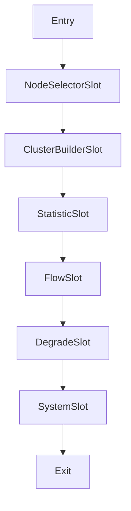

## 介绍

Sentinel 是阿里巴巴开源的一款轻量级流量控制组件，主要用于实现微服务架构中的流量控制、熔断降级和系统自适应保护等功能。它能够帮助开发者有效应对高并发场景下的系统稳定性问题。本文将带你了解Sentinel的基本架构及其核心组件，帮助你快速掌握Sentinel的工作原理。

## Sentinel 架构概览

Sentinel 的核心架构可以分为以下几个部分：

1. **资源（Resource）**：Sentinel 的核心概念之一是资源。资源可以是任何需要保护的代码块，例如一个方法、一个接口或一个服务。Sentinel 通过定义资源来实现对流量、并发等指标的控制。

2. **规则（Rule）**：规则是Sentinel用来控制资源访问的策略。常见的规则包括流量控制规则、熔断降级规则和系统保护规则。规则可以通过代码动态配置，也可以通过控制台进行管理。

3. **Slot Chain**：Slot Chain 是Sentinel的核心处理链，负责对资源进行各种检查和操作。Slot Chain 由多个 Slot 组成，每个 Slot 负责不同的功能，例如流量控制、熔断降级、系统保护等。

4. **统计（Statistic）**：Sentinel 通过统计模块实时收集资源的访问数据，例如QPS、响应时间等。这些统计数据是规则判断的基础。

5. **控制台（Dashboard）**：Sentinel 提供了一个控制台，用于实时监控和管理资源的规则配置。通过控制台，开发者可以动态调整规则，查看资源的实时状态。

## 核心组件详解

### 1. 资源（Resource）

资源是Sentinel中最基本的概念。你可以通过 `@SentinelResource` 注解或代码手动定义资源。以下是一个简单的资源定义示例：

```java
@SentinelResource(value = "exampleResource", blockHandler = "handleBlock")
public String exampleMethod() {
    return "Hello, Sentinel!";
}

public String handleBlock(BlockException ex) {
    return "Blocked by Sentinel!";
}
```

在这个例子中，`exampleMethod` 方法被定义为一个资源，`handleBlock` 方法用于处理被Sentinel拦截时的逻辑。

### 2. 规则（Rule）

规则是Sentinel用来控制资源访问的策略。以下是一个流量控制规则的示例：

```java
FlowRule rule = new FlowRule();
rule.setResource("exampleResource");
rule.setGrade(RuleConstant.FLOW_GRADE_QPS);
rule.setCount(10); // 每秒最多允许10次请求
FlowRuleManager.loadRules(Collections.singletonList(rule));
```

在这个例子中，我们定义了一个流量控制规则，限制 `exampleResource` 每秒最多只能处理10次请求。

### 3. Slot Chain

Slot Chain 是Sentinel的核心处理链，负责对资源进行各种检查和操作。以下是一个简化的Slot Chain处理流程：



在这个流程中，每个Slot负责不同的功能。例如，`FlowSlot` 负责流量控制，`DegradeSlot` 负责熔断降级。

### 4. 统计（Statistic）

Sentinel 通过统计模块实时收集资源的访问数据。以下是一个简单的统计示例：

```java
StatisticNode node = new StatisticNode();
node.addPassRequest(1); // 记录一次通过的请求
node.addRt(100); // 记录响应时间为100ms
```

这些统计数据是规则判断的基础，Sentinel会根据这些数据动态调整资源的访问策略。

### 5. 控制台（Dashboard）

Sentinel 提供了一个控制台，用于实时监控和管理资源的规则配置。通过控制台，开发者可以动态调整规则，查看资源的实时状态。以下是一个控制台的截图示例：

:::note
**注意**：控制台的具体使用方法和界面可能会随着版本的更新而变化，建议参考官方文档获取最新信息。
:::

## 实际应用场景

Sentinel 在实际应用中有多种场景，以下是一些常见的应用场景：

1. **流量控制**：在高并发场景下，通过流量控制规则限制资源的访问频率，防止系统过载。
2. **熔断降级**：当某个资源出现异常时，通过熔断降级规则快速失败，避免雪崩效应。
3. **系统保护**：通过系统保护规则，防止系统资源被耗尽，确保系统的稳定性。

以下是一个实际应用场景的示例：

```java
@SentinelResource(value = "orderService", blockHandler = "handleBlock")
public String createOrder() {
    // 创建订单的逻辑
    return "Order created!";
}

public String handleBlock(BlockException ex) {
    return "Order creation blocked by Sentinel!";
}
```

在这个例子中，`createOrder` 方法被定义为一个资源，当订单创建请求过多时，Sentinel会触发流量控制规则，调用 `handleBlock` 方法进行处理。

## 总结

通过本文的学习，你应该对Sentinel的基本架构和核心组件有了初步的了解。Sentinel 通过资源、规则、Slot Chain、统计和控制台等组件，实现了对微服务架构中流量控制、熔断降级和系统保护等功能。希望这些内容能够帮助你在实际项目中更好地应用Sentinel。

## 附加资源

- [Sentinel 官方文档](https://sentinelguard.io/zh-cn/docs/introduction.html)
- [Sentinel GitHub 仓库](https://github.com/alibaba/Sentinel)

## 练习

1. 尝试在你的项目中集成Sentinel，并定义一个资源。
2. 配置一个流量控制规则，限制某个资源的访问频率。
3. 通过Sentinel控制台查看资源的实时状态，并动态调整规则。

:::tip
**提示**：在实际项目中，建议结合监控系统和日志系统，实时监控Sentinel的运行状态，及时发现和解决问题。
:::