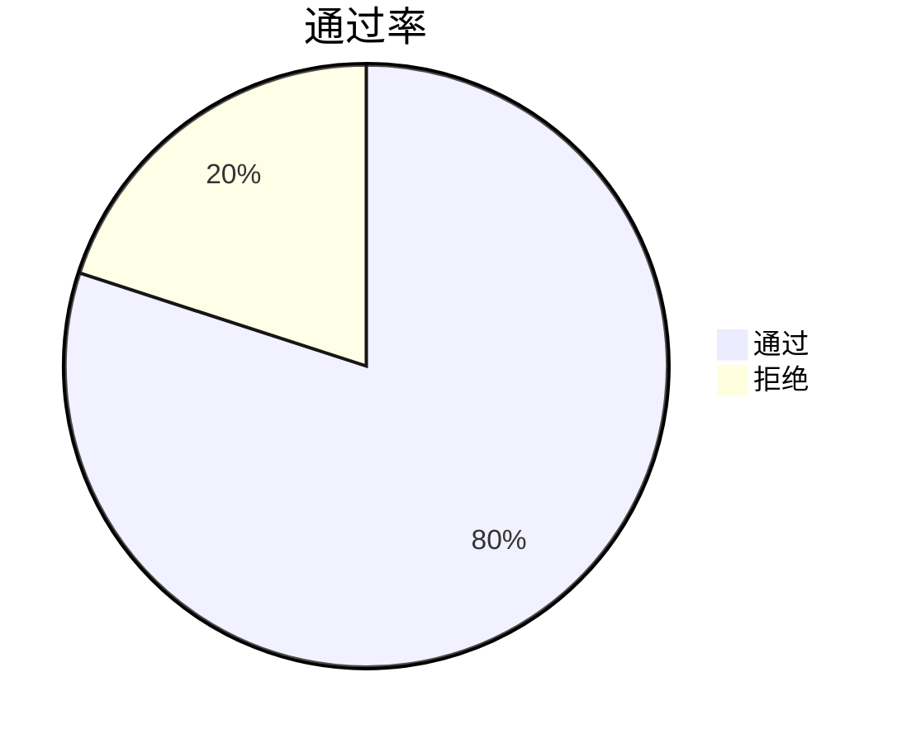

# Sentinel 流控监控指标

Sentinel是阿里巴巴开源的一款轻量级流量控制框架，广泛应用于微服务架构中。它通过监控系统资源的使用情况，动态调整流量控制策略，确保系统的稳定性和高可用性。本文将详细介绍Sentinel中的流控监控指标，帮助初学者理解如何通过这些指标优化系统性能。

## 什么是流控监控指标？

流控监控指标是Sentinel用于评估系统资源使用情况的关键数据。这些指标包括请求的通过率、拒绝率、响应时间等，帮助开发者实时了解系统的运行状态，并根据这些数据调整流量控制策略。

## 主要监控指标

### 1. 通过率（Pass Rate）
通过率是指在一定时间内，成功通过Sentinel流量控制的请求占总请求的比例。通过率越高，说明系统的处理能力越强。



### 2. 拒绝率（Block Rate）
拒绝率是指在一定时间内，被Sentinel拒绝的请求占总请求的比例。拒绝率过高可能意味着系统资源不足或流量控制策略过于严格。

### 3. 响应时间（Response Time）
响应时间是指从请求发出到收到响应的时间。响应时间过长可能意味着系统处理能力不足或存在性能瓶颈。

### 4. 并发数（Concurrency）
并发数是指同时处理的请求数量。并发数过高可能导致系统资源耗尽，影响系统稳定性。

## 实际案例

假设我们有一个电商网站，在双十一大促期间，流量激增。为了确保系统的稳定性，我们使用Sentinel进行流量控制。通过监控以下指标，我们可以及时调整流量控制策略：

- **通过率**：如果通过率低于预期，我们可以适当放宽流量控制策略，允许更多请求通过。
- **拒绝率**：如果拒绝率过高，我们可以增加系统资源或优化代码，提高系统处理能力。
- **响应时间**：如果响应时间过长，我们可以优化数据库查询或增加缓存，减少响应时间。
- **并发数**：如果并发数过高，我们可以限制同时处理的请求数量，防止系统资源耗尽。

## 代码示例

以下是一个简单的Sentinel流量控制示例，展示如何监控通过率和拒绝率：

```java
import com.alibaba.csp.sentinel.Entry;
import com.alibaba.csp.sentinel.SphU;
import com.alibaba.csp.sentinel.slots.block.BlockException;
import com.alibaba.csp.sentinel.slots.block.RuleConstant;
import com.alibaba.csp.sentinel.slots.block.flow.FlowRule;
import com.alibaba.csp.sentinel.slots.block.flow.FlowRuleManager;

import java.util.ArrayList;
import java.util.List;

public class SentinelDemo {
    public static void main(String[] args) {
        initFlowRules();
        while (true) {
            try (Entry entry = SphU.entry("HelloWorld")) {
                // 业务逻辑
                System.out.println("Hello World");
            } catch (BlockException e) {
                // 处理被拒绝的请求
                System.out.println("Blocked");
            }
        }
    }

    private static void initFlowRules() {
        List<FlowRule> rules = new ArrayList<>();
        FlowRule rule = new FlowRule();
        rule.setResource("HelloWorld");
        rule.setGrade(RuleConstant.FLOW_GRADE_QPS);
        rule.setCount(10); // 每秒最多通过10个请求
        rules.add(rule);
        FlowRuleManager.loadRules(rules);
    }
}
```

### 输出示例

```
Hello World
Hello World
Blocked
Hello World
...
```

## 总结

通过监控Sentinel的流控监控指标，我们可以实时了解系统的运行状态，并根据这些数据调整流量控制策略，确保系统的稳定性和高可用性。希望本文能帮助初学者更好地理解Sentinel的流控监控指标，并在实际项目中应用这些知识。

## 附加资源

- [Sentinel官方文档](https://sentinelguard.io/)
- [Sentinel GitHub仓库](https://github.com/alibaba/Sentinel)
- [微服务流量控制实战](https://example.com/microservices-traffic-control)

:::tip
建议初学者通过实际项目练习Sentinel的流量控制，并尝试监控不同的指标，以加深理解。
:::