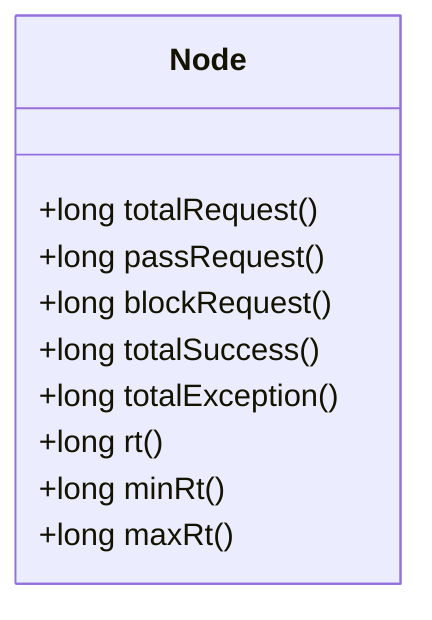

# Sentinel 核心类分析

Sentinel是阿里巴巴开源的一款轻量级流量控制组件，广泛应用于微服务架构中，用于实现流量控制、熔断降级、系统负载保护等功能。为了更好地理解Sentinel的工作原理，我们需要对其核心类进行深入分析。本文将逐步介绍Sentinel的核心类及其作用，并通过实际案例展示其应用场景。

## 1. 核心类概述

Sentinel的核心类主要包括以下几个：

- `Entry`: 表示一个资源访问的入口。
- `Context`: 表示一个调用链的上下文。
- `Node`: 表示一个资源的统计节点。
- `RuleManager`: 用于管理规则（如流量控制规则、熔断规则等）。
- `SphU`: 用于资源访问的工具类。

接下来，我们将逐一分析这些核心类的作用及其实现。

## 2. Entry类

`Entry`类是Sentinel中最核心的类之一，它表示一个资源访问的入口。每次访问一个资源时，都需要通过`Entry`类来进入资源，并在访问结束后退出资源。

### 2.1 Entry的使用

以下是一个简单的`Entry`使用示例：

```java
try (Entry entry = SphU.entry("resourceName")) {
    // 被保护的资源逻辑
    doSomething();
} catch (BlockException e) {
    // 处理被限流或降级的逻辑
    handleBlockException(e);
}
```

在这个示例中，`SphU.entry("resourceName")`创建了一个`Entry`对象，表示进入名为`resourceName`的资源。如果资源被限流或降级，则会抛出`BlockException`异常。

### 2.2 Entry的作用

`Entry`类的主要作用是：

- 记录资源的访问状态。
- 触发流量控制、熔断降级等规则。
- 统计资源的访问数据。

## 3. Context类

`Context`类表示一个调用链的上下文。每个调用链都有一个唯一的`Context`对象，用于存储调用链的相关信息，如调用链的入口、调用链的统计信息等。

### 3.1 Context的创建

`Context`对象通常由`ContextUtil`类创建和管理。以下是一个创建`Context`的示例：

```java
ContextUtil.enter("contextName", "origin");
```

在这个示例中，`ContextUtil.enter("contextName", "origin")`创建了一个名为`contextName`的`Context`对象，并指定了调用来源为`origin`。

### 3.2 Context的作用

`Context`类的主要作用是：

- 管理调用链的上下文信息。
- 关联调用链中的多个`Entry`对象。
- 提供调用链的统计信息。

## 4. Node类

`Node`类表示一个资源的统计节点。每个资源都有一个对应的`Node`对象，用于记录该资源的访问数据，如QPS、响应时间等。

### 4.1 Node的结构

`Node`类的结构如下：



在这个类图中，`Node`类提供了多个方法用于获取资源的统计信息，如总请求数、通过请求数、被限流请求数等。

### 4.2 Node的作用

`Node`类的主要作用是：

- 记录资源的访问数据。
- 提供资源的统计信息。
- 支持流量控制、熔断降级等规则的执行。

## 5. RuleManager类

`RuleManager`类用于管理Sentinel中的各种规则，如流量控制规则、熔断规则等。`RuleManager`类提供了多个静态方法用于加载、更新和删除规则。

### 5.1 RuleManager的使用

以下是一个加载流量控制规则的示例：

```java
FlowRule rule = new FlowRule();
rule.setResource("resourceName");
rule.setGrade(RuleConstant.FLOW_GRADE_QPS);
rule.setCount(10);
FlowRuleManager.loadRules(Collections.singletonList(rule));
```

在这个示例中，`FlowRuleManager.loadRules()`方法用于加载流量控制规则。`FlowRule`对象表示一个流量控制规则，可以设置资源的名称、流量控制的类型（如QPS）和阈值。

### 5.2 RuleManager的作用

`RuleManager`类的主要作用是：

- 管理Sentinel中的各种规则。
- 提供规则的加载、更新和删除功能。
- 支持规则的动态配置。

## 6. SphU类

`SphU`类是Sentinel中用于资源访问的工具类。它提供了多个静态方法用于创建`Entry`对象，并支持多种资源访问方式。

### 6.1 SphU的使用

以下是一个使用`SphU`类访问资源的示例：

```java
try (Entry entry = SphU.entry("resourceName")) {
    // 被保护的资源逻辑
    doSomething();
} catch (BlockException e) {
    // 处理被限流或降级的逻辑
    handleBlockException(e);
}
```

在这个示例中，`SphU.entry("resourceName")`方法用于创建一个`Entry`对象，表示进入名为`resourceName`的资源。

### 6.2 SphU的作用

`SphU`类的主要作用是：

- 提供资源访问的入口。
- 支持多种资源访问方式。
- 触发流量控制、熔断降级等规则。

## 7. 实际案例

为了更好地理解Sentinel的核心类及其作用，我们来看一个实际的应用场景。

### 7.1 场景描述

假设我们有一个微服务系统，其中有一个名为`orderService`的服务，用于处理订单请求。为了保护`orderService`不被过多的请求压垮，我们需要对其访问进行流量控制。

### 7.2 实现步骤

1. **定义资源**：首先，我们需要定义一个资源，表示`orderService`的访问入口。

    ```java
    public static final String RESOURCE_NAME = "orderService";
    ```

2. **加载流量控制规则**：接下来，我们需要加载流量控制规则，限制`orderService`的QPS为100。

    ```java
    FlowRule rule = new FlowRule();
    rule.setResource(RESOURCE_NAME);
    rule.setGrade(RuleConstant.FLOW_GRADE_QPS);
    rule.setCount(100);
    FlowRuleManager.loadRules(Collections.singletonList(rule));
    ```

3. **访问资源**：在访问`orderService`时，我们需要通过`SphU`类进入资源。

    ```java
    try (Entry entry = SphU.entry(RESOURCE_NAME)) {
        // 处理订单请求
        handleOrderRequest();
    } catch (BlockException e) {
        // 处理被限流的逻辑
        handleBlockException(e);
    }
    ```

4. **统计资源访问数据**：通过`Node`类，我们可以获取`orderService`的访问数据，如QPS、响应时间等。

    ```java
    Node node = ClusterBuilderSlot.getClusterNode(RESOURCE_NAME);
    long qps = node.passQps();
    long rt = node.avgRt();
    ```

### 7.3 结果分析

通过上述步骤，我们成功地对`orderService`进行了流量控制，并统计了其访问数据。当QPS超过100时，`orderService`将触发流量控制规则，拒绝部分请求。

## 8. 总结

本文详细分析了Sentinel的核心类，包括`Entry`、`Context`、`Node`、`RuleManager`和`SphU`。通过这些核心类的分析，我们了解了Sentinel的工作原理及其核心组件。同时，通过实际案例的展示，我们进一步理解了Sentinel在微服务架构中的应用场景。

## 9. 附加资源与练习

- **附加资源**：
  - [Sentinel官方文档](https://sentinelguard.io/zh-cn/docs/introduction.html)
  - [Sentinel GitHub仓库](https://github.com/alibaba/Sentinel)

- **练习**：
  - 尝试在自己的项目中集成Sentinel，并实现流量控制功能。
  - 编写一个简单的微服务系统，并使用Sentinel进行熔断降级。

:::tip
如果你在实践过程中遇到问题，可以参考Sentinel的官方文档或社区资源，获取更多帮助。
:::