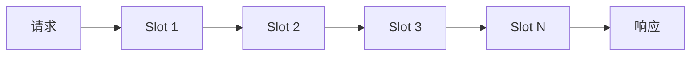

## 介绍

Sentinel是阿里巴巴开源的一款轻量级流量控制组件，广泛应用于微服务架构中。其核心设计之一是**槽链（Slot Chain）**，它是Sentinel实现流量控制、熔断降级等功能的关键机制。本文将带你逐步了解Sentinel槽链的设计原理、源码实现以及实际应用场景。

:::note
**什么是槽链？**  
槽链是Sentinel中用于处理请求的核心机制。它由多个槽（Slot）组成，每个槽负责不同的功能，例如流量统计、限流、熔断等。请求会依次通过槽链中的各个槽，每个槽根据其职责对请求进行处理。
:::

## 槽链的核心设计

### 1. 槽链的结构

槽链由多个槽（Slot）组成，每个槽都是一个独立的处理单元。Sentinel通过责任链模式将这些槽串联起来，形成一个处理链。请求会依次通过每个槽，直到所有槽处理完毕或某个槽中断处理。



### 2. 槽的类型

Sentinel中的槽分为两大类：

- **统计槽（Statistic Slot）**：负责统计请求的通过数、拒绝数、异常数等指标。
- **规则检查槽（Rule Checking Slot）**：负责根据配置的规则（如限流规则、熔断规则）对请求进行检查。

:::tip
**常见的槽包括：**
- `NodeSelectorSlot`：选择资源对应的统计节点。
- `ClusterBuilderSlot`：构建集群节点。
- `StatisticSlot`：统计请求的通过和拒绝情况。
- `FlowSlot`：执行流量控制规则。
- `DegradeSlot`：执行熔断降级规则。
:::

### 3. 槽链的源码实现

Sentinel的槽链实现位于 `com.alibaba.csp.sentinel.slots` 包中。以下是槽链的核心代码片段：

```java
public class DefaultSlotChainBuilder implements SlotChainBuilder {
    @Override
    public ProcessorSlotChain build() {
        ProcessorSlotChain chain = new DefaultProcessorSlotChain();
        chain.addLast(new NodeSelectorSlot());
        chain.addLast(new ClusterBuilderSlot());
        chain.addLast(new StatisticSlot());
        chain.addLast(new FlowSlot());
        chain.addLast(new DegradeSlot());
        return chain;
    }
}
```

:::caution
**注意：**  
槽的顺序非常重要。例如，`StatisticSlot` 必须在 `FlowSlot` 之前，因为流量控制需要依赖统计数据进行判断。
:::

### 4. 槽链的执行流程

当请求进入Sentinel时，槽链会依次执行每个槽的 `entry` 方法。如果某个槽判断请求不符合规则（如超过限流阈值），则会抛出 `BlockException`，中断后续槽的执行。

```java
public void entry(Context context, ResourceWrapper resourceWrapper, Object param, int count, boolean prioritized, Object... args) throws BlockException {
    for (ProcessorSlot slot : chain) {
        slot.entry(context, resourceWrapper, param, count, prioritized, args);
    }
}
```

## 实际案例

### 场景：限流控制

假设我们有一个接口 `/api/resource`，需要限制其QPS（每秒请求数）为100。我们可以通过配置 `FlowRule` 来实现：

```java
FlowRule rule = new FlowRule();
rule.setResource("/api/resource");
rule.setGrade(RuleConstant.FLOW_GRADE_QPS);
rule.setCount(100);
FlowRuleManager.loadRules(Collections.singletonList(rule));
```

当请求进入Sentinel时，`FlowSlot` 会根据配置的规则检查请求是否超过限流阈值。如果超过，则抛出 `FlowException`，请求被拒绝。

:::warning
**注意：**  
在实际应用中，建议将规则配置存储在动态配置中心（如Nacos、Zookeeper），以便实时更新规则。
:::

## 总结

Sentinel的槽链设计是其实现流量控制、熔断降级等功能的核心机制。通过责任链模式，Sentinel将不同的功能模块解耦，使得系统更加灵活和可扩展。理解槽链的设计原理和源码实现，有助于我们更好地使用和定制Sentinel。

## 附加资源

- [Sentinel官方文档](https://sentinelguard.io/zh-cn/docs/introduction.html)
- [Sentinel GitHub仓库](https://github.com/alibaba/Sentinel)

## 练习

1. 尝试自定义一个槽，并在槽链中添加该槽。
2. 配置一个熔断规则，观察 `DegradeSlot` 的行为。
3. 使用动态配置中心（如Nacos）管理Sentinel规则，并测试规则的实时更新。