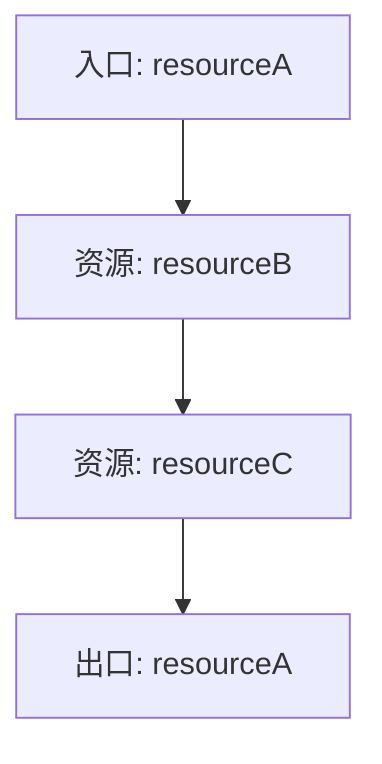

# Sentinel 资源调用链路

Sentinel是阿里巴巴开源的一款轻量级流量控制组件，广泛应用于微服务架构中。它通过资源调用链路的管理，实现了对系统资源的保护和控制。本文将深入探讨Sentinel中的资源调用链路，帮助初学者理解其工作原理和应用场景。

## 什么是资源调用链路？

在Sentinel中，**资源调用链路**是指从请求进入系统到最终处理完成的过程中，所有涉及到的资源（如方法、接口、服务等）的调用关系。Sentinel通过监控这些调用链路，能够实时检测系统的流量、响应时间等指标，从而进行流量控制、熔断降级等操作。

## 资源调用链路的核心概念

### 1. 资源（Resource）
资源是Sentinel中最基本的概念，通常对应一个方法、接口或服务。Sentinel会为每个资源分配一个唯一的标识符，用于监控和控制。

### 2. 入口（Entry）
入口是资源调用的起点。Sentinel通过`SphU.entry(resourceName)`方法标记一个资源的入口，并开始监控该资源的调用。

### 3. 上下文（Context）
上下文是资源调用链路的执行环境。Sentinel通过上下文管理资源的调用关系，确保每个资源的调用都能被正确追踪。

### 4. 调用链（Invocation Chain）
调用链是资源调用的路径，记录了从入口到出口的所有资源调用关系。Sentinel通过调用链实现资源的流量控制和熔断降级。

## 资源调用链路的工作原理

### 1. 入口标记
当一个请求进入系统时，首先需要通过`SphU.entry(resourceName)`方法标记资源的入口。Sentinel会为该资源创建一个上下文，并开始监控其调用。

```java
try (Entry entry = SphU.entry("resourceName")) {
    // 执行业务逻辑
} catch (BlockException e) {
    // 处理被限流或熔断的情况
}
```

### 2. 调用链构建
在资源调用的过程中，Sentinel会记录每个资源的调用关系，构建调用链。调用链中的每个节点都对应一个资源的入口和出口。



### 3. 流量控制与熔断降级
Sentinel根据调用链中的资源调用情况，实时计算流量、响应时间等指标。当某个资源的流量超过预设阈值时，Sentinel会触发流量控制或熔断降级机制，保护系统资源。

## 实际应用场景

### 场景1：接口限流
假设我们有一个接口`/api/user`，在高并发场景下需要对其进行限流。我们可以通过Sentinel的`SphU.entry`方法标记该接口的入口，并设置流量控制规则。

```java
try (Entry entry = SphU.entry("GET:/api/user")) {
    // 执行业务逻辑
} catch (BlockException e) {
    // 返回限流提示
}
```

### 场景2：服务熔断
在微服务架构中，某个服务可能会因为下游服务故障而变得不可用。我们可以通过Sentinel的熔断机制，在服务调用失败率达到一定阈值时，自动熔断该服务，避免雪崩效应。

```java
try (Entry entry = SphU.entry("serviceA")) {
    // 调用serviceA
} catch (BlockException e) {
    // 返回熔断提示
}
```

## 总结

Sentinel的资源调用链路是其流量控制和熔断降级功能的核心。通过理解资源、入口、上下文和调用链等概念，我们可以更好地利用Sentinel保护系统资源，提升系统的稳定性和可靠性。

## 附加资源与练习

- **官方文档**: [Sentinel官方文档](https://sentinelguard.io/zh-cn/docs/introduction.html)
- **练习**: 尝试在你的项目中集成Sentinel，并为一个接口设置流量控制规则，观察其效果。

:::tip
如果你在集成Sentinel时遇到问题，可以参考官方文档或社区论坛，获取更多帮助。
:::