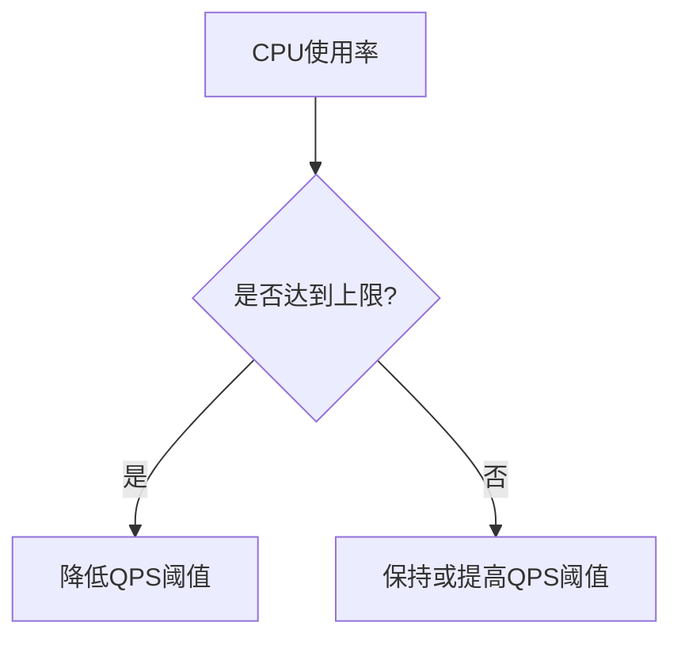

## 介绍

在分布式系统中，流量控制是保护系统免受过载影响的关键机制之一。Sentinel是阿里巴巴开源的一款流量控制组件，它通过QPS（每秒查询数）阈值来限制系统的流量。QPS阈值是指系统在单位时间内能够处理的请求数量上限。合理设置QPS阈值可以防止系统因流量过大而崩溃，同时确保系统在高负载下仍能稳定运行。

本文将详细介绍如何确定Sentinel中的QPS阈值，并通过实际案例和代码示例帮助初学者理解这一概念。

## 什么是QPS阈值？

QPS（Queries Per Second）是指系统在每秒内能够处理的请求数量。QPS阈值则是系统在单位时间内能够处理的请求数量的上限。当请求量超过QPS阈值时，Sentinel会触发流量控制机制，拒绝部分请求，以保护系统免受过载影响。

### 为什么需要设置QPS阈值？

1. **防止系统过载**：当请求量超过系统的处理能力时，系统可能会崩溃或响应变慢。设置QPS阈值可以防止这种情况发生。
2. **资源保护**：通过限制请求量，可以确保系统资源（如CPU、内存、数据库连接等）不会被耗尽。
3. **提高系统稳定性**：合理的QPS阈值可以确保系统在高负载下仍能稳定运行，避免因流量突增导致的系统不稳定。

## 如何确定QPS阈值？

确定QPS阈值需要考虑多个因素，包括系统的处理能力、资源限制、业务需求等。以下是确定QPS阈值的步骤：

### 1. 评估系统的处理能力

首先，需要评估系统在正常情况下的处理能力。可以通过压力测试工具（如JMeter、Gatling等）模拟高并发请求，观察系统的响应时间和资源使用情况。

```bash
# 使用JMeter进行压力测试
jmeter -n -t test_plan.jmx -l result.jtl
```

### 2. 确定系统的资源限制

系统的资源限制（如CPU、内存、数据库连接等）也会影响QPS阈值的设置。可以通过监控工具（如Prometheus、Grafana等）观察系统在高负载下的资源使用情况。



### 3. 考虑业务需求

不同的业务场景对QPS的要求不同。例如，电商网站在大促期间可能需要更高的QPS阈值，而内部管理系统则可能不需要。因此，在设置QPS阈值时，需要结合业务需求进行调整。

### 4. 设置和调优QPS阈值

在Sentinel中，可以通过以下代码设置QPS阈值：

```java
// 设置QPS阈值为100
FlowRule rule = new FlowRule();
rule.setResource("myResource");
rule.setGrade(RuleConstant.FLOW_GRADE_QPS);
rule.setCount(100);
FlowRuleManager.loadRules(Collections.singletonList(rule));
```

在实际应用中，可以通过监控系统的响应时间和资源使用情况，逐步调整QPS阈值，直到找到最佳值。

## 实际案例

假设我们有一个电商网站，在大促期间需要处理大量的订单请求。通过压力测试，我们发现系统在QPS为500时，响应时间开始显著增加，CPU使用率达到80%。因此，我们将QPS阈值设置为500，以确保系统在大促期间仍能稳定运行。

```java
// 设置QPS阈值为500
FlowRule rule = new FlowRule();
rule.setResource("orderService");
rule.setGrade(RuleConstant.FLOW_GRADE_QPS);
rule.setCount(500);
FlowRuleManager.loadRules(Collections.singletonList(rule));
```

在大促期间，我们通过监控系统发现，QPS阈值设置为500时，系统响应时间稳定，CPU使用率保持在合理范围内。因此，这个QPS阈值设置是合理的。

## 总结

确定Sentinel中的QPS阈值是保护系统免受过载影响的重要步骤。通过评估系统的处理能力、资源限制和业务需求，可以合理设置QPS阈值。在实际应用中，可以通过监控和调优，逐步找到最佳的QPS阈值。

:::tip
建议定期进行压力测试和监控，以确保QPS阈值的设置始终符合系统的实际需求。
:::

## 附加资源

- [Sentinel官方文档](https://sentinelguard.io/)
- [JMeter压力测试教程](https://jmeter.apache.org/usermanual/index.html)
- [Prometheus监控系统](https://prometheus.io/)

## 练习

1. 使用JMeter对你的系统进行压力测试，观察系统在不同QPS下的响应时间和资源使用情况。
2. 在Sentinel中设置不同的QPS阈值，观察系统的表现，并记录最佳设置。
3. 结合业务需求，设计一个适合你系统的QPS阈值调优方案。
