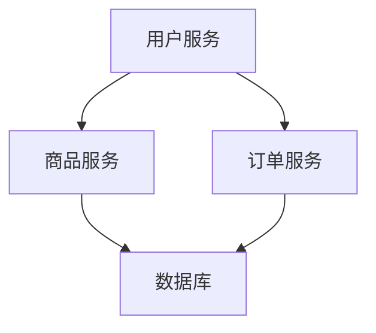

# Sentinel 与微服务架构

## 介绍

在微服务架构中，服务之间的调用关系复杂，任何一个服务的故障都可能导致整个系统的崩溃。为了确保系统的高可用性和稳定性，我们需要一种机制来保护服务免受流量激增、依赖故障等问题的影响。Sentinel 是阿里巴巴开源的一款轻量级流量控制组件，专门为微服务架构设计，提供了流量控制、熔断降级、系统保护等功能。

本文将逐步介绍如何在微服务架构中使用 Sentinel，并通过实际案例展示其应用场景。

---

## Sentinel 的核心功能

Sentinel 的核心功能包括：

1. **流量控制**：通过设置 QPS（每秒查询率）或线程数限制，控制服务的流量，防止服务被压垮。
2. **熔断降级**：当服务调用失败率达到一定阈值时，自动熔断服务，避免雪崩效应。
3. **系统保护**：根据系统的负载情况，动态调整流量，保护系统不被过载。

---

## Sentinel 与微服务架构的集成

### 1. 流量控制

在微服务架构中，流量控制是确保服务稳定性的关键。Sentinel 可以通过配置规则来限制服务的流量。例如，我们可以为某个 API 设置每秒最多处理 100 个请求。

```java
FlowRule rule = new FlowRule();
rule.setResource("GET:/api/resource");
rule.setCount(100);
rule.setGrade(RuleConstant.FLOW_GRADE_QPS);
FlowRuleManager.loadRules(Collections.singletonList(rule));
```

**输入**：每秒 150 个请求  
**输出**：只有前 100 个请求被处理，其余请求被拒绝。

:::tip
流量控制规则可以根据实际需求动态调整，例如在高峰期增加 QPS 限制。
:::

### 2. 熔断降级

当某个服务调用失败率过高时，Sentinel 可以自动熔断该服务，避免雪崩效应。例如，当失败率达到 50% 时，熔断该服务 10 秒。

```java
DegradeRule rule = new DegradeRule();
rule.setResource("GET:/api/resource");
rule.setCount(0.5); // 失败率阈值
rule.setTimeWindow(10); // 熔断时间窗口
DegradeRuleManager.loadRules(Collections.singletonList(rule));
```

**输入**：服务调用失败率达到 50%  
**输出**：服务被熔断 10 秒，期间所有请求被拒绝。

:::caution
熔断降级规则需要根据服务的实际容错能力进行配置，避免误熔断。
:::

### 3. 系统保护

Sentinel 可以根据系统的负载情况，动态调整流量。例如，当系统的 CPU 使用率超过 80% 时，自动拒绝部分请求。

```java
SystemRule rule = new SystemRule();
rule.setHighestSystemLoad(0.8); // CPU 使用率阈值
SystemRuleManager.loadRules(Collections.singletonList(rule));
```

**输入**：系统 CPU 使用率达到 80%  
**输出**：部分请求被拒绝，直到 CPU 使用率恢复正常。

:::warning
系统保护规则需要谨慎配置，避免过度限制流量导致服务不可用。
:::

---

## 实际案例

假设我们有一个电商系统，包含以下微服务：

1. **用户服务**：处理用户登录、注册等请求。
2. **商品服务**：提供商品信息查询功能。
3. **订单服务**：处理订单创建、支付等请求。

在高并发场景下，商品服务的查询请求可能会激增，导致服务过载。我们可以使用 Sentinel 对商品服务进行流量控制，并设置熔断降级规则。



**配置示例**：

```java
// 流量控制规则
FlowRule flowRule = new FlowRule();
flowRule.setResource("GET:/api/product");
flowRule.setCount(200); // 每秒最多处理 200 个请求
FlowRuleManager.loadRules(Collections.singletonList(flowRule));

// 熔断降级规则
DegradeRule degradeRule = new DegradeRule();
degradeRule.setResource("GET:/api/product");
degradeRule.setCount(0.6); // 失败率阈值
degradeRule.setTimeWindow(10); // 熔断时间窗口
DegradeRuleManager.loadRules(Collections.singletonList(degradeRule));
```

**效果**：当商品服务的请求量超过 200 QPS 或失败率达到 60% 时，Sentinel 会自动限制流量或熔断服务，确保系统的稳定性。

---

## 总结

Sentinel 是微服务架构中不可或缺的工具，能够有效应对高并发、依赖故障等挑战。通过流量控制、熔断降级和系统保护等功能，Sentinel 可以帮助我们构建高可用、稳定的微服务系统。

---

## 附加资源与练习

1. **官方文档**：[Sentinel 官方文档](https://sentinelguard.io/zh-cn/docs/introduction.html)
2. **练习**：尝试在自己的微服务项目中集成 Sentinel，并配置流量控制和熔断降级规则。
3. **扩展阅读**：了解 Sentinel 的更多高级功能，如热点参数限流、集群流控等。

:::note
如果你在实践过程中遇到问题，可以参考官方文档或社区讨论。
:::