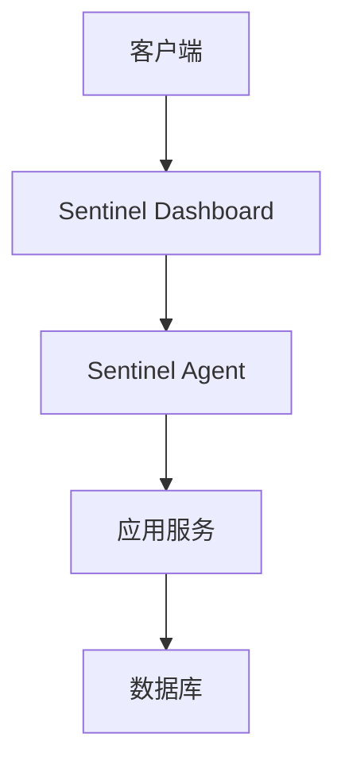

## 介绍

Sentinel是阿里巴巴开源的一款轻量级流量控制组件，广泛应用于微服务架构中，用于实现限流、熔断、系统负载保护等功能。在大规模生产环境中，如何高效、稳定地部署Sentinel是一个关键问题。本文将详细介绍Sentinel的大规模部署策略，帮助初学者理解并掌握相关技术。

## 基础概念

在深入讨论大规模部署之前，我们需要了解一些基础概念：

- **流量控制（Flow Control）**：通过限制请求的速率，防止系统过载。
- **熔断（Circuit Breaking）**：当系统出现故障时，自动切断请求，防止故障扩散。
- **系统负载保护（System Load Protection）**：根据系统的负载情况，动态调整流量控制策略。

## 部署架构

在大规模部署中，Sentinel通常采用分布式架构，以确保高可用性和可扩展性。以下是一个典型的部署架构：



在这个架构中，Sentinel Dashboard负责监控和管理流量控制规则，Sentinel Agent则负责在应用服务中执行这些规则。

## 部署步骤

### 1. 安装Sentinel Dashboard

首先，我们需要安装Sentinel Dashboard，它提供了一个Web界面，用于监控和管理流量控制规则。

```bash
# 下载Sentinel Dashboard
wget https://github.com/alibaba/Sentinel/releases/download/v1.8.2/sentinel-dashboard-1.8.2.jar

# 启动Sentinel Dashboard
java -jar sentinel-dashboard-1.8.2.jar
```

启动后，访问 `http://localhost:8080` 即可进入Sentinel Dashboard。

### 2. 配置Sentinel Agent

接下来，我们需要在应用服务中配置Sentinel Agent。以下是一个简单的配置示例：

```java
// 引入Sentinel依赖
<dependency>
    <groupId>com.alibaba.csp</groupId>
    <artifactId>sentinel-core</artifactId>
    <version>1.8.2</version>
</dependency>

// 初始化Sentinel
public static void init() {
    // 配置规则
    FlowRule rule = new FlowRule();
    rule.setResource("myResource");
    rule.setGrade(RuleConstant.FLOW_GRADE_QPS);
    rule.setCount(10); // 每秒最多允许10个请求
    FlowRuleManager.loadRules(Collections.singletonList(rule));
}
```

### 3. 监控和管理

通过Sentinel Dashboard，我们可以实时监控流量控制情况，并根据需要调整规则。例如，我们可以设置一个熔断规则，当请求失败率达到50%时，自动熔断。

```java
// 配置熔断规则
DegradeRule degradeRule = new DegradeRule();
degradeRule.setResource("myResource");
degradeRule.setGrade(RuleConstant.DEGRADE_GRADE_EXCEPTION_RATIO);
degradeRule.setCount(0.5); // 失败率达到50%时熔断
degradeRule.setTimeWindow(10); // 熔断持续10秒
DegradeRuleManager.loadRules(Collections.singletonList(degradeRule));
```

## 实际案例

假设我们有一个电商网站，在双十一大促期间，流量激增。为了确保系统的稳定性，我们使用Sentinel进行流量控制和熔断保护。

1. **流量控制**：我们设置了一个QPS限制，确保每秒最多处理1000个请求。
2. **熔断保护**：当某个服务的失败率达到50%时，自动熔断，防止故障扩散。

通过Sentinel的实时监控和动态调整，我们成功应对了流量高峰，确保了系统的稳定运行。

## 总结

Sentinel的大规模部署是确保系统高可用性和稳定性的关键。通过合理的架构设计和规则配置，我们可以有效应对流量高峰和系统故障。希望本文能帮助初学者理解并掌握Sentinel的大规模部署策略。

## 附加资源

- [Sentinel官方文档](https://github.com/alibaba/Sentinel/wiki)
- [Sentinel Dashboard使用指南](https://github.com/alibaba/Sentinel/wiki/Dashboard)
- [Sentinel实战案例](https://github.com/alibaba/Sentinel/wiki/实战案例)

## 练习

1. 尝试在自己的项目中部署Sentinel，并配置一个简单的流量控制规则。
2. 使用Sentinel Dashboard监控流量控制情况，并根据需要调整规则。
3. 模拟一个高流量场景，观察Sentinel的流量控制和熔断保护效果。
