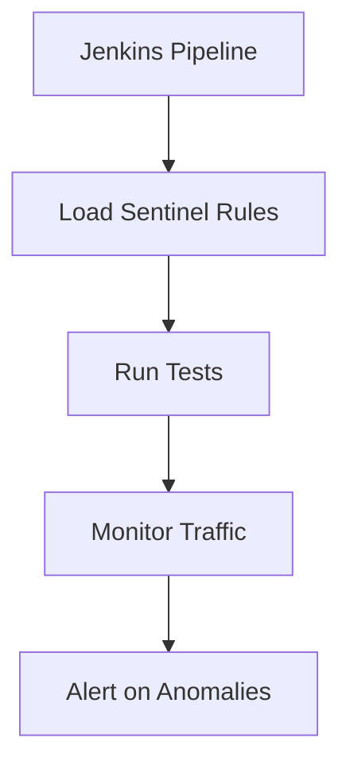

# Sentinel 与DevOps集成案例

## 介绍

Sentinel 是阿里巴巴开源的一款轻量级流量控制组件，广泛应用于微服务架构中，用于实现流量控制、熔断降级、系统负载保护等功能。DevOps 是一种强调开发与运维协作的文化与实践，旨在通过自动化工具链提高软件交付效率和质量。将 Sentinel 与 DevOps 集成，可以帮助团队在持续集成和持续交付（CI/CD）过程中更好地管理系统的稳定性和性能。

本文将介绍如何将 Sentinel 集成到 DevOps 工具链中，并通过实际案例展示其应用场景。

## Sentinel 与 DevOps 集成的基本概念

在 DevOps 环境中，Sentinel 可以通过以下方式与工具链集成：

1. **自动化配置管理**：通过配置管理工具（如 Ansible、Puppet）自动化部署 Sentinel 的规则和配置。
2. **监控与告警**：与监控系统（如 Prometheus、Grafana）集成，实时监控流量和系统状态，并在异常时触发告警。
3. **CI/CD 集成**：在 CI/CD 流水线中嵌入 Sentinel 的测试和验证步骤，确保新代码不会引入流量控制问题。

## 实际案例：Sentinel 与 Jenkins 集成

### 场景描述

假设我们有一个基于微服务的电商平台，使用 Jenkins 作为 CI/CD 工具。为了确保在高流量场景下系统的稳定性，我们需要在 Jenkins 流水线中集成 Sentinel，以自动化地测试和验证流量控制规则。

### 步骤 1：安装 Sentinel 插件

首先，我们需要在 Jenkins 中安装 Sentinel 插件。可以通过 Jenkins 的插件管理界面搜索并安装 `sentinel-plugin`。

```bash
# 示例：通过 Jenkins CLI 安装插件
java -jar jenkins-cli.jar -s http://localhost:8080/ install-plugin sentinel-plugin
```

### 步骤 2：配置 Sentinel 规则

在 Jenkins 项目的配置页面中，添加一个 Sentinel 配置步骤。我们可以通过 YAML 文件定义流量控制规则，例如：

```yaml
# sentinel-rules.yaml
flowRules:
  - resource: orderService
    count: 100
    grade: 1
    controlBehavior: 0
    limitApp: default
```

### 步骤 3：在流水线中集成 Sentinel 测试

在 Jenkins 流水线脚本中，添加一个步骤来加载 Sentinel 规则并运行测试。以下是一个示例流水线脚本：

```groovy
pipeline {
    agent any
    stages {
        stage('Load Sentinel Rules') {
            steps {
                sh 'sentinel-load -f sentinel-rules.yaml'
            }
        }
        stage('Run Tests') {
            steps {
                sh 'mvn test'
            }
        }
    }
}
```

### 步骤 4：监控与告警

在流水线运行过程中，Sentinel 会实时监控流量并记录日志。我们可以将这些日志发送到 Prometheus，并通过 Grafana 进行可视化展示。以下是一个 Prometheus 配置示例：

```yaml
# prometheus.yml
scrape_configs:
  - job_name: 'sentinel'
    static_configs:
      - targets: ['localhost:9091']
```

在 Grafana 中，我们可以创建一个仪表盘来展示流量控制的关键指标，如 QPS、拒绝请求数等。



## 总结

通过将 Sentinel 与 DevOps 工具链集成，我们可以在 CI/CD 过程中自动化地测试和验证流量控制规则，从而确保系统的稳定性和性能。本文通过一个实际案例展示了如何将 Sentinel 集成到 Jenkins 流水线中，并通过 Prometheus 和 Grafana 实现监控与告警。

## 附加资源

- [Sentinel 官方文档](https://sentinelguard.io/)
- [Jenkins 插件开发指南](https://www.jenkins.io/doc/developer/)
- [Prometheus 入门指南](https://prometheus.io/docs/introduction/overview/)

## 练习

1. 尝试在本地 Jenkins 实例中安装 Sentinel 插件，并配置一个简单的流水线。
2. 使用 Prometheus 和 Grafana 监控 Sentinel 的流量控制指标，并创建一个仪表盘。
3. 修改 Sentinel 规则，观察其对系统性能的影响，并记录结果。
