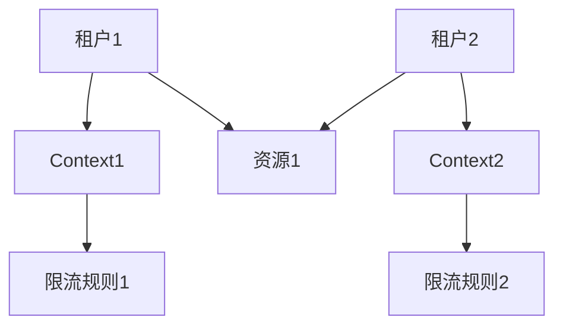

# Sentinel 多租户环境案例

## 介绍

在多租户环境中，多个用户或租户共享同一套系统资源。为了确保每个租户的资源使用不会影响到其他租户，我们需要一种机制来隔离和控制每个租户的资源使用。Sentinel 是一个强大的流量控制工具，可以帮助我们在多租户环境中实现资源的隔离和流量控制。

本文将逐步介绍如何在多租户环境中使用 Sentinel，并通过一个实际案例展示其应用场景。

## 多租户环境中的资源隔离

在多租户环境中，资源隔离是至关重要的。每个租户应该只能访问和使用分配给他们的资源，而不能影响到其他租户。Sentinel 通过 `Context` 和 `Entry` 机制来实现资源的隔离。

### Context

`Context` 是 Sentinel 中的一个核心概念，它代表了一个资源的上下文。在多租户环境中，我们可以为每个租户创建一个独立的 `Context`，从而实现资源的隔离。

### Entry

`Entry` 是 Sentinel 中的另一个核心概念，它代表了对资源的访问。通过 `Entry`，我们可以控制每个租户对资源的访问频率和数量。

## 代码示例

以下是一个简单的代码示例，展示了如何在多租户环境中使用 Sentinel 进行资源隔离和流量控制。

```java
import com.alibaba.csp.sentinel.Entry;
import com.alibaba.csp.sentinel.SphU;
import com.alibaba.csp.sentinel.context.ContextUtil;
import com.alibaba.csp.sentinel.slots.block.BlockException;

public class MultiTenantExample {

    public static void main(String[] args) {
        // 模拟两个租户
        String tenant1 = "tenant1";
        String tenant2 = "tenant2";

        // 为每个租户创建独立的 Context
        ContextUtil.enter(tenant1, tenant1);
        try (Entry entry = SphU.entry("resource1")) {
            // 租户1访问资源
            System.out.println(tenant1 + " accessed resource1");
        } catch (BlockException e) {
            // 处理被限流的情况
            System.out.println(tenant1 + " is blocked");
        } finally {
            ContextUtil.exit();
        }

        ContextUtil.enter(tenant2, tenant2);
        try (Entry entry = SphU.entry("resource1")) {
            // 租户2访问资源
            System.out.println(tenant2 + " accessed resource1");
        } catch (BlockException e) {
            // 处理被限流的情况
            System.out.println(tenant2 + " is blocked");
        } finally {
            ContextUtil.exit();
        }
    }
}
```

### 输入和输出

假设我们为 `resource1` 设置了 QPS 限制为 1，那么上述代码的输出可能是：

```
tenant1 accessed resource1
tenant2 is blocked
```

## 实际案例

### 场景描述

假设我们有一个 SaaS 平台，多个租户共享同一套 API 服务。为了防止某个租户的流量过大影响到其他租户，我们需要对每个租户的 API 调用进行限流。

### 解决方案

我们可以使用 Sentinel 为每个租户创建一个独立的 `Context`，并为每个租户设置不同的限流规则。这样，即使某个租户的流量激增，也不会影响到其他租户的正常使用。



## 总结

在多租户环境中，资源隔离和流量控制是确保系统稳定性的关键。Sentinel 提供了强大的 `Context` 和 `Entry` 机制，帮助我们轻松实现多租户环境中的资源隔离和流量控制。

通过本文的介绍和实际案例，你应该已经掌握了如何在多租户环境中使用 Sentinel。希望这些内容对你的学习和实践有所帮助。

## 附加资源

- [Sentinel 官方文档](https://sentinelguard.io/)
- [Sentinel GitHub 仓库](https://github.com/alibaba/Sentinel)

## 练习

1. 尝试在本地环境中运行上述代码示例，并观察输出结果。
2. 修改代码，为不同的租户设置不同的限流规则，并观察效果。
3. 思考并尝试在实际项目中应用 Sentinel 的多租户资源隔离机制。