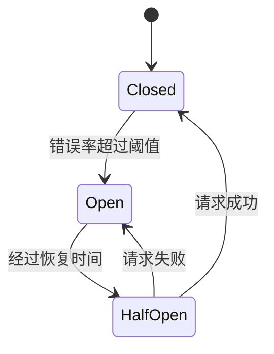

# Sentinel 分布式系统熔断案例

## 介绍

在分布式系统中，服务之间的调用可能会因为网络延迟、服务过载或故障而导致响应时间过长或失败。为了避免这些故障扩散到整个系统，我们需要一种机制来快速检测并隔离问题服务。**熔断器（Circuit Breaker）** 就是这样一种机制，它可以在服务出现问题时自动切断请求，防止系统雪崩。

**Sentinel** 是阿里巴巴开源的一款轻量级流量控制组件，支持熔断、限流、降级等功能。本文将结合实际案例，展示如何使用Sentinel实现分布式系统的熔断机制。

---

## 熔断器的工作原理

熔断器的工作机制类似于电路中的保险丝。当某个服务的错误率超过阈值时，熔断器会“跳闸”，停止向该服务发送请求。经过一段时间后，熔断器会进入“半开”状态，尝试恢复部分请求。如果请求成功，熔断器会完全恢复；如果仍然失败，则继续保持熔断状态。



---

## 实际案例：订单服务熔断

假设我们有一个电商系统，其中订单服务依赖于库存服务。当库存服务出现故障时，订单服务可能会因为等待超时而堆积大量请求，最终导致整个系统崩溃。为了防止这种情况，我们可以使用Sentinel为订单服务添加熔断机制。

### 1. 引入Sentinel依赖

首先，在项目中引入Sentinel的依赖。以Maven项目为例：

```xml
<dependency>
    <groupId>com.alibaba.csp</groupId>
    <artifactId>sentinel-core</artifactId>
    <version>1.8.6</version>
</dependency>
<dependency>
    <groupId>com.alibaba.csp</groupId>
    <artifactId>sentinel-annotation-aspectj</artifactId>
    <version>1.8.6</version>
</dependency>
```

### 2. 定义熔断规则

接下来，我们需要定义熔断规则。例如，当库存服务的错误率超过50%时，触发熔断。

```java
import com.alibaba.csp.sentinel.slots.block.RuleConstant;
import com.alibaba.csp.sentinel.slots.block.degrade.DegradeRule;
import com.alibaba.csp.sentinel.slots.block.degrade.DegradeRuleManager;

public class SentinelConfig {
    public static void init() {
        DegradeRule rule = new DegradeRule("inventoryService")
            .setGrade(RuleConstant.DEGRADE_GRADE_EXCEPTION_RATIO) // 基于异常比例
            .setCount(0.5) // 错误率阈值
            .setTimeWindow(10) // 熔断恢复时间（秒）
            .setMinRequestAmount(5); // 最小请求数
        DegradeRuleManager.loadRules(Collections.singletonList(rule));
    }
}
```

### 3. 使用注解实现熔断

在订单服务中，我们可以使用Sentinel的 `@SentinelResource` 注解来实现熔断。

```java
import com.alibaba.csp.sentinel.annotation.SentinelResource;
import com.alibaba.csp.sentinel.slots.block.BlockException;

@Service
public class OrderService {

    @SentinelResource(value = "inventoryService", blockHandler = "handleBlock")
    public String checkInventory(String productId) {
        // 调用库存服务
        return inventoryService.checkStock(productId);
    }

    public String handleBlock(String productId, BlockException ex) {
        // 熔断后的降级逻辑
        return "库存服务暂时不可用，请稍后重试";
    }
}
```

### 4. 测试熔断效果

启动服务后，我们可以通过模拟库存服务的故障来测试熔断效果。当错误率超过50%时，订单服务会自动触发熔断，并返回降级结果。

---

## 总结

通过以上案例，我们学习了如何使用Sentinel实现分布式系统的熔断机制。熔断器能够有效防止故障扩散，提升系统的稳定性和可用性。对于初学者来说，理解熔断器的工作原理并掌握其实现方法是非常重要的。

:::tip 提示
在实际项目中，熔断规则需要根据业务场景进行调整。例如，可以设置不同的错误率阈值、恢复时间等参数。
:::

---

## 附加资源与练习

1. **Sentinel官方文档**：了解更多关于Sentinel的功能和配置。
2. **练习**：尝试在自己的项目中实现一个简单的熔断机制，并测试其效果。
3. **扩展阅读**：学习其他流量控制组件，如Hystrix和Resilience4j，比较它们的异同。

希望本文能帮助你更好地理解Sentinel的熔断机制，并在实际项目中应用它！