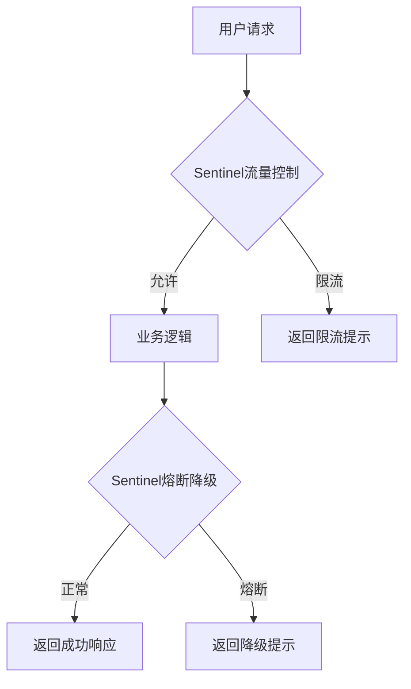

# Sentinel 性能瓶颈解决案例

## 介绍

Sentinel是阿里巴巴开源的一款轻量级流量控制组件，广泛应用于微服务架构中，用于实现限流、熔断、降级等功能。在实际生产环境中，性能瓶颈是一个常见的问题，尤其是在高并发场景下。本文将介绍如何通过Sentinel解决性能瓶颈问题，并通过一个实际案例帮助初学者理解其应用。

## 性能瓶颈的背景

在高并发场景下，系统的性能瓶颈可能出现在多个环节，例如数据库连接池耗尽、线程池资源不足、接口响应时间过长等。Sentinel通过流量控制、熔断降级等机制，可以有效缓解这些问题，从而提升系统的稳定性和性能。

## 案例场景

假设我们有一个电商系统，其中有一个核心接口 `/order/create` 用于创建订单。在高并发场景下，该接口的响应时间显著增加，甚至出现了超时和错误。经过分析，我们发现该接口的性能瓶颈主要出现在数据库写入操作上。

## 解决方案

### 1. 使用Sentinel进行流量控制

首先，我们可以通过Sentinel对该接口进行流量控制，限制每秒的请求量，避免过多的请求同时涌入数据库。

```java
// 定义资源名称
private static final String RESOURCE_NAME = "createOrder";

// 初始化Sentinel规则
private static void initFlowRule() {
    List<FlowRule> rules = new ArrayList<>();
    FlowRule rule = new FlowRule();
    rule.setResource(RESOURCE_NAME);
    rule.setGrade(RuleConstant.FLOW_GRADE_QPS);
    rule.setCount(100); // 设置QPS阈值为100
    rules.add(rule);
    FlowRuleManager.loadRules(rules);
}

// 在接口中使用Sentinel进行流量控制
@PostMapping("/order/create")
public String createOrder() {
    try (Entry entry = SphU.entry(RESOURCE_NAME)) {
        // 业务逻辑
        return "Order created successfully";
    } catch (BlockException e) {
        // 处理被限流的请求
        return "Request blocked by Sentinel";
    }
}
```

### 2. 使用Sentinel进行熔断降级

当接口的响应时间过长或错误率过高时，Sentinel可以自动触发熔断机制，暂时停止对该接口的请求，避免系统雪崩。

```java
// 定义熔断规则
private static void initDegradeRule() {
    List<DegradeRule> rules = new ArrayList<>();
    DegradeRule rule = new DegradeRule();
    rule.setResource(RESOURCE_NAME);
    rule.setGrade(RuleConstant.DEGRADE_GRADE_RT); // 基于响应时间
    rule.setCount(200); // 响应时间超过200ms触发熔断
    rule.setTimeWindow(10); // 熔断持续10秒
    rules.add(rule);
    DegradeRuleManager.loadRules(rules);
}

// 在接口中使用Sentinel进行熔断降级
@PostMapping("/order/create")
public String createOrder() {
    try (Entry entry = SphU.entry(RESOURCE_NAME)) {
        // 业务逻辑
        return "Order created successfully";
    } catch (BlockException e) {
        // 处理被熔断的请求
        return "Request degraded by Sentinel";
    }
}
```

### 3. 监控与调优

Sentinel提供了丰富的监控功能，可以通过控制台实时查看接口的流量、响应时间、错误率等指标。根据这些指标，我们可以进一步调整流量控制和熔断降级的规则，以达到最佳的性能和稳定性。



## 实际案例

在一个电商系统的促销活动中，`/order/create` 接口的QPS（每秒请求量）从平时的100激增到1000。由于数据库写入操作的瓶颈，接口的响应时间从50ms增加到500ms，错误率也显著上升。

通过引入Sentinel，我们对该接口进行了流量控制，将QPS限制在500，并设置了基于响应时间的熔断规则。当响应时间超过200ms时，Sentinel会自动触发熔断机制，暂时停止对该接口的请求。经过调优后，系统的响应时间稳定在100ms以内，错误率也显著下降。

## 总结

通过Sentinel的流量控制和熔断降级机制，我们可以有效解决高并发场景下的性能瓶颈问题。Sentinel不仅提供了强大的限流和熔断功能，还具备丰富的监控能力，帮助我们实时了解系统的运行状态并进行调优。

## 附加资源

- [Sentinel官方文档](https://sentinelguard.io/zh-cn/docs/introduction.html)
- [Sentinel GitHub仓库](https://github.com/alibaba/Sentinel)

## 练习

1. 尝试在你的项目中集成Sentinel，并对一个核心接口进行流量控制和熔断降级的配置。
2. 使用Sentinel控制台监控接口的流量、响应时间和错误率，并根据监控数据调整规则。
3. 模拟高并发场景，观察Sentinel的限流和熔断机制如何发挥作用。