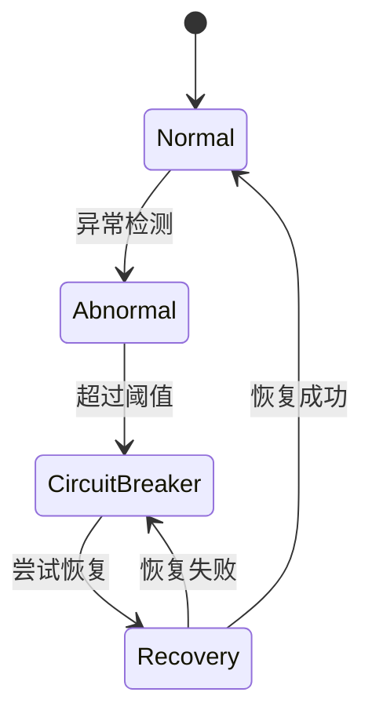

# Sentinel 熔断降级概述

在现代分布式系统中，服务之间的依赖关系变得越来越复杂。当一个服务出现故障或响应缓慢时，可能会导致整个系统的崩溃。为了防止这种情况发生，**熔断降级**机制应运而生。Sentinel 是阿里巴巴开源的一款轻量级流量控制组件，提供了强大的熔断降级功能，帮助开发者保护系统的稳定性。

## 什么是熔断降级？

熔断降级是一种保护机制，用于在系统出现异常时快速失败并返回默认结果，避免故障扩散。它的核心思想是：当某个服务的错误率或响应时间超过预设阈值时，系统会自动“熔断”该服务，停止对其的调用，并返回一个预设的降级结果。这样可以防止故障服务拖垮整个系统。

### 熔断降级的工作原理

熔断降级通常分为以下几个阶段：

1. **正常状态**：系统正常运行，服务调用成功。
2. **异常检测**：当服务调用失败或响应时间过长时，系统开始记录异常。
3. **熔断状态**：当异常次数或错误率超过阈值时，系统进入熔断状态，停止调用该服务。
4. **恢复状态**：经过一段时间后，系统尝试恢复调用，如果调用成功，则恢复正常状态；否则继续保持熔断状态。



## Sentinel 中的熔断降级

Sentinel 提供了多种熔断策略，包括：

- **慢调用比例**：当服务的响应时间超过预设阈值时，触发熔断。
- **异常比例**：当服务的异常比例超过预设阈值时，触发熔断。
- **异常数**：当服务的异常数超过预设阈值时，触发熔断。

### 代码示例

以下是一个使用 Sentinel 实现熔断降级的简单示例：

```java
import com.alibaba.csp.sentinel.annotation.SentinelResource;
import com.alibaba.csp.sentinel.slots.block.BlockException;

public class DemoService {

    @SentinelResource(value = "demoMethod", blockHandler = "handleBlock")
    public String demoMethod() {
        // 模拟业务逻辑
        if (Math.random() > 0.5) {
            throw new RuntimeException("模拟异常");
        }
        return "正常响应";
    }

    public String handleBlock(BlockException ex) {
        return "降级处理";
    }
}
```

在这个示例中，`demoMethod` 方法被 `@SentinelResource` 注解标记，并指定了 `blockHandler` 方法 `handleBlock`。当 `demoMethod` 方法触发熔断时，系统会自动调用 `handleBlock` 方法，返回降级结果。

### 输入与输出

- **输入**：调用 `demoMethod` 方法。
- **输出**：
  - 如果方法正常执行，返回 `"正常响应"`。
  - 如果方法触发熔断，返回 `"降级处理"`。

## 实际应用场景

### 场景 1：保护核心服务

在一个电商系统中，订单服务依赖于库存服务。如果库存服务响应缓慢或不可用，订单服务可能会受到影响。通过使用 Sentinel 的熔断降级功能，可以在库存服务出现问题时，快速返回一个默认的库存状态，避免订单服务被拖垮。

### 场景 2：防止雪崩效应

在微服务架构中，服务之间的调用链可能会很长。如果某个服务出现故障，可能会导致整个调用链的崩溃。通过为每个服务配置熔断降级策略，可以有效防止雪崩效应的发生。

## 总结

Sentinel 的熔断降级功能是保护分布式系统稳定性的重要工具。通过合理配置熔断策略，可以在系统出现异常时快速失败并返回降级结果，避免故障扩散。本文介绍了熔断降级的基本概念、工作原理以及在实际应用中的使用场景，并提供了代码示例帮助理解。

## 附加资源与练习

- **练习 1**：尝试在本地环境中配置 Sentinel，并为一个简单的服务添加熔断降级策略。
- **练习 2**：模拟一个服务调用链，观察熔断降级在不同场景下的表现。

:::tip
了解更多关于 Sentinel 的详细信息，可以参考 [Sentinel 官方文档](https://sentinelguard.io/)。
:::