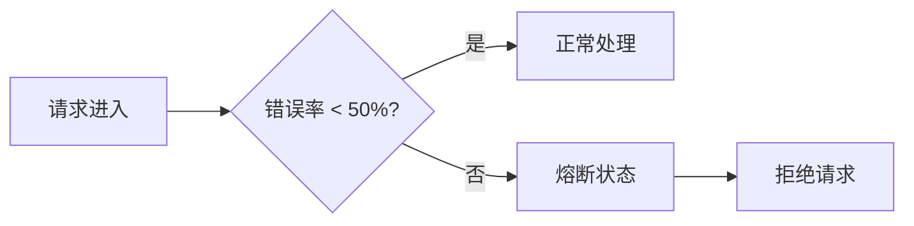
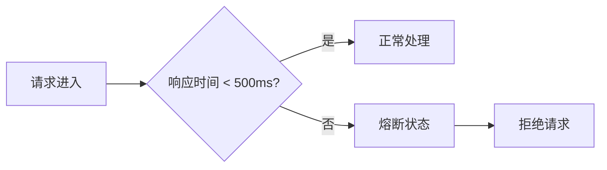
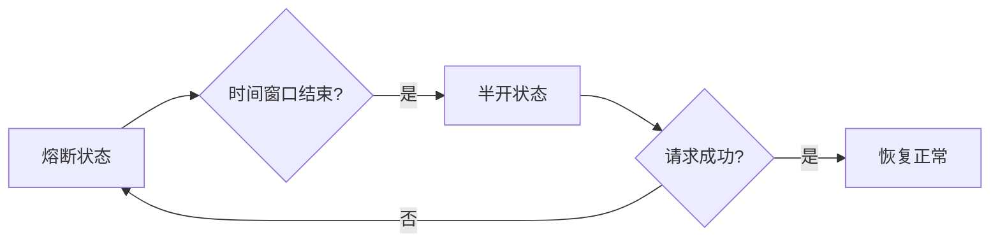

## 介绍

Sentinel是阿里巴巴开源的一款轻量级流量控制组件，主要用于微服务架构中的流量管理、熔断降级和系统保护。熔断机制是Sentinel的核心功能之一，它能够在系统出现异常或资源耗尽时，快速切断对故障服务的调用，防止故障扩散，从而保护系统的稳定性。

本文将详细介绍Sentinel的熔断效果分析，帮助初学者理解熔断机制的工作原理及其在实际应用中的表现。

## 熔断机制的工作原理

熔断机制的核心思想是：当某个服务的错误率或响应时间超过预设阈值时，Sentinel会自动切断对该服务的调用，直接返回预设的降级结果，避免故障扩散。熔断机制通常分为以下几个阶段：

1. **Closed（关闭状态）**：系统正常运行，所有请求都会被正常处理。
2. **Open（打开状态）**：当错误率或响应时间超过阈值时，系统进入熔断状态，所有请求都会被拒绝。
3. **Half-Open（半开状态）**：在熔断一段时间后，系统会尝试恢复部分请求，以检测服务是否恢复正常。

### 熔断规则配置

在Sentinel中，熔断规则可以通过以下参数进行配置：

- **资源名（resource）**：需要保护的资源名称。
- **熔断策略（strategy）**：支持基于错误率、响应时间等策略。
- **阈值（threshold）**：触发熔断的阈值。
- **时间窗口（timeWindow）**：熔断后的恢复时间。

以下是一个简单的熔断规则配置示例：

```java
FlowRule rule = new FlowRule();
rule.setResource("myResource");
rule.setGrade(RuleConstant.FLOW_GRADE_QPS);
rule.setCount(10); // 每秒最多允许10个请求
rule.setControlBehavior(RuleConstant.CONTROL_BEHAVIOR_RATE_LIMITER);
rule.setMaxQueueingTimeMs(500); // 最大排队时间500ms
FlowRuleManager.loadRules(Collections.singletonList(rule));
```

## 熔断效果分析

### 1. 错误率熔断

当服务的错误率超过预设阈值时，Sentinel会自动触发熔断。例如，假设我们设置错误率阈值为50%，当服务的错误率达到50%时，Sentinel会进入熔断状态，拒绝所有请求。



### 2. 响应时间熔断

当服务的响应时间超过预设阈值时，Sentinel也会触发熔断。例如，假设我们设置响应时间阈值为500ms，当服务的响应时间超过500ms时，Sentinel会进入熔断状态。



### 3. 半开状态

在熔断一段时间后，Sentinel会进入半开状态，尝试恢复部分请求。如果这些请求成功处理，系统会逐渐恢复正常；如果仍然失败，系统会再次进入熔断状态。



## 实际案例

假设我们有一个电商系统，其中有一个商品详情服务。在高并发场景下，商品详情服务可能会出现响应时间过长或错误率过高的情况。我们可以通过Sentinel的熔断机制来保护系统。

### 案例配置

```java
DegradeRule rule = new DegradeRule();
rule.setResource("productDetailService");
rule.setGrade(RuleConstant.DEGRADE_GRADE_RT);
rule.setCount(500); // 响应时间超过500ms触发熔断
rule.setTimeWindow(10); // 熔断10秒后进入半开状态
DegradeRuleManager.loadRules(Collections.singletonList(rule));
```

### 案例效果

- **正常情况**：商品详情服务的响应时间在500ms以内，系统正常运行。
- **异常情况**：当商品详情服务的响应时间超过500ms时，Sentinel触发熔断，拒绝所有请求，防止系统崩溃。
- **恢复情况**：10秒后，Sentinel进入半开状态，尝试恢复部分请求。如果请求成功处理，系统逐渐恢复正常；如果仍然失败，系统再次进入熔断状态。

## 总结

Sentinel的熔断机制是保护系统稳定性的重要手段。通过合理配置熔断规则，我们可以在系统出现异常时快速切断故障服务，防止故障扩散。本文介绍了熔断机制的工作原理、配置方法以及实际应用案例，希望能够帮助初学者更好地理解和应用Sentinel的熔断功能。

## 附加资源

- [Sentinel官方文档](https://sentinelguard.io/zh-cn/docs/introduction.html)
- [Sentinel GitHub仓库](https://github.com/alibaba/Sentinel)

## 练习

1. 在你的本地环境中配置一个简单的Sentinel熔断规则，并测试其效果。
2. 尝试修改熔断规则的阈值和时间窗口，观察系统的响应变化。
3. 结合实际项目，思考如何优化熔断规则的配置，以提高系统的稳定性。