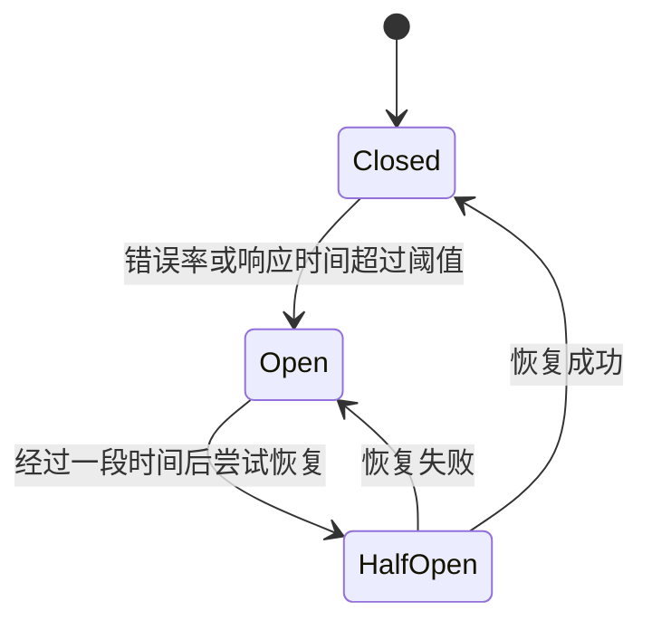

# Sentinel 熔断监控

## 介绍

在现代分布式系统中，服务之间的依赖关系复杂，任何一个服务的故障都可能导致整个系统的崩溃。为了应对这种情况，熔断机制应运而生。**Sentinel** 是阿里巴巴开源的一款轻量级流量控制组件，提供了熔断、降级、限流等功能。本文将重点介绍 **Sentinel熔断监控**，帮助初学者理解其工作原理和实际应用。

熔断监控的核心思想是：当某个服务的错误率或响应时间超过预设阈值时，Sentinel会自动切断对该服务的调用，避免故障扩散，并在一段时间后尝试恢复。

## 熔断监控的工作原理

Sentinel的熔断监控基于以下几个关键概念：

1. **熔断规则（Circuit Breaker Rule）**：定义了熔断触发的条件，例如错误率、响应时间等。
2. **熔断状态（Circuit Breaker State）**：包括关闭（Closed）、打开（Open）和半开（Half-Open）三种状态。
3. **恢复机制（Recovery Mechanism）**：在熔断打开后，Sentinel会在一段时间后尝试恢复服务调用。

### 熔断状态转换



- **Closed**：正常状态，服务调用不受限制。
- **Open**：熔断状态，所有请求被拒绝。
- **Half-Open**：尝试恢复状态，允许部分请求通过以检测服务是否恢复正常。

## 代码示例

以下是一个简单的Java代码示例，展示如何使用Sentinel进行熔断监控。

```java
import com.alibaba.csp.sentinel.annotation.SentinelResource;
import com.alibaba.csp.sentinel.slots.block.BlockException;

public class DemoService {

    @SentinelResource(value = "demoMethod", blockHandler = "handleBlock")
    public String demoMethod() {
        // 模拟服务调用
        if (Math.random() > 0.5) {
            throw new RuntimeException("Service Error");
        }
        return "Service Response";
    }

    public String handleBlock(BlockException ex) {
        return "Service is blocked due to circuit breaker";
    }
}
```

### 输入与输出

- **正常情况**：`demoMethod` 返回 `"Service Response"`。
- **熔断情况**：当错误率超过阈值时，`demoMethod` 返回 `"Service is blocked due to circuit breaker"`。

## 实际应用场景

### 场景1：电商系统中的库存服务

假设在一个电商系统中，库存服务是一个关键依赖。如果库存服务的响应时间过长或错误率过高，可能会导致订单服务无法正常处理订单。通过Sentinel的熔断监控，可以在库存服务出现问题时自动切断对其的调用，避免订单服务受到影响。

### 场景2：微服务架构中的支付服务

在微服务架构中，支付服务可能依赖于多个外部服务（如银行接口、风控服务等）。如果某个外部服务出现故障，Sentinel可以快速熔断对该服务的调用，确保支付服务的稳定性。

## 总结

Sentinel的熔断监控是保障分布式系统稳定性的重要工具。通过定义熔断规则、监控服务状态以及自动恢复机制，Sentinel能够有效防止故障扩散，提升系统的容错能力。

## 附加资源与练习

- **官方文档**：[Sentinel GitHub](https://github.com/alibaba/Sentinel)
- **练习**：尝试在自己的项目中集成Sentinel，并配置熔断规则，观察其在不同场景下的行为。

:::tip
建议初学者在本地环境中搭建一个简单的微服务项目，通过模拟故障场景来深入理解Sentinel的熔断监控机制。
:::