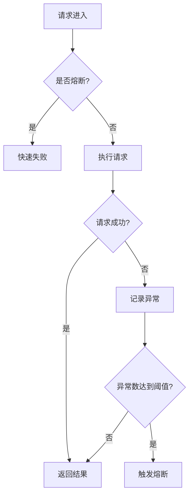

# Sentinel 熔断最佳实践

## 介绍

在现代分布式系统中，服务之间的依赖关系复杂，任何一个服务的故障都可能导致整个系统的崩溃。Sentinel是阿里巴巴开源的一款流量控制组件，提供了熔断降级、流量控制、系统负载保护等功能。其中，**熔断降级**是Sentinel的核心功能之一，用于在服务出现异常时快速失败，避免故障扩散。

本文将详细介绍Sentinel熔断降级的最佳实践，帮助初学者理解如何在高并发场景下保护系统的稳定性。

## 什么是熔断降级？

熔断降级是一种保护机制，当某个服务或资源出现异常（如响应时间过长、错误率过高等）时，系统会自动切断对该服务的请求，避免故障扩散。熔断器会在一定时间内拒绝所有请求，直到服务恢复正常。

Sentinel的熔断降级功能基于以下三种策略：

1. **慢调用比例（Slow Request Ratio）**：当请求的响应时间超过设定的阈值时，触发熔断。
2. **异常比例（Error Ratio）**：当请求的异常比例超过设定的阈值时，触发熔断。
3. **异常数（Error Count）**：当请求的异常数超过设定的阈值时，触发熔断。

## 熔断降级的最佳实践

### 1. 合理设置熔断规则

熔断规则是熔断降级的核心配置。Sentinel提供了丰富的配置选项，开发者可以根据业务需求灵活调整。

```java
// 示例：设置慢调用比例熔断规则
DegradeRule rule = new DegradeRule("resourceName")
    .setGrade(RuleConstant.DEGRADE_GRADE_RT) // 基于响应时间
    .setCount(500) // 响应时间阈值，单位：毫秒
    .setTimeWindow(10) // 熔断时间窗口，单位：秒
    .setRtSlowRequestAmount(5) // 触发熔断的最小慢调用数
    .setMinRequestAmount(10); // 触发熔断的最小请求数

DegradeRuleManager.loadRules(Collections.singletonList(rule));
```

:::tip
在实际应用中，建议根据服务的实际响应时间和错误率动态调整熔断规则，避免过于保守或激进的配置。
:::

### 2. 监控与告警

熔断降级的有效性依赖于对系统状态的实时监控。Sentinel提供了丰富的监控指标，开发者可以通过Dashboard查看系统的实时状态。



:::caution
熔断触发后，系统会自动拒绝所有请求，直到熔断时间窗口结束。因此，建议配置告警机制，及时通知开发人员处理异常。
:::

### 3. 熔断恢复策略

熔断恢复是熔断降级的重要环节。Sentinel支持以下两种恢复策略：

- **自动恢复**：熔断时间窗口结束后，系统会自动尝试恢复请求。
- **手动恢复**：开发人员可以通过API手动恢复熔断状态。

```java
// 示例：手动恢复熔断状态
DegradeRuleManager.recoverRule("resourceName");
```

:::note
在高并发场景下，建议优先使用自动恢复策略，避免手动操作带来的风险。
:::

### 4. 实际案例

假设我们有一个电商系统，用户下单时需要调用库存服务。在高并发场景下，库存服务可能会出现响应时间过长或错误率过高的情况。为了保护系统的稳定性，我们可以使用Sentinel的熔断降级功能。

```java
// 示例：库存服务的熔断降级配置
DegradeRule stockRule = new DegradeRule("stockService")
    .setGrade(RuleConstant.DEGRADE_GRADE_RT)
    .setCount(1000) // 响应时间阈值：1秒
    .setTimeWindow(10) // 熔断时间窗口：10秒
    .setRtSlowRequestAmount(5)
    .setMinRequestAmount(10);

DegradeRuleManager.loadRules(Collections.singletonList(stockRule));
```

当库存服务的响应时间超过1秒时，Sentinel会自动触发熔断，拒绝所有请求，直到服务恢复正常。

## 总结

Sentinel的熔断降级功能是保护系统稳定性的重要工具。通过合理设置熔断规则、实时监控系统状态、配置告警机制以及选择合适的恢复策略，开发者可以有效避免故障扩散，提升系统的可用性。

## 附加资源

- [Sentinel官方文档](https://sentinelguard.io/)
- [Sentinel GitHub仓库](https://github.com/alibaba/Sentinel)
- [分布式系统熔断器设计模式](https://microservices.io/patterns/reliability/circuit-breaker.html)

## 练习

1. 尝试在你的项目中集成Sentinel，并配置一个简单的熔断规则。
2. 模拟高并发场景，观察熔断器的触发和恢复过程。
3. 根据实际业务需求，调整熔断规则，优化系统的稳定性。