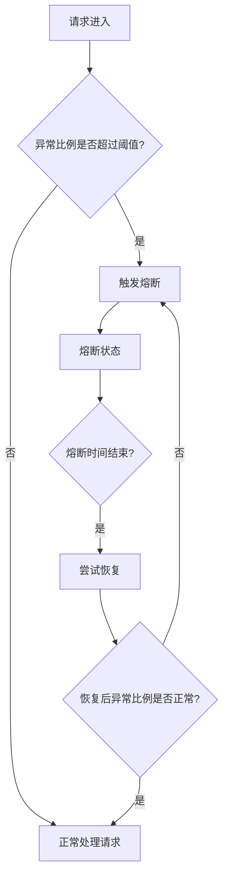

# Sentinel 异常比例熔断

Sentinel是阿里巴巴开源的一款流量控制组件，广泛应用于微服务架构中，用于保护系统免受高流量或异常请求的影响。其中，**异常比例熔断**是Sentinel提供的一种重要熔断策略，用于在系统出现大量异常时快速熔断服务，避免系统崩溃。

## 什么是异常比例熔断？

异常比例熔断是一种基于异常比例的熔断策略。当某个资源的异常比例（即异常请求数占总请求数的比例）超过预设阈值时，Sentinel会自动触发熔断机制，暂时停止对该资源的访问，从而保护系统免受进一步损害。

:::tip
异常比例熔断的核心思想是：当系统出现大量异常时，快速切断对问题资源的访问，避免雪崩效应。
:::

## 异常比例熔断的工作原理

异常比例熔断的工作流程可以分为以下几个步骤：

1. **统计异常比例**：Sentinel会统计一段时间内某个资源的请求总数和异常请求数，计算异常比例。
2. **判断是否触发熔断**：如果异常比例超过预设阈值，Sentinel会触发熔断。
3. **熔断状态**：在熔断状态下，所有对该资源的请求都会被直接拒绝，直到熔断器恢复。
4. **恢复机制**：经过一段时间的熔断后，Sentinel会尝试恢复对资源的访问。如果恢复后的请求仍然异常比例过高，熔断器会继续保持熔断状态。



## 如何配置异常比例熔断？

在Sentinel中，可以通过代码或配置文件来设置异常比例熔断的规则。以下是一个Java代码示例，展示如何配置异常比例熔断规则：

```java
import com.alibaba.csp.sentinel.slots.block.RuleConstant;
import com.alibaba.csp.sentinel.slots.block.degrade.DegradeRule;
import com.alibaba.csp.sentinel.slots.block.degrade.DegradeRuleManager;

public class SentinelDegradeDemo {
    public static void main(String[] args) {
        // 创建熔断规则
        DegradeRule rule = new DegradeRule();
        rule.setResource("myResource"); // 资源名称
        rule.setGrade(RuleConstant.DEGRADE_GRADE_EXCEPTION_RATIO); // 熔断策略：异常比例
        rule.setCount(0.5); // 异常比例阈值（50%）
        rule.setTimeWindow(10); // 熔断恢复时间窗口（10秒）
        rule.setMinRequestAmount(5); // 最小请求数，低于此值不触发熔断

        // 加载规则
        DegradeRuleManager.loadRules(Collections.singletonList(rule));
    }
}
```

### 代码解释

- `setResource("myResource")`：设置需要保护的资源名称。
- `setGrade(RuleConstant.DEGRADE_GRADE_EXCEPTION_RATIO)`：设置熔断策略为异常比例熔断。
- `setCount(0.5)`：设置异常比例阈值为50%。
- `setTimeWindow(10)`：设置熔断恢复时间窗口为10秒。
- `setMinRequestAmount(5)`：设置最小请求数为5，低于此值不触发熔断。

:::caution
在实际应用中，异常比例阈值和熔断恢复时间窗口需要根据具体业务场景进行调整，避免误熔断或熔断时间过长。
:::

## 实际应用场景

假设我们有一个电商系统，其中有一个商品详情查询接口。在高并发场景下，如果数据库出现性能问题，可能会导致大量查询请求超时或失败。此时，我们可以通过配置异常比例熔断规则来保护系统：

1. **设置异常比例阈值**：当商品详情查询接口的异常比例超过50%时，触发熔断。
2. **熔断恢复时间窗口**：熔断持续10秒后，尝试恢复对接口的访问。
3. **最小请求数**：只有当请求数超过5次时，才触发熔断，避免低流量场景下的误熔断。

通过这种方式，我们可以在数据库出现问题时，快速切断对商品详情查询接口的访问，避免系统雪崩。

## 总结

Sentinel的异常比例熔断机制是一种有效的系统保护策略，能够在系统出现大量异常时快速熔断服务，避免问题进一步扩大。通过合理配置异常比例阈值、熔断恢复时间窗口和最小请求数，我们可以确保系统在高并发场景下的稳定性。

:::note
**附加资源**：
- [Sentinel官方文档](https://sentinelguard.io/)
- [微服务熔断机制详解](https://microservices.io/patterns/reliability/circuit-breaker.html)
:::

**练习**：
1. 尝试在自己的项目中配置Sentinel的异常比例熔断规则，并模拟高并发场景测试其效果。
2. 调整异常比例阈值和熔断恢复时间窗口，观察系统行为的变化。