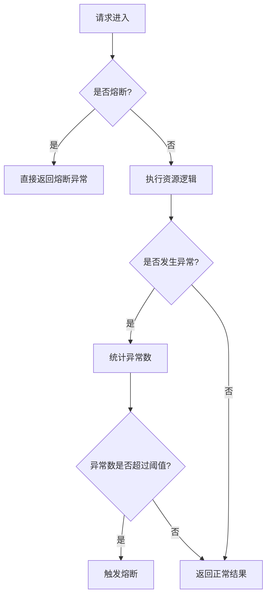

# Sentinel 异常数熔断

Sentinel是阿里巴巴开源的一款轻量级流量控制组件，广泛用于微服务架构中。其中，**异常数熔断**是Sentinel提供的一种重要的熔断策略，用于在系统出现大量异常时，快速切断流量，避免系统崩溃。本文将详细介绍异常数熔断的概念、工作原理、配置方法以及实际应用场景。

## 什么是异常数熔断？

异常数熔断是Sentinel的一种熔断策略，基于**异常数量**来判断是否需要熔断。当某个资源（如接口或方法）在指定时间窗口内发生的异常次数超过设定的阈值时，Sentinel会自动触发熔断，阻止后续请求访问该资源，直到熔断器恢复。

:::tip
熔断的目的是在系统出现异常时，快速切断流量，避免异常扩散，从而保护系统的稳定性。
:::

## 异常数熔断的工作原理

异常数熔断的核心逻辑如下：

1. **统计异常数**：Sentinel会统计指定时间窗口内某个资源发生的异常次数。
2. **判断熔断条件**：如果异常数超过设定的阈值，则触发熔断。
3. **熔断状态**：在熔断期间，所有请求都会被拒绝，直接返回熔断异常。
4. **恢复机制**：经过一段时间的熔断后，Sentinel会尝试恢复资源，允许部分请求通过，如果这些请求成功，则完全恢复资源。

以下是一个简单的流程图，展示了异常数熔断的工作过程：



## 如何配置异常数熔断？

在Sentinel中，可以通过代码或配置文件来设置异常数熔断规则。以下是一个Java代码示例，展示如何配置异常数熔断：

```java
// 定义资源名称
String resourceName = "exampleResource";

// 配置异常数熔断规则
DegradeRule rule = new DegradeRule(resourceName)
    .setGrade(RuleConstant.DEGRADE_GRADE_EXCEPTION_COUNT) // 设置熔断策略为异常数
    .setCount(10) // 设置异常数阈值为10
    .setTimeWindow(10); // 设置时间窗口为10秒

// 将规则添加到Sentinel中
DegradeRuleManager.loadRules(Collections.singletonList(rule));
```

:::note
- `setGrade(RuleConstant.DEGRADE_GRADE_EXCEPTION_COUNT)`：指定熔断策略为异常数熔断。
- `setCount(10)`：设置异常数阈值为10，即在10秒内如果发生10次异常，则触发熔断。
- `setTimeWindow(10)`：设置时间窗口为10秒。
:::

## 实际应用场景

异常数熔断在以下场景中非常有用：

1. **接口异常保护**：当某个接口由于依赖服务不稳定而频繁抛出异常时，可以通过异常数熔断快速切断流量，避免影响其他服务。
2. **数据库访问保护**：如果数据库连接池耗尽或数据库响应超时，可以通过异常数熔断保护数据库，避免雪崩效应。
3. **第三方服务调用**：当调用第三方服务时，如果对方服务不可用或响应异常，可以通过异常数熔断避免大量请求堆积。

### 示例场景：保护支付接口

假设我们有一个支付接口，调用第三方支付网关进行支付操作。如果第三方支付网关不稳定，可能会导致支付接口频繁抛出异常。此时，我们可以通过异常数熔断来保护支付接口：

```java
// 定义支付接口资源
String paymentResource = "paymentService";

// 配置异常数熔断规则
DegradeRule paymentRule = new DegradeRule(paymentResource)
    .setGrade(RuleConstant.DEGRADE_GRADE_EXCEPTION_COUNT)
    .setCount(5) // 5次异常触发熔断
    .setTimeWindow(10); // 10秒时间窗口

// 将规则添加到Sentinel中
DegradeRuleManager.loadRules(Collections.singletonList(paymentRule));
```

在上述配置中，如果支付接口在10秒内发生5次异常，Sentinel会自动触发熔断，阻止后续请求访问支付接口，直到熔断器恢复。

## 总结

异常数熔断是Sentinel中一种重要的熔断策略，能够有效保护系统免受异常流量的影响。通过统计异常数并在达到阈值时触发熔断，Sentinel可以快速切断流量，避免系统崩溃。在实际应用中，异常数熔断可以用于保护接口、数据库访问以及第三方服务调用等场景。

:::caution
在使用异常数熔断时，需要根据实际业务场景合理设置异常数阈值和时间窗口，避免误熔断或熔断不及时。
:::

## 附加资源与练习

- **练习**：尝试在你的项目中配置异常数熔断规则，并模拟异常场景，观察熔断效果。
- **资源**：
  - [Sentinel官方文档](https://sentinelguard.io/)
  - [Sentinel GitHub仓库](https://github.com/alibaba/Sentinel)

通过本文的学习，你应该已经掌握了Sentinel异常数熔断的基本概念和配置方法。希望你能在实际项目中灵活运用这一机制，提升系统的稳定性！