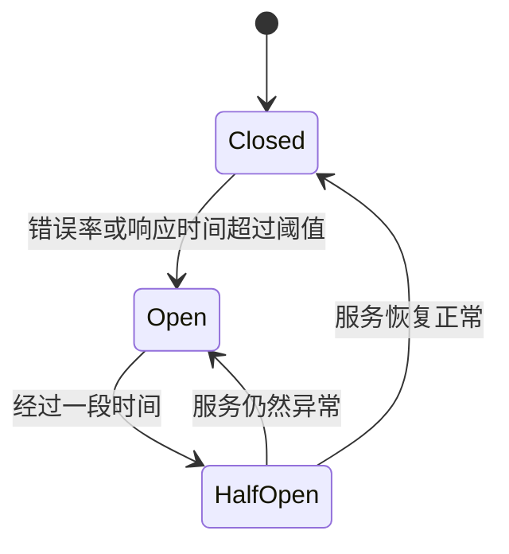

# Sentinel 熔断降级案例

## 介绍

在现代分布式系统中，服务之间的依赖关系非常复杂。当一个服务出现故障或响应时间过长时，可能会导致整个系统的崩溃。为了避免这种情况，Sentinel 提供了一种**熔断降级**机制，能够在服务出现问题时自动切断请求，保护系统的稳定性。

熔断降级的核心思想是：当某个服务的错误率或响应时间超过预设阈值时，Sentinel 会自动切断对该服务的请求，避免故障扩散。同时，Sentinel 还支持降级策略，可以在服务不可用时返回默认值或执行备用逻辑。

## 熔断降级的基本概念

### 1. 熔断器（Circuit Breaker）
熔断器是熔断降级的核心组件。它通过监控服务的错误率或响应时间，决定是否切断请求。熔断器有三种状态：
- **Closed**：正常状态，允许请求通过。
- **Open**：熔断状态，切断所有请求。
- **Half-Open**：半开状态，允许部分请求通过，用于测试服务是否恢复。

### 2. 降级策略（Fallback）
当服务被熔断时，Sentinel 可以执行降级策略，例如返回默认值、执行备用逻辑或抛出异常。

### 3. 阈值配置
Sentinel 允许用户配置熔断的阈值，例如：
- **错误率**：当错误率超过一定比例时触发熔断。
- **响应时间**：当平均响应时间超过一定阈值时触发熔断。

## 实际案例

### 场景描述
假设我们有一个电商系统，其中订单服务依赖于库存服务。当库存服务出现故障时，订单服务可能会因为等待超时而无法响应。为了避免这种情况，我们可以使用 Sentinel 的熔断降级机制。

### 代码示例

以下是一个简单的 Java 示例，展示如何使用 Sentinel 实现熔断降级。

```java
import com.alibaba.csp.sentinel.annotation.SentinelResource;
import com.alibaba.csp.sentinel.slots.block.BlockException;

public class OrderService {

    @SentinelResource(value = "checkInventory", blockHandler = "handleBlock")
    public String checkInventory(String productId) {
        // 模拟调用库存服务
        if (productId.equals("123")) {
            throw new RuntimeException("库存服务异常");
        }
        return "库存充足";
    }

    // 熔断降级处理逻辑
    public String handleBlock(String productId, BlockException ex) {
        return "库存服务不可用，请稍后重试";
    }
}
```

### 运行结果

1. **正常情况**：
   - 输入：`checkInventory("456")`
   - 输出：`"库存充足"`

2. **异常情况**：
   - 输入：`checkInventory("123")`
   - 输出：`"库存服务不可用，请稍后重试"`

### 配置熔断规则

我们可以通过 Sentinel 控制台或代码配置熔断规则。以下是一个配置示例：

```java
import com.alibaba.csp.sentinel.slots.block.RuleConstant;
import com.alibaba.csp.sentinel.slots.block.degrade.DegradeRule;
import com.alibaba.csp.sentinel.slots.block.degrade.DegradeRuleManager;

public class SentinelConfig {

    public static void initDegradeRule() {
        DegradeRule rule = new DegradeRule();
        rule.setResource("checkInventory");
        rule.setGrade(RuleConstant.DEGRADE_GRADE_EXCEPTION_COUNT);
        rule.setCount(2); // 当异常数达到2时触发熔断
        rule.setTimeWindow(10); // 熔断持续10秒

        DegradeRuleManager.loadRules(Collections.singletonList(rule));
    }
}
```

### 状态转换图

以下是一个简单的状态转换图，展示熔断器的工作流程：



## 总结

Sentinel 的熔断降级机制是保护分布式系统稳定性的重要工具。通过监控服务的错误率和响应时间，Sentinel 能够自动切断故障服务的请求，避免故障扩散。同时，降级策略可以在服务不可用时提供备用逻辑，确保用户体验。

## 附加资源

- [Sentinel 官方文档](https://sentinelguard.io/zh-cn/docs/introduction.html)
- [Sentinel GitHub 仓库](https://github.com/alibaba/Sentinel)

## 练习

1. 尝试在本地环境中配置 Sentinel 并实现一个简单的熔断降级案例。
2. 修改熔断规则，观察不同阈值下的熔断行为。
3. 设计一个复杂的分布式系统场景，并应用 Sentinel 的熔断降级机制。

:::tip
如果你在配置或运行过程中遇到问题，可以参考 Sentinel 的官方文档或社区论坛获取帮助。
:::