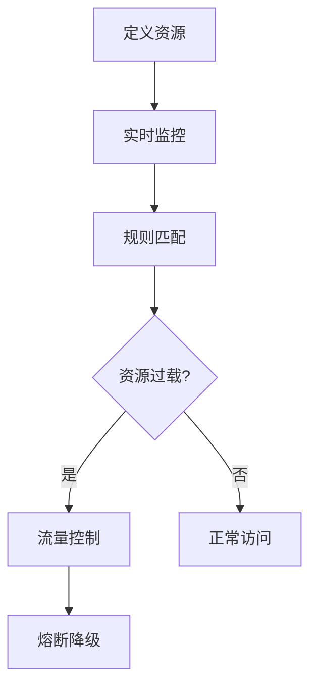

# Sentinel 系统保护概述

Sentinel是一种用于分布式系统的自适应保护框架，旨在帮助开发者应对高并发、流量突增等场景下的系统稳定性问题。通过实时监控系统资源的使用情况，Sentinel能够动态调整流量控制策略，确保系统在极端情况下仍能稳定运行。

## 什么是Sentinel系统保护？

Sentinel系统保护的核心思想是通过**自适应流量控制**和**熔断降级**机制，防止系统因过载而崩溃。它能够实时监控系统的关键指标（如QPS、响应时间、线程数等），并根据预设的规则动态调整流量，避免系统资源被耗尽。

:::note
**自适应流量控制**：根据系统的实时负载情况，动态调整流量控制策略，确保系统在高负载下仍能稳定运行。
:::

## Sentinel 的工作原理

Sentinel的工作原理可以分为以下几个步骤：

1. **资源定义**：开发者需要为系统中的关键资源（如API接口、数据库查询等）定义保护规则。
2. **实时监控**：Sentinel会实时监控这些资源的访问情况，包括QPS、响应时间、错误率等。
3. **规则匹配**：根据预设的规则，Sentinel会判断当前资源是否处于过载状态。
4. **流量控制**：如果资源过载，Sentinel会触发流量控制机制，限制或拒绝部分请求。
5. **熔断降级**：当资源持续过载时，Sentinel会触发熔断机制，暂时停止对该资源的访问，避免系统崩溃。

### 代码示例

以下是一个简单的Sentinel流量控制示例：

```java
// 定义资源
@SentinelResource(value = "myResource", blockHandler = "handleBlock")
public String myResource() {
    // 业务逻辑
    return "Hello, Sentinel!";
}

// 流量控制处理函数
public String handleBlock(BlockException ex) {
    return "请求被限流，请稍后重试！";
}
```

在这个示例中，`myResource`方法被定义为一个受Sentinel保护的资源。当该资源的访问量超过预设的阈值时，Sentinel会调用`handleBlock`方法，返回限流提示。

:::tip
**提示**：在实际应用中，Sentinel的规则可以通过控制台动态配置，无需重启应用即可生效。
:::

## 实际应用场景

### 场景1：电商大促

在电商大促期间，系统的流量可能会突然激增。如果没有有效的保护机制，系统可能会因为过载而崩溃。通过使用Sentinel，开发者可以设置流量控制规则，确保系统在高并发下仍能稳定运行。

### 场景2：微服务调用

在微服务架构中，服务之间的调用关系复杂，某个服务的故障可能会引发连锁反应。通过Sentinel的熔断降级机制，可以在某个服务出现故障时，快速切断对该服务的调用，避免故障扩散。

## 总结

Sentinel系统保护是一种强大的工具，能够帮助开发者在高并发、流量突增等场景下，确保系统的稳定性。通过实时监控和动态调整流量控制策略，Sentinel能够有效防止系统因过载而崩溃。

:::caution
**注意**：虽然Sentinel能够有效保护系统，但开发者仍需根据实际业务场景，合理配置规则，避免过度限流或熔断。
:::

## 附加资源与练习

- **官方文档**：访问[Sentinel官方文档](https://sentinelguard.io/)了解更多详细信息。
- **练习**：尝试在你的项目中集成Sentinel，并配置不同的流量控制规则，观察系统的表现。



通过以上内容，你应该对Sentinel系统保护有了初步的了解。接下来，可以尝试在实际项目中应用这些知识，进一步提升系统的稳定性。