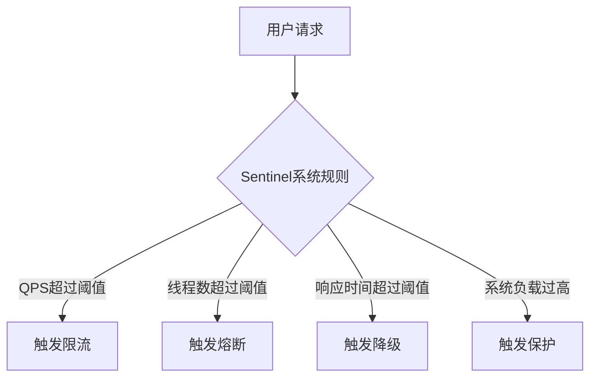

# Sentinel 系统规则最佳实践

Sentinel是阿里巴巴开源的一款轻量级流量控制组件，广泛应用于微服务架构中，用于实现流量控制、熔断降级和系统自适应保护等功能。本文将重点介绍Sentinel系统规则的最佳实践，帮助初学者理解如何通过合理配置规则来保护系统。

## 什么是Sentinel系统规则？

Sentinel系统规则是用于保护系统整体稳定性的规则集合。它通过监控系统的关键指标（如QPS、线程数、响应时间等），在系统负载过高时自动触发保护机制，防止系统崩溃。系统规则的核心目标是确保系统在高并发场景下仍能稳定运行。

## 系统规则的核心指标

Sentinel系统规则主要基于以下几个核心指标：

1. **QPS（每秒查询数）**：限制系统每秒处理的请求数量。
2. **线程数**：限制系统同时处理的请求线程数。
3. **响应时间**：限制请求的平均响应时间。
4. **系统负载**：监控系统的CPU使用率、内存使用率等。

## 系统规则配置示例

以下是一个典型的Sentinel系统规则配置示例：

```java
// 配置系统规则
List<SystemRule> rules = new ArrayList<>();
SystemRule rule = new SystemRule();
rule.setQps(100); // 设置QPS阈值为100
rule.setThreadCount(50); // 设置线程数阈值为50
rule.setAvgRt(200); // 设置平均响应时间阈值为200ms
rule.setHighestSystemLoad(2.0); // 设置系统负载阈值为2.0
rules.add(rule);
SystemRuleManager.loadRules(rules);
```

### 输入与输出

- **输入**：系统规则配置（QPS、线程数、响应时间、系统负载）。
- **输出**：当系统指标超过阈值时，Sentinel会自动触发保护机制，拒绝部分请求或降级服务。

## 系统规则的最佳实践

### 1. 合理设置QPS阈值

QPS是衡量系统处理能力的重要指标。设置QPS阈值时，需要根据系统的实际处理能力进行调整。如果阈值设置过低，可能导致系统资源浪费；如果设置过高，可能导致系统过载。

:::tip
建议通过压力测试工具（如JMeter）对系统进行压测，确定系统的最大QPS，然后根据实际业务需求设置合理的阈值。
:::

### 2. 控制线程数

线程数是影响系统性能的关键因素之一。过多的线程可能导致系统资源耗尽，进而引发系统崩溃。通过设置线程数阈值，可以有效控制系统的并发处理能力。

```java
rule.setThreadCount(50); // 设置线程数阈值为50
```

### 3. 监控响应时间

响应时间是衡量系统性能的重要指标。通过设置响应时间阈值，可以在系统响应变慢时及时触发保护机制，防止系统雪崩。

```java
rule.setAvgRt(200); // 设置平均响应时间阈值为200ms
```

### 4. 动态调整系统负载

系统负载是反映系统整体压力的综合指标。通过监控系统负载，可以在系统压力过大时及时触发保护机制。

```java
rule.setHighestSystemLoad(2.0); // 设置系统负载阈值为2.0
```

## 实际应用场景

### 场景1：电商大促

在电商大促期间，系统可能会面临突发的流量高峰。通过配置Sentinel系统规则，可以有效保护系统，防止因流量过大导致的系统崩溃。



### 场景2：API网关

在API网关中，Sentinel系统规则可以用于保护后端服务，防止因某个API的流量过大而影响其他API的正常运行。

```java
// 配置API网关的系统规则
SystemRule apiRule = new SystemRule();
apiRule.setQps(500); // 设置API网关的QPS阈值为500
apiRule.setThreadCount(100); // 设置线程数阈值为100
SystemRuleManager.loadRules(Collections.singletonList(apiRule));
```

## 总结

Sentinel系统规则是保护系统稳定性的重要工具。通过合理配置QPS、线程数、响应时间和系统负载等指标，可以有效防止系统在高并发场景下崩溃。本文介绍了系统规则的核心概念、配置方法以及实际应用场景，希望能帮助初学者更好地理解和应用Sentinel。

## 附加资源与练习

- **资源**：
  - [Sentinel官方文档](https://sentinelguard.io/)
  - [Sentinel GitHub仓库](https://github.com/alibaba/Sentinel)
- **练习**：
  - 使用Sentinel配置一个简单的系统规则，模拟高并发场景，观察系统的保护机制。
  - 尝试通过压力测试工具（如JMeter）对系统进行压测，调整系统规则，找到最优的配置参数。