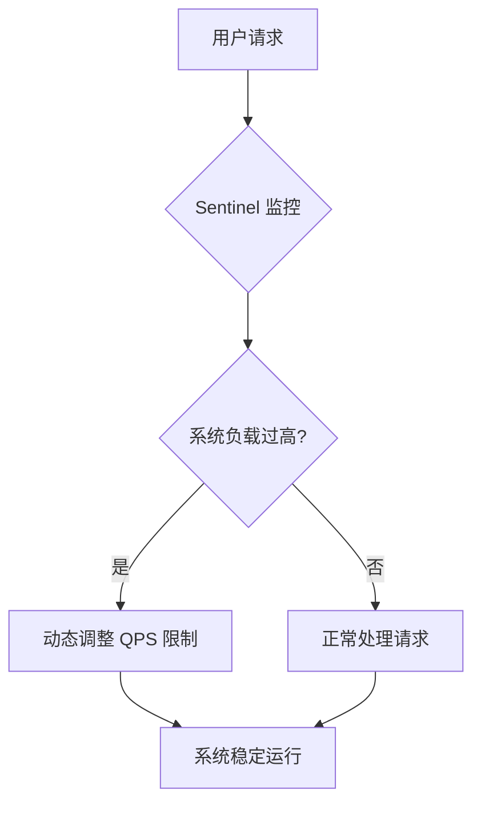

# Sentinel 自适应机制

Sentinel 是阿里巴巴开源的一款流量控制组件，广泛应用于微服务架构中，用于保护系统免受突发流量的冲击。Sentinel 的自适应机制是其核心功能之一，能够根据系统的实时状态动态调整流量控制规则，确保系统在高负载下仍能稳定运行。

## 什么是 Sentinel 自适应机制？

Sentinel 的自适应机制是指系统能够根据当前的流量情况、资源使用率等指标，自动调整流量控制规则，以达到保护系统的目的。这种机制不需要人工干预，能够实时响应系统的变化，确保系统在高并发场景下不会崩溃。

### 自适应机制的核心思想

1. **动态调整规则**：根据系统的实时状态，动态调整流量控制规则，如 QPS（每秒查询率）、线程数等。
2. **实时监控**：通过实时监控系统的各项指标，如 CPU 使用率、响应时间等，来判断系统的健康状况。
3. **自动降级**：当系统负载过高时，自动触发降级策略，减少不必要的请求，保护核心业务。

## Sentinel 自适应机制的工作原理

Sentinel 的自适应机制主要通过以下几个步骤来实现：

1. **数据采集**：Sentinel 会实时采集系统的各项指标，如请求量、响应时间、错误率等。
2. **规则评估**：根据采集到的数据，评估当前的流量控制规则是否合理。
3. **规则调整**：如果发现规则不合理，Sentinel 会自动调整规则，如增加或减少 QPS 限制。
4. **规则生效**：调整后的规则会立即生效，确保系统在高负载下仍能稳定运行。

### 代码示例

以下是一个简单的 Sentinel 自适应机制示例，展示了如何通过代码实现动态调整 QPS 限制。

```java
// 初始化 Sentinel
FlowRule rule = new FlowRule();
rule.setResource("myResource");
rule.setGrade(RuleConstant.FLOW_GRADE_QPS);
rule.setCount(10); // 初始 QPS 限制为 10

// 动态调整 QPS 限制
rule.setCount(20); // 将 QPS 限制调整为 20
```

**输入**：初始 QPS 限制为 10，动态调整为 20。

**输出**：系统会根据新的 QPS 限制来处理请求，确保系统在高负载下仍能稳定运行。

## 实际应用场景

### 场景 1：电商大促

在电商大促期间，系统的流量会突然增加。Sentinel 的自适应机制可以根据系统的实时状态，动态调整流量控制规则，确保系统在高并发场景下不会崩溃。



### 场景 2：API 限流

在 API 限流场景中，Sentinel 可以根据 API 的调用频率，动态调整 QPS 限制，防止 API 被过度调用。

```java
// 初始化 Sentinel
FlowRule rule = new FlowRule();
rule.setResource("myAPI");
rule.setGrade(RuleConstant.FLOW_GRADE_QPS);
rule.setCount(100); // 初始 QPS 限制为 100

// 动态调整 QPS 限制
rule.setCount(200); // 将 QPS 限制调整为 200
```

**输入**：初始 QPS 限制为 100，动态调整为 200。

**输出**：API 会根据新的 QPS 限制来处理请求，防止 API 被过度调用。

## 总结

Sentinel 的自适应机制通过动态调整流量控制规则，确保系统在高负载下仍能稳定运行。这种机制不需要人工干预，能够实时响应系统的变化，是保护系统稳定性的重要手段。

### 附加资源

- [Sentinel 官方文档](https://sentinelguard.io/)
- [Sentinel GitHub 仓库](https://github.com/alibaba/Sentinel)

### 练习

1. 尝试在自己的项目中集成 Sentinel，并测试其自适应机制。
2. 编写一个简单的 API 限流示例，观察 Sentinel 如何动态调整 QPS 限制。

:::tip
在实际应用中，建议结合系统的具体需求，合理配置 Sentinel 的规则，以达到最佳的保护效果。
:::