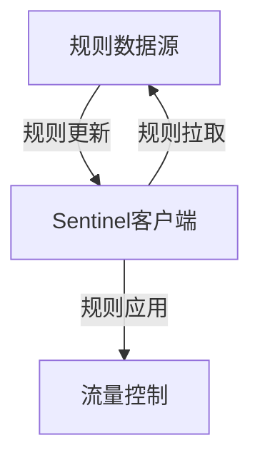

# Sentinel 规则推送模式

Sentinel是阿里巴巴开源的一款轻量级流量控制框架，广泛应用于微服务架构中。Sentinel的核心功能之一是动态规则管理，而**规则推送模式**是实现动态规则管理的关键机制之一。本文将详细介绍Sentinel规则推送模式的概念、工作原理以及实际应用场景。

## 什么是Sentinel规则推送模式？

Sentinel规则推送模式是指通过外部数据源（如配置中心、数据库等）动态地将规则推送到Sentinel客户端，从而实现规则的实时更新和管理。与传统的静态规则配置相比，推送模式能够在不重启应用的情况下动态调整规则，极大地提高了系统的灵活性和可维护性。

:::note
**规则推送模式的核心优势**：无需重启应用即可动态调整规则，适用于需要频繁调整规则的场景。
:::

## 规则推送模式的工作原理

Sentinel的规则推送模式依赖于**规则管理器**和**规则数据源**。规则管理器负责从数据源中获取规则，并将其应用到Sentinel客户端。规则数据源可以是任何支持动态配置的系统，如Nacos、Zookeeper、Redis等。

### 规则推送流程

1. **规则更新**：在规则数据源中更新规则。
2. **规则拉取**：Sentinel客户端定期从规则数据源中拉取最新的规则。
3. **规则应用**：拉取到的规则被应用到Sentinel客户端，实时生效。



:::tip
**规则拉取频率**：Sentinel客户端默认每5秒拉取一次规则，但可以通过配置调整拉取频率。
:::

## 实际应用场景

### 场景1：动态调整限流规则

假设你有一个电商系统，在双十一大促期间，流量会突然激增。为了应对这种情况，你可以通过规则推送模式动态调整限流规则，确保系统在高并发下依然稳定运行。

```java
// 示例：动态调整限流规则
FlowRule rule = new FlowRule();
rule.setResource("orderService");
rule.setCount(100); // 设置限流阈值为100
rule.setGrade(RuleConstant.FLOW_GRADE_QPS);
FlowRuleManager.loadRules(Collections.singletonList(rule));
```

### 场景2：动态调整熔断规则

在微服务架构中，某个服务可能会出现故障，导致调用链路的雪崩效应。通过规则推送模式，你可以动态调整熔断规则，快速隔离故障服务，避免影响整个系统。

```java
// 示例：动态调整熔断规则
DegradeRule degradeRule = new DegradeRule();
degradeRule.setResource("paymentService");
degradeRule.setCount(0.5); // 设置异常比例阈值为50%
degradeRule.setTimeWindow(10); // 设置熔断时长为10秒
DegradeRuleManager.loadRules(Collections.singletonList(degradeRule));
```

## 总结

Sentinel规则推送模式为动态规则管理提供了强大的支持，使得开发者能够在不重启应用的情况下实时调整规则。无论是限流、熔断还是系统保护，规则推送模式都能帮助你快速响应系统变化，确保系统的稳定性和可靠性。

:::caution
**注意事项**：在使用规则推送模式时，务必确保规则数据源的高可用性，避免因数据源故障导致规则失效。
:::

## 附加资源与练习

- **官方文档**：[Sentinel GitHub](https://github.com/alibaba/Sentinel)
- **练习**：尝试在本地搭建一个Sentinel客户端，并使用Nacos作为规则数据源，实现动态规则推送。

通过本文的学习，你应该对Sentinel规则推送模式有了初步的了解。接下来，你可以通过实际操作进一步掌握这一强大的功能。