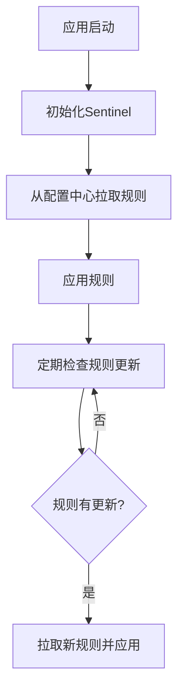

# Sentinel 规则拉取模式

Sentinel是阿里巴巴开源的一款流量控制组件，广泛应用于微服务架构中。Sentinel规则拉取模式是Sentinel中一种重要的规则管理方式，它允许动态地从外部数据源（如配置中心）拉取规则，并在运行时应用这些规则。本文将详细介绍Sentinel规则拉取模式的概念、工作原理以及实际应用场景。

## 什么是Sentinel规则拉取模式？

Sentinel规则拉取模式是指Sentinel在运行时从外部数据源（如Nacos、Zookeeper、Apollo等配置中心）动态获取规则，并根据这些规则进行流量控制。与传统的静态规则配置不同，拉取模式使得规则可以在不重启应用的情况下动态更新，从而提高了系统的灵活性和可维护性。

## 工作原理

Sentinel规则拉取模式的核心思想是将规则的管理与应用的运行时分离。具体来说，Sentinel会定期从配置中心拉取最新的规则，并将其应用到当前的流量控制策略中。这种模式的优势在于：

1. **动态更新**：规则可以在不重启应用的情况下动态更新。
2. **集中管理**：规则可以集中存储在配置中心，便于管理和维护。
3. **高可用性**：即使配置中心暂时不可用，Sentinel仍然可以使用本地缓存中的规则继续工作。

### 规则拉取流程

以下是一个简化的规则拉取流程：



## 代码示例

以下是一个使用Nacos作为配置中心的Sentinel规则拉取模式的示例：

```java
// 初始化Sentinel
InitExecutor.doInit();

// 配置Nacos数据源
String serverAddr = "127.0.0.1:8848";
String groupId = "SENTINEL_GROUP";
String dataId = "flow-rules";

ReadableDataSource<String, List<FlowRule>> flowRuleDataSource = new NacosDataSource<>(serverAddr, groupId, dataId,
    source -> JSON.parseObject(source, new TypeReference<List<FlowRule>>() {}));
FlowRuleManager.register2Property(flowRuleDataSource.getProperty());
```

### 输入与输出

- **输入**：Nacos配置中心中的规则配置，例如：

```json
[
    {
        "resource": "testResource",
        "limitApp": "default",
        "grade": 1,
        "count": 10,
        "strategy": 0,
        "controlBehavior": 0,
        "clusterMode": false
    }
]
```

- **输出**：Sentinel应用中的流量控制规则，例如：

```java
List<FlowRule> rules = FlowRuleManager.getRules();
System.out.println(rules);
```

## 实际应用场景

### 场景1：动态调整限流规则

假设你有一个电商网站，在双十一大促期间，流量会急剧增加。通过Sentinel规则拉取模式，你可以在不重启应用的情况下，动态调整限流规则，以应对突发的流量高峰。

### 场景2：多环境规则管理

在开发、测试和生产环境中，你可能需要不同的限流规则。通过配置中心集中管理规则，可以轻松地在不同环境中切换规则，而无需修改代码。

## 总结

Sentinel规则拉取模式提供了一种灵活、动态的规则管理方式，特别适用于需要频繁调整规则的场景。通过将规则存储在配置中心，Sentinel可以在运行时动态拉取并应用这些规则，从而提高了系统的灵活性和可维护性。

## 附加资源与练习

- **资源**：
  - [Sentinel官方文档](https://sentinelguard.io/zh-cn/docs/introduction.html)
  - [Nacos官方文档](https://nacos.io/zh-cn/docs/what-is-nacos.html)

- **练习**：
  1. 尝试在本地搭建一个Nacos配置中心，并使用Sentinel规则拉取模式动态调整限流规则。
  2. 模拟一个高并发场景，观察Sentinel如何根据动态规则进行流量控制。

通过本文的学习，你应该对Sentinel规则拉取模式有了初步的了解。希望你能在实际项目中灵活运用这一模式，提升系统的稳定性和可维护性。