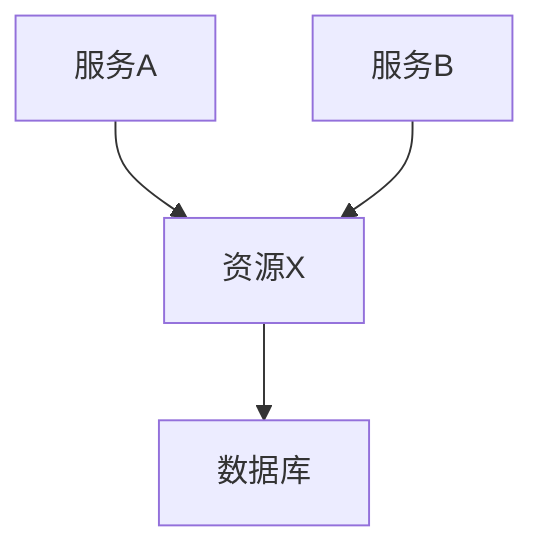
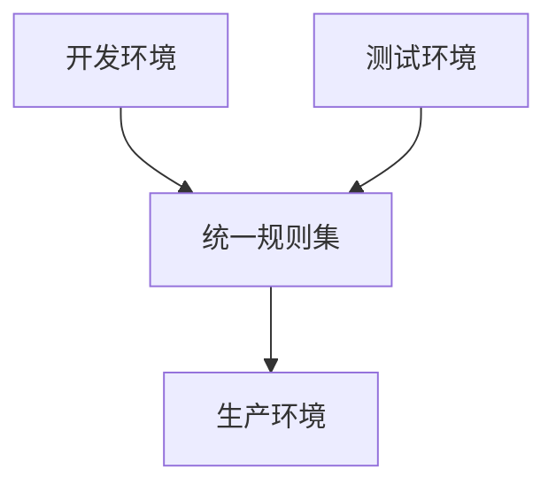

# Sentinel 规则合并策略

Sentinel是阿里巴巴开源的一款轻量级流量控制框架，广泛应用于微服务架构中。在实际开发中，我们可能会定义多个Sentinel规则来管理不同的资源。然而，随着规则数量的增加，如何高效地管理和合并这些规则成为一个重要问题。本文将详细介绍Sentinel规则合并策略，帮助初学者理解并掌握这一概念。

## 什么是Sentinel规则合并策略？

Sentinel规则合并策略是指在多个规则同时作用于同一资源时，如何将这些规则合并为一个统一的规则集。合并策略的目的是确保规则的一致性，避免冲突，并提高规则管理的效率。

### 为什么需要规则合并？

1. **避免冲突**：多个规则可能对同一资源设置不同的限制条件，合并策略可以确保这些规则不会相互冲突。
2. **提高效率**：合并后的规则集可以减少规则的数量，降低管理和维护的复杂度。
3. **简化配置**：通过合并策略，可以将多个规则简化为一个统一的规则，简化配置过程。

## Sentinel 规则合并策略的实现

Sentinel提供了多种规则合并策略，常见的包括：

1. **覆盖策略**：新规则覆盖旧规则。
2. **合并策略**：将多个规则合并为一个统一的规则。
3. **优先级策略**：根据规则的优先级进行合并。

### 覆盖策略

覆盖策略是最简单的合并策略，新规则会直接覆盖旧规则。这种策略适用于需要频繁更新规则的场景。

```java
// 示例：覆盖策略
FlowRule oldRule = new FlowRule();
oldRule.setResource("resourceA");
oldRule.setCount(10);

FlowRule newRule = new FlowRule();
newRule.setResource("resourceA");
newRule.setCount(20);

// 新规则覆盖旧规则
FlowRuleManager.loadRules(Collections.singletonList(newRule));
```

### 合并策略

合并策略将多个规则合并为一个统一的规则。例如，可以将多个流量控制规则合并为一个统一的流量控制规则。

```java
// 示例：合并策略
FlowRule rule1 = new FlowRule();
rule1.setResource("resourceA");
rule1.setCount(10);

FlowRule rule2 = new FlowRule();
rule2.setResource("resourceA");
rule2.setCount(20);

// 合并规则
FlowRule mergedRule = new FlowRule();
mergedRule.setResource("resourceA");
mergedRule.setCount(rule1.getCount() + rule2.getCount());

FlowRuleManager.loadRules(Collections.singletonList(mergedRule));
```

### 优先级策略

优先级策略根据规则的优先级进行合并。优先级高的规则会覆盖优先级低的规则。

```java
// 示例：优先级策略
FlowRule highPriorityRule = new FlowRule();
highPriorityRule.setResource("resourceA");
highPriorityRule.setCount(30);
highPriorityRule.setPriority(1);

FlowRule lowPriorityRule = new FlowRule();
lowPriorityRule.setResource("resourceA");
lowPriorityRule.setCount(20);
lowPriorityRule.setPriority(2);

// 优先级高的规则覆盖优先级低的规则
FlowRuleManager.loadRules(Collections.singletonList(highPriorityRule));
```

## 实际应用场景

### 场景一：微服务流量控制

在微服务架构中，多个服务可能同时访问同一个资源。通过Sentinel规则合并策略，可以确保这些服务对资源的访问不会超出限制。



### 场景二：多环境配置管理

在不同的环境（如开发、测试、生产）中，可能需要设置不同的Sentinel规则。通过规则合并策略，可以将这些环境的规则合并为一个统一的规则集，简化配置管理。



## 总结

Sentinel规则合并策略是管理多个规则的有效方法，能够避免规则冲突、提高管理效率并简化配置过程。通过覆盖策略、合并策略和优先级策略，开发者可以根据实际需求选择合适的合并方式。

### 附加资源

- [Sentinel官方文档](https://sentinelguard.io/)
- [Sentinel GitHub仓库](https://github.com/alibaba/Sentinel)

### 练习

1. 尝试在本地环境中配置多个Sentinel规则，并使用不同的合并策略进行测试。
2. 思考在实际项目中，哪些场景适合使用覆盖策略，哪些场景适合使用合并策略。

通过本文的学习，你应该已经掌握了Sentinel规则合并策略的基本概念和实现方法。希望这些知识能够帮助你在实际项目中更好地管理和应用Sentinel规则。