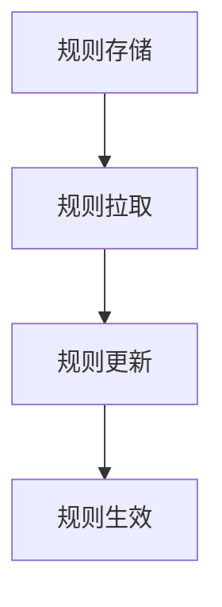

# Sentinel 动态规则数据源

Sentinel是阿里巴巴开源的一款轻量级流量控制框架，广泛用于微服务架构中的流量管理、熔断降级和系统保护。Sentinel的动态规则数据源是其核心功能之一，允许用户在不重启应用的情况下动态更新规则。本文将详细介绍Sentinel动态规则数据源的概念、工作原理及其实际应用。

## 什么是动态规则数据源？

在Sentinel中，规则（如流量控制规则、熔断规则等）通常用于定义系统的保护策略。传统的规则配置方式是通过配置文件或代码硬编码，这种方式在规则需要频繁调整时显得不够灵活。动态规则数据源则提供了一种机制，使得规则可以在运行时动态更新，而无需重启应用。

动态规则数据源的核心思想是将规则的存储和管理从应用中分离出来，通过外部数据源（如数据库、配置中心、文件等）来管理规则。Sentinel会定期从数据源中拉取最新的规则，并应用到系统中。

## 动态规则数据源的工作原理

Sentinel的动态规则数据源通过以下几个步骤实现规则的动态更新：

1. **规则存储**：规则存储在外部数据源中，如数据库、配置中心或文件。
2. **规则拉取**：Sentinel会定期从数据源中拉取最新的规则。
3. **规则更新**：拉取到的规则会被应用到Sentinel的规则管理器中，替换旧的规则。
4. **规则生效**：新的规则会立即生效，影响系统的流量控制和熔断策略。



## 如何使用动态规则数据源

### 1. 配置数据源

首先，你需要配置一个数据源来存储规则。Sentinel支持多种数据源类型，包括文件、数据库、配置中心等。以下是一个使用文件作为数据源的示例：

```java
// 初始化文件数据源
ReadableDataSource<String, List<FlowRule>> flowRuleDataSource = new FileRefreshableDataSource<>(
    "flowRule.json", // 规则文件路径
    source -> JSON.parseObject(source, new TypeReference<List<FlowRule>>() {})
);
FlowRuleManager.register2Property(flowRuleDataSource.getProperty());
```

在这个示例中，`flowRule.json` 文件存储了流量控制规则。Sentinel会定期从该文件中读取规则，并更新到系统中。

### 2. 定义规则

在数据源中定义规则。以下是一个简单的流量控制规则示例：

```json
[
    {
        "resource": "com.example.Resource",
        "count": 10,
        "grade": 1,
        "limitApp": "default",
        "strategy": 0,
        "controlBehavior": 0
    }
]
```

这个规则表示对资源 `com.example.Resource` 的访问进行流量控制，每秒最多允许10次请求。

### 3. 动态更新规则

当规则文件 `flowRule.json` 被修改后，Sentinel会自动检测到变化，并拉取最新的规则应用到系统中。你无需重启应用，新的规则会立即生效。

## 实际应用场景

### 场景1：电商平台的秒杀活动

在电商平台的秒杀活动中，流量可能会在短时间内激增。通过使用Sentinel的动态规则数据源，可以在活动开始前调整流量控制规则，限制每个用户的请求频率，防止系统崩溃。

### 场景2：微服务架构中的熔断降级

在微服务架构中，某个服务的故障可能会影响整个系统的稳定性。通过动态规则数据源，可以实时调整熔断规则，快速隔离故障服务，保证系统的可用性。

## 总结

Sentinel的动态规则数据源提供了一种灵活的方式来管理系统的流量控制和熔断规则。通过将规则存储在外部数据源中，Sentinel可以在运行时动态更新规则，而无需重启应用。这种方式特别适用于需要频繁调整规则的场景，如电商平台的秒杀活动或微服务架构中的熔断降级。

## 附加资源

- [Sentinel官方文档](https://sentinelguard.io/zh-cn/docs/introduction.html)
- [Sentinel GitHub仓库](https://github.com/alibaba/Sentinel)

## 练习

1. 尝试配置一个使用数据库作为数据源的Sentinel动态规则数据源。
2. 编写一个简单的流量控制规则，并通过动态规则数据源应用到系统中，观察规则的变化对系统的影响。
