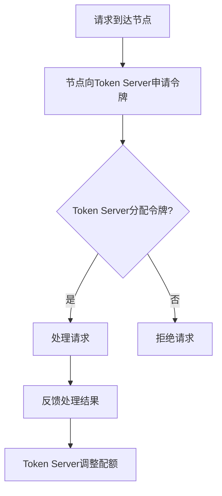

# Sentinel 集群流控概述

## 介绍

Sentinel是阿里巴巴开源的一款轻量级流量控制组件，主要用于保护分布式系统中的服务稳定性。**集群流控**是Sentinel的一个重要特性，它允许在分布式环境中对多个节点的流量进行统一控制，确保整个系统的稳定性。

在单机流控中，每个节点独立控制自己的流量，但在分布式系统中，单机流控无法应对全局流量突增的情况。集群流控通过协调多个节点的流量控制，确保整个系统的流量在安全范围内。

## 集群流控的工作原理

集群流控的核心思想是将流量控制的责任从单个节点转移到整个集群。Sentinel通过一个中心化的Token Server来管理集群中的流量配额。每个节点在需要处理请求时，会向Token Server申请令牌（Token），只有获得令牌的请求才会被处理。

### 工作流程

1. **请求到达**：当一个请求到达某个节点时，节点会向Token Server申请令牌。
2. **令牌分配**：Token Server根据当前的流量配额和集群状态，决定是否分配令牌。
3. **请求处理**：如果节点获得令牌，请求会被处理；否则，请求会被拒绝或进入等待队列。
4. **反馈机制**：节点将处理结果反馈给Token Server，Token Server根据反馈调整流量配额。



## 代码示例

以下是一个简单的Sentinel集群流控配置示例：

```java
// 初始化集群流控规则
ClusterFlowRuleManager.loadRules(Collections.singletonList(
    new ClusterFlowRule("resourceName")
        .setThreshold(100) // 设置集群流量阈值
        .setStrategy(ClusterRuleConstant.FLOW_CLUSTER_STRATEGY_NORMAL) // 设置流控策略
));

// 在代码中使用集群流控
Entry entry = null;
try {
    entry = SphU.entry("resourceName");
    // 业务逻辑处理
} catch (BlockException e) {
    // 处理被流控的情况
} finally {
    if (entry != null) {
        entry.exit();
    }
}
```

:::note
在上面的代码中，`ClusterFlowRuleManager.loadRules`用于加载集群流控规则，`SphU.entry`用于在代码中应用流控。
:::

## 实际应用场景

### 场景1：电商大促

在电商大促期间，某些热门商品的访问量可能会突然激增。如果每个节点独立控制流量，可能会导致某些节点过载，而其他节点资源闲置。通过集群流控，可以确保整个系统的流量均匀分布，避免单点过载。

### 场景2：微服务架构

在微服务架构中，某个服务的多个实例可能分布在不同的节点上。如果某个实例的流量突增，可能会导致整个服务的响应时间变长。通过集群流控，可以确保所有实例的流量在安全范围内，从而保证服务的稳定性。

## 总结

Sentinel集群流控是分布式系统中保护服务稳定性的重要工具。它通过协调多个节点的流量控制，确保整个系统的流量在安全范围内。本文介绍了集群流控的基本概念、工作原理，并通过代码示例和实际场景展示了其应用。

## 附加资源

- [Sentinel官方文档](https://sentinelguard.io/)
- [Sentinel GitHub仓库](https://github.com/alibaba/Sentinel)

## 练习

1. 尝试在本地环境中配置Sentinel集群流控，并模拟高流量场景，观察流控效果。
2. 阅读Sentinel官方文档，了解更多高级流控策略和配置选项。
