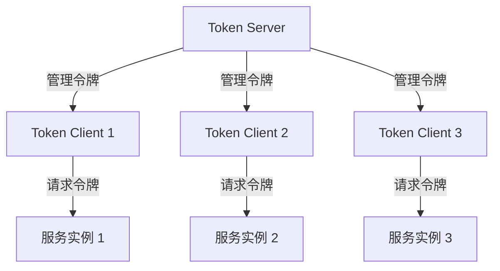

# Sentinel 集群流控架构

Sentinel是阿里巴巴开源的一款轻量级流量控制组件，广泛用于微服务架构中，用于保护系统的稳定性和高可用性。**集群流控**是Sentinel的一个重要特性，它允许在分布式环境中对流量进行全局控制，而不仅仅是单机级别的限流。本文将详细介绍Sentinel集群流控的架构、工作原理以及实际应用场景。

## 什么是集群流控？

在微服务架构中，服务通常以集群的形式部署在多台机器上。传统的单机流控只能对单台机器的流量进行限制，无法应对整个集群的流量波动。**集群流控**通过在集群中共享流量数据，实现对整个集群的流量进行统一控制，从而更好地保护系统的稳定性。

## Sentinel 集群流控架构

Sentinel的集群流控架构主要由以下几个组件组成：

1. **Token Server**：负责管理集群中的令牌（Token），并根据集群的流量情况动态调整令牌的发放速率。
2. **Token Client**：部署在每个服务实例上，负责与Token Server通信，获取令牌并根据令牌的发放情况决定是否允许请求通过。
3. **规则管理**：通过Sentinel Dashboard或API动态配置集群流控规则。

### 架构图



### 工作原理

1. **初始化**：在集群中启动一个Token Server，其他服务实例作为Token Client与Token Server建立连接。
2. **规则配置**：通过Sentinel Dashboard或API配置集群流控规则，例如QPS（每秒查询率）限制。
3. **令牌请求**：当服务实例收到请求时，Token Client会向Token Server请求令牌。
4. **令牌发放**：Token Server根据当前的流量情况和配置的规则，决定是否发放令牌。
5. **请求处理**：如果Token Client成功获取到令牌，则允许请求通过；否则，请求将被拒绝。

## 代码示例

以下是一个简单的Sentinel集群流控配置示例：

```java
// 配置集群流控规则
FlowRule rule = new FlowRule();
rule.setResource("cluster-resource");
rule.setGrade(RuleConstant.FLOW_GRADE_QPS);
rule.setCount(100); // 集群QPS限制为100
rule.setClusterMode(true); // 启用集群模式
rule.setClusterConfig(new ClusterFlowConfig()
    .setFlowId(12345L) // 集群流控规则ID
    .setThresholdType(ClusterRuleConstant.FLOW_THRESHOLD_GLOBAL) // 全局阈值
);

// 加载规则
FlowRuleManager.loadRules(Collections.singletonList(rule));
```

### 输入与输出

- **输入**：每秒100个请求。
- **输出**：如果集群的QPS超过100，多余的请求将被拒绝。

## 实际应用场景

### 场景1：电商大促

在电商大促期间，某些热门商品的访问量可能会激增。通过Sentinel集群流控，可以确保整个集群的QPS不超过系统承载能力，从而避免系统崩溃。

### 场景2：API网关限流

在API网关中，通常需要对某些高频率调用的API进行限流。通过Sentinel集群流控，可以在整个网关集群中对这些API进行统一的流量控制，确保系统的稳定性。

## 总结

Sentinel集群流控是分布式系统中保护系统稳定性的重要工具。通过Token Server和Token Client的协作，Sentinel能够实现对集群流量的全局控制。本文介绍了Sentinel集群流控的架构、工作原理以及实际应用场景，并通过代码示例展示了如何配置集群流控规则。

## 附加资源与练习

- **练习1**：尝试在本地环境中部署一个Sentinel集群流控示例，并观察流量控制的效果。
- **练习2**：阅读Sentinel官方文档，了解更多高级功能，如热点参数限流、系统自适应保护等。

:::tip
如果你对Sentinel的其他功能感兴趣，可以继续学习Sentinel的单机流控、熔断降级等特性。
:::