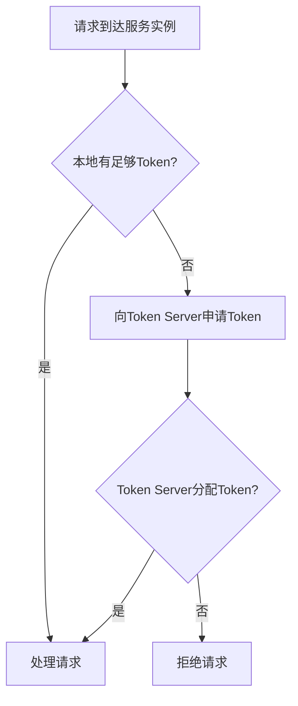

# Sentinel 集群流控性能

Sentinel是阿里巴巴开源的一款轻量级流量控制组件，广泛应用于微服务架构中，用于保护系统的稳定性。**集群流控**是Sentinel的一个重要特性，它能够在分布式环境中对流量进行全局控制。本文将详细介绍Sentinel集群流控的性能特点，并通过实际案例帮助初学者理解其应用场景。

## 什么是Sentinel集群流控？

在微服务架构中，单个服务的流量控制可能无法满足全局的需求。例如，当多个服务实例共同处理请求时，单个实例的流控规则可能无法有效保护整个系统。**Sentinel集群流控**通过在集群级别对流量进行控制，确保整个系统的稳定性。

集群流控的核心思想是将流控规则集中管理，并通过集群中的某个节点（通常是Token Server）来协调各个实例的流量控制。这种方式能够避免单点流控的局限性，提升系统的整体性能。

## 集群流控的工作原理

Sentinel集群流控的工作流程可以分为以下几个步骤：

1. **规则下发**：流控规则由配置中心下发到各个服务实例。
2. **请求拦截**：每个服务实例在接收到请求时，会先检查本地缓存中的流控规则。
3. **Token申请**：如果本地缓存中没有足够的Token（即流量配额），实例会向Token Server申请Token。
4. **Token分配**：Token Server根据全局的流控规则，决定是否分配Token给请求实例。
5. **请求处理**：如果申请到Token，请求会被处理；否则，请求会被拒绝。



## 集群流控的性能特点

### 1. 高并发处理能力

Sentinel集群流控通过Token Server集中管理流量配额，能够有效应对高并发场景。Token Server采用高效的算法进行Token分配，确保在高并发情况下仍能快速响应。

### 2. 低延迟

由于Token Server与各个服务实例之间的通信是基于轻量级的RPC协议，因此集群流控的延迟非常低。即使在分布式环境中，流控决策也能在毫秒级别完成。

### 3. 动态调整能力

Sentinel集群流控支持动态调整流控规则。当系统负载发生变化时，管理员可以通过配置中心实时更新流控规则，而无需重启服务。

### 4. 容错机制

Sentinel集群流控具备良好的容错机制。如果Token Server发生故障，各个服务实例可以降级为本地流控模式，确保系统仍能正常运行。

## 实际案例：电商系统的秒杀场景

假设我们有一个电商系统，在秒杀活动期间会面临巨大的流量冲击。为了确保系统的稳定性，我们可以使用Sentinel集群流控来限制每秒的请求量。

### 场景描述

- 系统中有10个服务实例，每个实例最多处理100个请求/秒。
- 全局流控规则设置为1000个请求/秒。

### 实现步骤

1. **配置流控规则**：在Sentinel控制台中，设置全局流控规则为1000个请求/秒。
2. **启动Token Server**：在集群中选择一个节点作为Token Server。
3. **部署服务实例**：将流控规则下发到各个服务实例。
4. **监控流量**：通过Sentinel Dashboard实时监控流量情况，确保系统稳定运行。

### 代码示例

以下是一个简单的Java代码示例，展示如何在服务实例中配置Sentinel集群流控：

```java
// 引入Sentinel依赖
import com.alibaba.csp.sentinel.annotation.SentinelResource;
import com.alibaba.csp.sentinel.slots.block.BlockException;

public class SeckillService {

    @SentinelResource(value = "seckill", blockHandler = "handleBlock")
    public String seckill(String productId) {
        // 处理秒杀请求
        return "秒杀成功: " + productId;
    }

    // 流控降级处理
    public String handleBlock(String productId, BlockException ex) {
        return "秒杀失败: 请求被限流";
    }
}
```

### 输入与输出

- **输入**：用户发起秒杀请求，例如 `seckill("product123")`。
- **输出**：
  - 如果请求通过流控检查，返回 `"秒杀成功: product123"`。
  - 如果请求被限流，返回 `"秒杀失败: 请求被限流"`。

## 总结

Sentinel集群流控是一种强大的流量控制机制，能够在分布式环境中有效保护系统的稳定性。通过集中管理流量配额，Sentinel集群流控具备高并发处理能力、低延迟、动态调整能力和良好的容错机制。在实际应用中，如电商系统的秒杀场景，Sentinel集群流控能够显著提升系统的抗压能力。

## 附加资源与练习

- **官方文档**：[Sentinel GitHub](https://github.com/alibaba/Sentinel)
- **练习**：尝试在自己的微服务项目中集成Sentinel集群流控，并模拟高并发场景进行测试。

:::tip
提示：在实际生产环境中，建议结合监控系统（如Prometheus）和告警系统（如AlertManager）一起使用，以便及时发现和处理流量异常。
:::