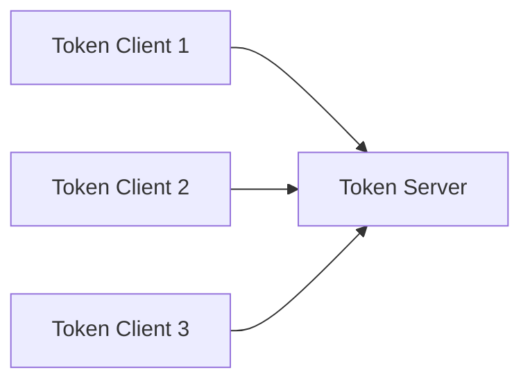

# Sentinel 集群流控高可用

## 介绍

Sentinel 是阿里巴巴开源的一款面向分布式服务架构的流量控制组件，主要用于保护系统的稳定性。在高并发场景下，单个节点的流量控制可能无法满足需求，因此 Sentinel 提供了**集群流控**功能，允许在多个节点之间共享流量控制状态，从而实现高可用性和一致性。

本文将详细介绍 Sentinel 集群流控的高可用性机制，并通过实际案例展示其应用场景。

---

## 什么是集群流控？

集群流控是指在分布式系统中，多个节点共同参与流量控制决策。与单机流控不同，集群流控需要协调多个节点的流量数据，确保整个系统的流量控制策略一致。

Sentinel 的集群流控通过以下方式实现高可用性：

1. **Token Server**：负责管理集群中的流量控制状态，分配令牌（Token）。
2. **Token Client**：向 Token Server 请求令牌，并根据响应决定是否允许请求通过。

:::tip
集群流控的核心思想是将流量控制的状态集中管理，避免单点故障，同时确保多个节点的流量控制策略一致。
:::

---

## 集群流控的工作原理

### 1. Token Server 和 Token Client

在 Sentinel 的集群流控中，Token Server 是核心组件，负责管理整个集群的流量控制状态。Token Client 则是每个服务节点上的 Sentinel 实例，负责向 Token Server 请求令牌。



### 2. 令牌分配机制

Token Server 根据预设的流量控制规则（如 QPS、线程数等）分配令牌。如果 Token Client 请求的令牌数量超过限制，Token Server 会拒绝请求，从而触发流控。

### 3. 高可用性保障

Sentinel 通过以下机制确保集群流控的高可用性：

- **多 Token Server 部署**：支持多个 Token Server 实例，避免单点故障。
- **故障切换**：当某个 Token Server 不可用时，Token Client 可以自动切换到其他可用的 Token Server。
- **数据一致性**：通过分布式一致性协议（如 Raft）确保多个 Token Server 之间的状态一致。

---

## 实际案例：电商系统的集群流控

假设我们有一个电商系统，包含多个服务节点（如商品服务、订单服务、支付服务）。在高并发场景下，我们需要对支付服务进行流量控制，以防止系统过载。

### 1. 配置 Token Server

首先，我们需要部署一个 Token Server，并配置其流量控制规则。例如，限制支付服务的 QPS 为 1000。

```java
// Token Server 配置
ClusterFlowRuleManager.loadRules(Collections.singletonList(
    new ClusterFlowRule("payment-service")
        .setThreshold(1000)
        .setStrategy(ClusterRuleConstant.FLOW_CLUSTER_STRATEGY_NORMAL)
));
```

### 2. 配置 Token Client

在每个支付服务节点上，配置 Token Client 并连接到 Token Server。

```java
// Token Client 配置
ClusterClientConfig clientConfig = new ClusterClientConfig();
clientConfig.setServerHost("token-server-ip");
clientConfig.setServerPort(9999);
ClusterClientConfigManager.applyNewConfig(clientConfig);
```

### 3. 测试流量控制

当支付服务的 QPS 超过 1000 时，Token Server 会拒绝多余的请求，从而保护系统不被过载。

---

## 总结

Sentinel 的集群流控通过集中管理流量控制状态，实现了分布式系统的高可用性和一致性。通过 Token Server 和 Token Client 的协作，Sentinel 能够有效应对高并发场景下的流量控制需求。

:::note
在实际应用中，建议部署多个 Token Server 实例，并通过分布式一致性协议确保数据一致性，从而提高系统的可靠性。
:::

---

## 附加资源与练习

### 资源
- [Sentinel 官方文档](https://sentinelguard.io/)
- [Sentinel GitHub 仓库](https://github.com/alibaba/Sentinel)

### 练习
1. 尝试在本地部署一个 Token Server 和多个 Token Client，模拟高并发场景下的流量控制。
2. 修改 Token Server 的流量控制规则，观察 Token Client 的行为变化。
3. 研究 Sentinel 的故障切换机制，并测试其在高可用性场景下的表现。