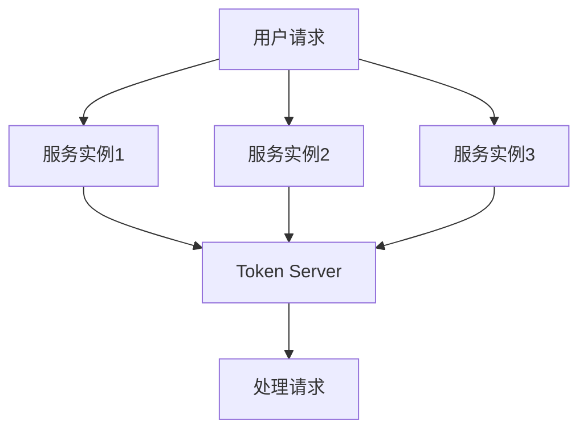

# Sentinel 集群限流规则

在现代分布式系统中，流量控制是确保系统稳定性和高可用性的关键。Sentinel 是阿里巴巴开源的一款流量控制组件，支持单机限流和集群限流。本文将重点介绍 **Sentinel集群限流规则**，帮助初学者理解其工作原理、配置方法以及实际应用场景。

## 什么是Sentinel集群限流？

Sentinel集群限流是一种分布式流量控制机制，用于在多个服务实例之间共享流量控制规则。与单机限流不同，集群限流能够跨多个节点协同工作，确保整个集群的流量在可控范围内。

:::note
**单机限流 vs 集群限流**  
- 单机限流：仅针对单个服务实例进行流量控制。  
- 集群限流：跨多个服务实例协同控制流量，适用于分布式系统。
:::

## 集群限流的核心概念

### 1. Token Server
集群限流的核心是 **Token Server**，它是一个独立的服务，负责管理全局的流量配额。每个服务实例（称为 **Token Client**）会向 Token Server 申请令牌（Token），只有获得令牌的请求才能被处理。

### 2. 限流规则
Sentinel集群限流规则定义了流量的控制策略，包括：
- **阈值类型**：QPS（每秒请求数）或线程数。
- **限流模式**：单机限流或集群限流。
- **集群规则配置**：包括 Token Server 地址、限流阈值等。

### 3. 流量控制算法
Sentinel 使用 **滑动窗口算法** 和 **漏桶算法** 来实现精确的流量控制。

## 配置Sentinel集群限流规则

以下是一个简单的集群限流规则配置示例：

```java
// 定义集群限流规则
FlowRule rule = new FlowRule();
rule.setResource("cluster-resource"); // 资源名称
rule.setGrade(RuleConstant.FLOW_GRADE_QPS); // 限流阈值类型（QPS）
rule.setCount(100); // 限流阈值
rule.setClusterMode(true); // 启用集群限流模式
rule.setClusterConfig(new ClusterFlowConfig()
    .setFlowId(12345L) // 集群规则ID
    .setThresholdType(ClusterRuleConstant.FLOW_THRESHOLD_GLOBAL) // 全局阈值
    .setFallbackToLocalWhenFail(true)); // Token Server 不可用时降级为单机限流

// 加载规则
FlowRuleManager.loadRules(Collections.singletonList(rule));
```

:::tip
**规则配置说明**  
- `setResource`：定义需要限流的资源名称。  
- `setGrade`：设置限流阈值类型（QPS 或线程数）。  
- `setCount`：设置限流阈值。  
- `setClusterMode(true)`：启用集群限流模式。  
- `setFallbackToLocalWhenFail(true)`：当 Token Server 不可用时，自动降级为单机限流。
:::

## 实际应用场景

### 场景1：电商秒杀活动
在电商平台的秒杀活动中，大量用户同时访问可能导致系统崩溃。通过 Sentinel 集群限流，可以控制全局的请求量，确保系统稳定运行。



### 场景2：API网关限流
在微服务架构中，API 网关需要限制每个服务的调用频率。通过 Sentinel 集群限流，可以实现跨多个网关实例的全局流量控制。

## 总结

Sentinel集群限流规则是分布式系统中实现流量控制的重要工具。通过 Token Server 和限流规则的配置，可以有效防止系统过载，提升系统的稳定性和可用性。对于初学者来说，理解集群限流的核心概念和配置方法是掌握 Sentinel 的关键。

:::caution
**注意事项**  
- 确保 Token Server 的高可用性，避免单点故障。  
- 合理设置限流阈值，避免过度限制导致用户体验下降。
:::

## 附加资源与练习

1. **官方文档**：访问 [Sentinel 官方文档](https://sentinelguard.io/) 了解更多高级功能。  
2. **练习**：尝试在本地搭建一个 Sentinel 集群限流环境，并配置规则进行测试。  
3. **扩展阅读**：学习 Sentinel 的其他功能，如熔断降级、系统自适应保护等。

希望本文能帮助你更好地理解 Sentinel 集群限流规则！如果有任何问题，欢迎在评论区留言讨论。