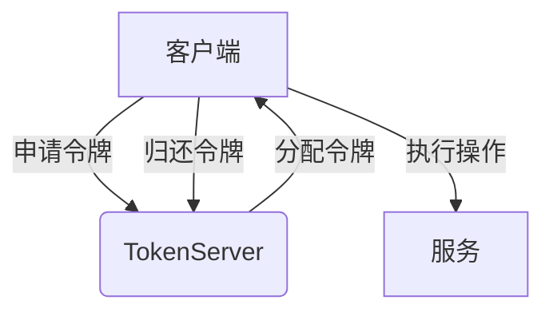

# Sentinel TokenServer 模式

Sentinel 是阿里巴巴开源的一款流量控制组件，广泛应用于微服务架构中。在分布式系统中，单机的流控能力有限，因此 Sentinel 提供了集群流控功能，而 **TokenServer 模式** 是实现集群流控的核心机制之一。本文将详细介绍 Sentinel 的 TokenServer 模式，帮助初学者理解其工作原理和应用场景。

---

## 什么是 TokenServer 模式？

TokenServer 模式是 Sentinel 集群流控的一种实现方式。它通过一个中心化的 **TokenServer** 来管理所有客户端的令牌请求，从而实现全局的流量控制。TokenServer 负责分配令牌（Token），客户端需要从 TokenServer 获取令牌后才能执行操作。如果令牌不足，客户端将被限流。

:::note
**令牌（Token）** 是流控的基本单位，表示允许通过的请求数量。每个请求需要消耗一个令牌。
:::

---

## TokenServer 模式的工作原理

TokenServer 模式的核心思想是将流控逻辑集中到一个中心节点（TokenServer），客户端通过与该节点通信来获取令牌。以下是其工作流程：

1. **客户端发送请求**：客户端在执行操作前，向 TokenServer 发送请求，申请令牌。
2. **TokenServer 分配令牌**：TokenServer 根据当前的流控规则和剩余令牌数量，决定是否分配令牌。
3. **客户端执行操作**：如果客户端成功获取令牌，则执行操作；否则，触发限流逻辑。
4. **令牌回收**：操作完成后，客户端将令牌归还给 TokenServer。

以下是一个简单的流程图：



---

## 如何配置 TokenServer 模式

### 1. 启动 TokenServer

首先，需要在集群中选择一个节点作为 TokenServer。可以通过以下代码启动 TokenServer：

```java
// 启动 TokenServer
ClusterTokenServer tokenServer = new SentinelDefaultTokenServer();
tokenServer.start();
```

### 2. 配置客户端

客户端需要配置 TokenServer 的地址，以便与其通信。以下是一个客户端的配置示例：

```java
// 配置 TokenServer 地址
ClusterFlowConfig config = new ClusterFlowConfig();
config.setServerHost("127.0.0.1");
config.setServerPort(9999);

// 应用配置
ClusterStateManager.applyConfig(config);
```

### 3. 定义流控规则

在 TokenServer 上定义流控规则，例如每秒允许通过的请求数量：

```java
FlowRule rule = new FlowRule();
rule.setResource("testResource");
rule.setCount(100); // 每秒允许 100 个请求
rule.setGrade(RuleConstant.FLOW_GRADE_QPS);
FlowRuleManager.loadRules(Collections.singletonList(rule));
```

---

## 实际应用场景

### 场景：电商系统的秒杀活动

在电商系统的秒杀活动中，瞬时流量可能非常高。通过 Sentinel 的 TokenServer 模式，可以实现全局的流量控制，避免系统崩溃。

1. **TokenServer 部署**：在秒杀活动期间，部署一个 TokenServer 来管理所有用户的请求。
2. **客户端请求令牌**：用户在点击“秒杀”按钮时，客户端向 TokenServer 申请令牌。
3. **限流保护**：如果令牌不足，用户会收到“活动太火爆，请稍后再试”的提示，从而保护系统不被压垮。

---

## 总结

Sentinel 的 TokenServer 模式通过集中式令牌管理，实现了高效的集群流控。它适用于高并发场景，能够有效保护系统不被过载。通过本文的学习，你应该已经掌握了 TokenServer 模式的基本原理、配置方法以及实际应用场景。

---

## 附加资源与练习

### 资源
- [Sentinel 官方文档](https://sentinelguard.io/)
- [GitHub 仓库](https://github.com/alibaba/Sentinel)

### 练习
1. 尝试在本地的微服务项目中集成 Sentinel，并配置 TokenServer 模式。
2. 模拟高并发场景，观察 TokenServer 的流控效果。
3. 修改流控规则，测试不同配置下的系统表现。

:::tip
如果你在配置过程中遇到问题，可以参考 Sentinel 的官方文档或社区论坛，获取更多帮助。
:::