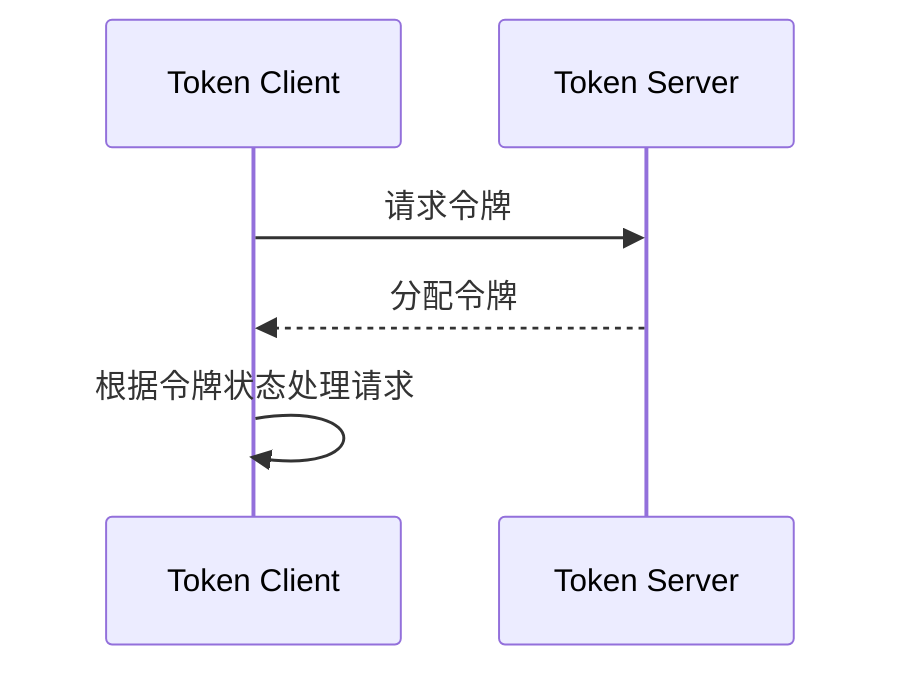

# Sentinel 集群节点通信

Sentinel是阿里巴巴开源的一款轻量级流量控制组件，广泛用于分布式系统中的流量管理、熔断降级和系统保护。在Sentinel集群模式下，多个节点需要协同工作以实现全局的流量控制。因此，**集群节点通信**是实现这一目标的关键机制。

本文将详细介绍Sentinel集群节点通信的工作原理、实现方式以及实际应用场景，帮助初学者深入理解这一重要概念。

---

## 什么是Sentinel集群节点通信？

在Sentinel集群模式下，多个节点（通常是部署在不同机器上的Sentinel实例）需要共享流量控制的状态信息。为了实现这一点，节点之间需要进行通信，以确保每个节点都能获取到全局的流量控制状态。

**集群节点通信**是指Sentinel集群中的各个节点通过网络协议（如HTTP或RPC）交换流量控制数据的过程。通过这种通信机制，Sentinel能够实现集群级别的流量控制，而不仅仅是单机级别的控制。

---

## 集群节点通信的工作原理

Sentinel集群节点通信的核心是**Token Server**和**Token Client**的协作模式。在这种模式下：

1. **Token Server**：负责管理全局的流量控制状态，并分配令牌（Token）给各个客户端。
2. **Token Client**：向Token Server请求令牌，并根据令牌的状态决定是否允许请求通过。

### 通信流程

以下是Sentinel集群节点通信的基本流程：

1. **初始化**：每个Sentinel节点启动时，会配置为Token Server或Token Client。
2. **请求令牌**：Token Client向Token Server发送请求，获取令牌。
3. **令牌分配**：Token Server根据当前的流量控制规则，决定是否分配令牌。
4. **响应处理**：Token Client根据收到的响应，决定是否允许请求通过。



---

## 代码示例

以下是一个简单的代码示例，展示如何在Sentinel中配置集群节点通信。

### 配置Token Server

```java
// 配置Token Server
ClusterTokenServer tokenServer = new SentinelDefaultTokenServer();
tokenServer.start();
```

### 配置Token Client

```java
// 配置Token Client
ClusterClientConfig clientConfig = new ClusterClientConfig();
clientConfig.setServerHost("127.0.0.1");
clientConfig.setServerPort(8720);

ClusterClientStateManager.applyNewConfig(clientConfig);
```

### 请求令牌

```java
// 请求令牌
if (ClusterStateManager.isClient()) {
    TokenResult result = ClusterStateManager.requestToken(1, 1);
    if (result.isPass()) {
        // 允许请求通过
    } else {
        // 拒绝请求
    }
}
```

---

## 实际应用场景

Sentinel集群节点通信在以下场景中尤为重要：

1. **分布式系统流量控制**：在微服务架构中，多个服务实例需要共享流量控制状态，以避免单个实例过载。
2. **高并发场景**：在电商大促或秒杀活动中，集群节点通信可以确保系统在高并发情况下的稳定性。
3. **多数据中心部署**：在跨数据中心的部署中，集群节点通信可以实现全局的流量控制。

---

## 总结

Sentinel集群节点通信是实现分布式系统流量控制的核心机制。通过Token Server和Token Client的协作，Sentinel能够在集群级别实现高效的流量管理。本文介绍了集群节点通信的基本概念、工作原理、代码示例以及实际应用场景，希望能够帮助初学者更好地理解这一重要技术。

---

## 附加资源与练习

- **官方文档**：[Sentinel GitHub](https://github.com/alibaba/Sentinel)
- **练习**：尝试在自己的项目中配置Sentinel集群模式，并观察集群节点通信的效果。
- **扩展阅读**：学习Sentinel的其他功能，如熔断降级、系统保护等。

:::tip
如果你在配置过程中遇到问题，可以参考Sentinel的官方文档或社区论坛，获取更多帮助。
:::