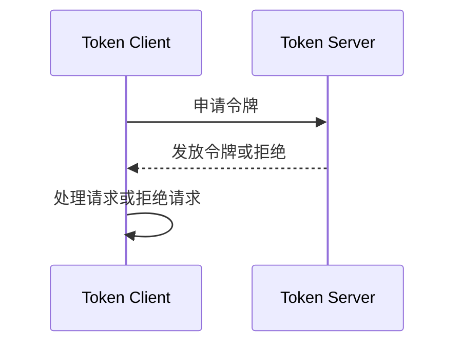

# Sentinel 集群流控场景

## 介绍

Sentinel 是阿里巴巴开源的一款轻量级流量控制组件，主要用于保护分布式系统中的服务稳定性。**集群流控**是 Sentinel 提供的一种高级功能，它允许在分布式环境中对多个节点的流量进行统一控制。通过集群流控，您可以确保整个集群的流量在预设的阈值范围内，从而避免单点过载或资源耗尽的问题。

在单机流控中，每个节点独立控制自己的流量，但在分布式系统中，这种方式可能会导致整体流量超出预期。集群流控通过协调多个节点的流量，确保整个系统的稳定性。

## 集群流控的核心概念

### 1. Token Server 和 Token Client
在集群流控中，Sentinel 引入了 **Token Server** 和 **Token Client** 的概念：
- **Token Server**：负责管理全局的流量配额，决定是否允许请求通过。
- **Token Client**：向 Token Server 申请令牌（Token），并根据响应决定是否处理请求。

### 2. 集群流控规则
集群流控规则定义了流控的阈值和行为。以下是一个典型的集群流控规则配置：

```json
{
  "resource": "cluster-resource",
  "count": 100,
  "grade": 1,
  "strategy": 0,
  "controlBehavior": 0,
  "clusterMode": true
}
```

- `resource`：需要保护的资源名称。
- `count`：流控阈值，表示每秒允许通过的请求数。
- `grade`：流控模式，1 表示基于 QPS 的流控。
- `strategy`：流控策略，0 表示直接拒绝。
- `controlBehavior`：流控行为，0 表示快速失败。
- `clusterMode`：是否启用集群模式。

### 3. 集群流控的工作原理
以下是一个简化的集群流控工作流程：
1. 客户端（Token Client）向 Token Server 发送请求，申请令牌。
2. Token Server 根据全局配额决定是否发放令牌。
3. 如果令牌发放成功，客户端处理请求；否则，拒绝请求。



## 实际应用场景

### 场景 1：电商秒杀活动
在电商平台的秒杀活动中，大量用户会在短时间内涌入系统。如果不对流量进行控制，可能会导致系统崩溃。通过集群流控，可以限制整个集群的请求量，确保系统稳定运行。

:::tip
**示例代码：**
```java
// 定义集群流控规则
FlowRule rule = new FlowRule();
rule.setResource("seckill");
rule.setCount(1000); // 每秒最多允许 1000 个请求
rule.setGrade(RuleConstant.FLOW_GRADE_QPS);
rule.setClusterMode(true); // 启用集群模式
FlowRuleManager.loadRules(Collections.singletonList(rule));
```
:::

### 场景 2：API 网关限流
在微服务架构中，API 网关是流量的入口。通过集群流控，可以防止某个服务的流量过大，影响其他服务的正常运行。

:::note
**示例代码：**
```java
// 在 API 网关中应用集群流控
FlowRule rule = new FlowRule();
rule.setResource("api-gateway");
rule.setCount(500); // 每秒最多允许 500 个请求
rule.setGrade(RuleConstant.FLOW_GRADE_QPS);
rule.setClusterMode(true); // 启用集群模式
FlowRuleManager.loadRules(Collections.singletonList(rule));
```
:::

## 总结

Sentinel 的集群流控功能为分布式系统提供了强大的流量控制能力。通过协调多个节点的流量，它可以有效防止系统过载，确保服务的稳定性。无论是电商秒杀活动还是 API 网关限流，集群流控都能发挥重要作用。

## 附加资源与练习

1. **官方文档**：访问 [Sentinel 官方文档](https://sentinelguard.io/) 了解更多高级功能。
2. **练习**：尝试在本地搭建一个 Sentinel 集群，并配置集群流控规则，观察其效果。
3. **扩展阅读**：学习 Sentinel 的其他功能，如熔断降级、系统自适应保护等。

:::caution
**注意**：在实际生产环境中使用集群流控时，请确保 Token Server 的高可用性，避免单点故障。
:::