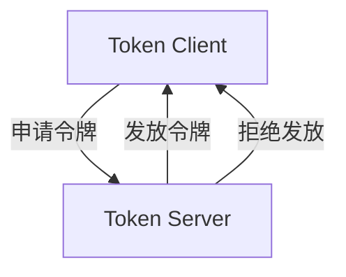

# Sentinel 集群流控监控

## 介绍

Sentinel是阿里巴巴开源的一款轻量级的流量控制组件，广泛应用于微服务架构中，用于保护服务免受突发流量的冲击。**集群流控**是Sentinel的一个重要特性，它允许在分布式环境中对多个实例的流量进行统一控制。而**集群流控监控**则是确保集群流控策略能够正确执行的关键机制。

在分布式系统中，单个实例的流量控制可能无法满足全局需求。通过集群流控，Sentinel可以将多个实例的流量数据汇总，并根据全局规则进行统一控制。集群流控监控则负责实时监控这些流控策略的执行情况，确保系统在高并发场景下依然能够稳定运行。

## 集群流控监控的工作原理

Sentinel的集群流控监控依赖于**Token Server**和**Token Client**的协作。Token Server负责维护全局的流量配额，而Token Client则向Token Server申请令牌（Token）。当某个实例的流量超过预设阈值时，Token Server会拒绝发放令牌，从而实现流控。



### 核心组件

1. **Token Server**：负责管理全局的流量配额，并根据规则决定是否发放令牌。
2. **Token Client**：每个实例都有一个Token Client，负责向Token Server申请令牌。
3. **监控模块**：实时监控集群流控的执行情况，并将数据反馈给管理员。

## 代码示例

以下是一个简单的Sentinel集群流控配置示例。假设我们有一个服务需要限制每秒最多处理100个请求。

```java
// 配置集群流控规则
FlowRule rule = new FlowRule();
rule.setResource("myResource");
rule.setGrade(RuleConstant.FLOW_GRADE_QPS);
rule.setCount(100);
rule.setClusterMode(true); // 启用集群模式
FlowRuleManager.loadRules(Collections.singletonList(rule));

// 在代码中使用Sentinel进行流控
Entry entry = null;
try {
    entry = SphU.entry("myResource");
    // 业务逻辑处理
} catch (BlockException e) {
    // 处理流控异常
} finally {
    if (entry != null) {
        entry.exit();
    }
}
```

### 输入与输出

- **输入**：每秒100个请求。
- **输出**：如果请求数超过100，Sentinel会触发流控，拒绝多余的请求。

## 实际应用场景

### 场景1：电商大促

在电商大促期间，某些热门商品的访问量可能会激增。通过Sentinel的集群流控，可以确保所有实例的总请求数不超过预设阈值，从而避免系统崩溃。

### 场景2：API网关

在API网关中，某些API可能会被大量调用。通过集群流控，可以限制这些API的总调用次数，保护后端服务不被压垮。

## 总结

Sentinel的集群流控监控是分布式系统中不可或缺的一部分。它通过Token Server和Token Client的协作，实现了全局流量的统一控制。通过实时监控，管理员可以及时了解流控策略的执行情况，确保系统在高并发场景下的稳定性。

## 附加资源与练习

- **练习1**：尝试在自己的微服务项目中集成Sentinel，并配置一个简单的集群流控规则。
- **练习2**：模拟高并发场景，观察Sentinel的流控效果。

:::tip
如果你对Sentinel的更多高级功能感兴趣，可以查阅官方文档或参与社区讨论。
:::