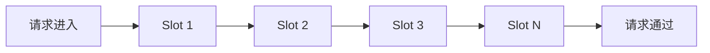

# Sentinel SlotChain扩展

Sentinel是阿里巴巴开源的一款轻量级流量控制框架，广泛应用于微服务架构中。SlotChain是Sentinel的核心机制之一，它通过一系列的“槽”（Slot）来处理流量控制的逻辑。本文将详细介绍如何扩展Sentinel的SlotChain，以实现自定义的流量控制逻辑。

## 什么是SlotChain？

在Sentinel中，SlotChain是一个责任链模式的实现，它由多个Slot组成。每个Slot负责处理特定的流量控制逻辑，例如限流、熔断、系统保护等。当请求进入Sentinel时，会依次经过这些Slot，每个Slot都会对请求进行处理，并决定是否允许请求通过。

### SlotChain的工作流程



如上图所示，请求会依次经过SlotChain中的每个Slot，直到所有Slot都处理完毕，请求才会被允许通过。

## 扩展SlotChain

Sentinel允许开发者通过自定义Slot来扩展SlotChain的功能。通过扩展SlotChain，开发者可以实现更加灵活的流量控制逻辑，例如基于业务规则的限流、自定义的熔断策略等。

### 自定义Slot的实现

要扩展SlotChain，首先需要实现一个自定义的Slot。自定义Slot需要实现`com.alibaba.csp.sentinel.slotchain.ProcessorSlot`接口，并重写`entry`和`exit`方法。

```java
public class CustomSlot implements ProcessorSlot<DefaultNode> {

    @Override
    public void entry(Context context, ResourceWrapper resourceWrapper, DefaultNode node, int count, boolean prioritized, Object... args) throws Throwable {
        // 自定义的流量控制逻辑
        System.out.println("CustomSlot: Entry");
        // 继续执行下一个Slot
        fireEntry(context, resourceWrapper, node, count, prioritized, args);
    }

    @Override
    public void exit(Context context, ResourceWrapper resourceWrapper, int count, Object... args) {
        // 自定义的退出逻辑
        System.out.println("CustomSlot: Exit");
        // 继续执行下一个Slot
        fireExit(context, resourceWrapper, count, args);
    }
}
```

在上面的代码中，`entry`方法会在请求进入时被调用，`exit`方法会在请求退出时被调用。开发者可以在这些方法中实现自定义的流量控制逻辑。

### 将自定义Slot添加到SlotChain

实现自定义Slot后，需要将其添加到SlotChain中。Sentinel提供了`SlotChainBuilder`接口，开发者可以通过实现该接口来构建自定义的SlotChain。

```java
public class CustomSlotChainBuilder implements SlotChainBuilder {

    @Override
    public ProcessorSlotChain build() {
        ProcessorSlotChain chain = new DefaultProcessorSlotChain();
        // 添加自定义Slot
        chain.addLast(new CustomSlot());
        // 添加其他默认Slot
        chain.addLast(new FlowSlot());
        chain.addLast(new DegradeSlot());
        chain.addLast(new SystemSlot());
        return chain;
    }
}
```

在上面的代码中，`CustomSlotChainBuilder`类实现了`SlotChainBuilder`接口，并在`build`方法中构建了一个包含自定义Slot的SlotChain。

### 注册自定义SlotChainBuilder

最后，需要将自定义的`SlotChainBuilder`注册到Sentinel中。可以通过以下代码实现：

```java
Env.slotChainBuilder = new CustomSlotChainBuilder();
```

## 实际应用场景

假设我们有一个电商系统，需要对某些特定的商品进行限流。我们可以通过扩展SlotChain来实现这一需求。

### 场景描述

- 商品A的库存有限，需要限制每秒的请求量。
- 商品B的库存充足，不需要限流。

### 实现步骤

1. 实现一个自定义Slot，用于检查请求的商品类型。
2. 如果请求的商品是A，则进行限流处理。
3. 将自定义Slot添加到SlotChain中。

```java
public class ProductLimitSlot implements ProcessorSlot<DefaultNode> {

    @Override
    public void entry(Context context, ResourceWrapper resourceWrapper, DefaultNode node, int count, boolean prioritized, Object... args) throws Throwable {
        String productId = (String) args[0];
        if ("A".equals(productId)) {
            // 对商品A进行限流处理
            if (node.passQps() > 10) {
                throw new FlowException("商品A请求量过大");
            }
        }
        fireEntry(context, resourceWrapper, node, count, prioritized, args);
    }

    @Override
    public void exit(Context context, ResourceWrapper resourceWrapper, int count, Object... args) {
        fireExit(context, resourceWrapper, count, args);
    }
}
```

在上面的代码中，`ProductLimitSlot`会根据请求的商品类型进行限流处理。如果请求的商品是A，并且每秒的请求量超过10次，则会抛出`FlowException`。

## 总结

通过扩展Sentinel的SlotChain，开发者可以实现更加灵活的流量控制逻辑。本文介绍了如何实现自定义Slot，并将其添加到SlotChain中。通过实际案例，展示了如何基于业务规则进行限流处理。

## 附加资源

- [Sentinel官方文档](https://sentinelguard.io/zh-cn/docs/introduction.html)
- [Sentinel GitHub仓库](https://github.com/alibaba/Sentinel)

## 练习

1. 尝试实现一个自定义Slot，用于记录每个请求的处理时间。
2. 将自定义Slot添加到SlotChain中，并测试其效果。
