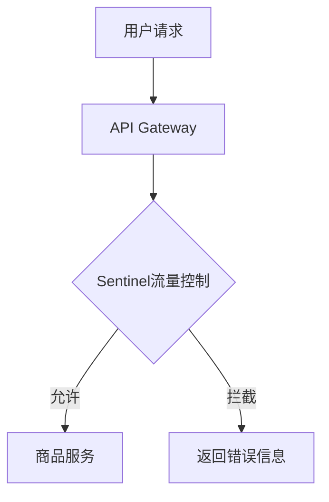

# Sentinel 与Gateway集成

在现代微服务架构中，流量控制和熔断保护是确保系统稳定性的关键。Sentinel 是阿里巴巴开源的一款轻量级流量控制框架，而 Spring Cloud Gateway 是 Spring Cloud 生态中的 API 网关。通过将 Sentinel 与 Gateway 集成，我们可以在网关层实现流量控制、熔断降级等功能，从而保护后端服务。

## 什么是Sentinel与Gateway集成？

Sentinel 与 Gateway 集成是指将 Sentinel 的流量控制能力嵌入到 Spring Cloud Gateway 中。通过这种集成，我们可以在网关层对请求进行限流、熔断、降级等操作，从而防止后端服务因流量过大或异常情况而崩溃。

## 为什么需要Sentinel与Gateway集成？

在微服务架构中，API 网关是所有请求的入口。如果网关没有流量控制机制，大量的请求可能会直接冲击后端服务，导致服务不可用。通过将 Sentinel 与 Gateway 集成，我们可以在网关层对请求进行精细化的控制，确保后端服务的稳定性。

## 如何集成Sentinel与Gateway？

### 1. 添加依赖

首先，我们需要在 `pom.xml` 中添加 Sentinel 和 Spring Cloud Gateway 的依赖：

```xml
<dependency>
    <groupId>com.alibaba.cloud</groupId>
    <artifactId>spring-cloud-starter-alibaba-sentinel</artifactId>
</dependency>
<dependency>
    <groupId>org.springframework.cloud</groupId>
    <artifactId>spring-cloud-starter-gateway</artifactId>
</dependency>
```

### 2. 配置Sentinel

在 `application.yml` 中配置 Sentinel 的相关参数：

```yaml
spring:
  cloud:
    gateway:
      routes:
        - id: service_route
          uri: http://localhost:8081
          predicates:
            - Path=/service/**
    sentinel:
      enabled: true
      eager: true
```

### 3. 定义流量控制规则

我们可以通过 Sentinel 控制台或代码定义流量控制规则。以下是一个通过代码定义规则的示例：

```java
@PostConstruct
public void initFlowRules() {
    List<FlowRule> rules = new ArrayList<>();
    FlowRule rule = new FlowRule();
    rule.setResource("service_route");
    rule.setGrade(RuleConstant.FLOW_GRADE_QPS);
    rule.setCount(10); // 每秒最多允许10个请求
    rules.add(rule);
    FlowRuleManager.loadRules(rules);
}
```

### 4. 测试流量控制

启动应用后，我们可以通过发送请求来测试流量控制是否生效。如果请求超过设定的 QPS 限制，Sentinel 将会拦截请求并返回错误信息。

## 实际应用场景

假设我们有一个电商系统，用户可以通过 API 网关访问商品服务。在高并发场景下，商品服务可能会因为请求过多而崩溃。通过将 Sentinel 与 Gateway 集成，我们可以在网关层对商品服务的请求进行限流，确保商品服务的稳定性。



## 总结

通过将 Sentinel 与 Spring Cloud Gateway 集成，我们可以在网关层实现流量控制、熔断降级等功能，从而保护后端服务。这种集成不仅提高了系统的稳定性，还增强了系统的可维护性。

## 附加资源

- [Sentinel 官方文档](https://sentinelguard.io/zh-cn/docs/introduction.html)
- [Spring Cloud Gateway 官方文档](https://spring.io/projects/spring-cloud-gateway)

## 练习

1. 尝试在你的 Spring Cloud Gateway 项目中集成 Sentinel，并定义不同的流量控制规则。
2. 使用 Sentinel 控制台监控流量，并观察流量控制的效果。
