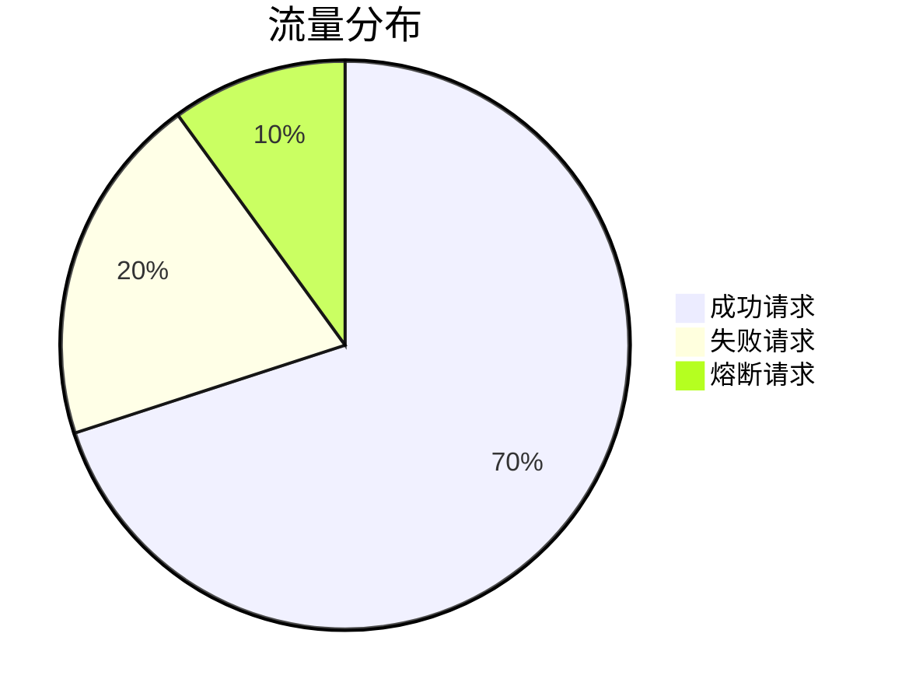

# Sentinel 控制台概述

Sentinel是阿里巴巴开源的一款轻量级流量控制组件，主要用于微服务的流量控制、熔断降级和系统保护。Sentinel控制台是Sentinel的可视化管理工具，提供了实时的监控、规则配置和流量管理功能。通过Sentinel控制台，开发者可以轻松地查看系统的实时状态，并动态调整流量控制规则。

## 什么是Sentinel控制台？

Sentinel控制台是一个基于Web的管理界面，用于监控和管理Sentinel的流量控制规则。它提供了以下主要功能：

1. **实时监控**：查看系统的实时流量、QPS、响应时间等指标。
2. **规则管理**：动态配置流量控制、熔断降级和系统保护规则。
3. **集群流控**：支持集群模式下的流量控制。
4. **历史数据**：查看历史流量数据和规则变更记录。

## 如何启动Sentinel控制台？

Sentinel控制台是一个独立的Java应用，可以通过以下步骤启动：

1. 下载Sentinel控制台的JAR包。
2. 使用以下命令启动控制台：

   ```bash
   java -Dserver.port=8080 -Dcsp.sentinel.dashboard.server=localhost:8080 -Dproject.name=sentinel-dashboard -jar sentinel-dashboard.jar
   ```

   其中，`-Dserver.port`指定控制台的端口号，`-Dcsp.sentinel.dashboard.server`指定控制台的地址，`-Dproject.name`指定项目的名称。

3. 启动后，访问`http://localhost:8080`即可进入Sentinel控制台。

## 控制台界面介绍

Sentinel控制台的主界面分为以下几个部分：

1. **仪表盘**：显示系统的实时流量、QPS、响应时间等指标。
2. **规则管理**：用于配置流量控制、熔断降级和系统保护规则。
3. **集群流控**：用于配置集群模式下的流量控制规则。
4. **历史数据**：查看历史流量数据和规则变更记录。

### 仪表盘

仪表盘是Sentinel控制台的核心功能之一，它提供了系统的实时监控数据。以下是一个典型的仪表盘界面：



:::note
仪表盘中的数据是实时更新的，开发者可以通过仪表盘快速了解系统的运行状态。
:::

### 规则管理

在规则管理界面，开发者可以动态配置流量控制、熔断降级和系统保护规则。以下是一个流量控制规则的配置示例：

```json
{
  "resource": "GET:/api/user",
  "count": 100,
  "grade": 1,
  "limitApp": "default",
  "strategy": 0,
  "controlBehavior": 0
}
```

:::tip
`resource`表示需要保护的资源，`count`表示每秒允许通过的请求数，`grade`表示流量控制的类型（1表示QPS，0表示线程数），`limitApp`表示针对的应用，`strategy`表示流控策略，`controlBehavior`表示流控行为。
:::

### 集群流控

集群流控是Sentinel的高级功能，用于在集群模式下进行流量控制。以下是一个集群流控规则的配置示例：

```json
{
  "resource": "GET:/api/user",
  "count": 100,
  "grade": 1,
  "limitApp": "default",
  "strategy": 0,
  "controlBehavior": 0,
  "clusterMode": true
}
```

:::caution
集群流控需要配置Sentinel的Token Server和Token Client，确保集群中的各个节点能够正确通信。
:::

## 实际应用场景

假设我们有一个微服务系统，其中有一个用户查询接口`GET:/api/user`，在高并发场景下，我们需要对该接口进行流量控制，以防止系统过载。通过Sentinel控制台，我们可以轻松地配置流量控制规则，并实时监控接口的流量情况。

1. **配置流量控制规则**：在规则管理界面，添加一条流量控制规则，限制`GET:/api/user`接口的QPS为100。
2. **实时监控**：在仪表盘界面，查看`GET:/api/user`接口的实时流量和QPS。
3. **动态调整规则**：根据监控数据，动态调整流量控制规则，确保系统的稳定性。

## 总结

Sentinel控制台是Sentinel的重要组成部分，它提供了实时的监控、规则配置和流量管理功能。通过Sentinel控制台，开发者可以轻松地管理和保护微服务系统，确保系统在高并发场景下的稳定性。

## 附加资源

- [Sentinel官方文档](https://sentinelguard.io/zh-cn/docs/introduction.html)
- [Sentinel GitHub仓库](https://github.com/alibaba/Sentinel)

## 练习

1. 启动Sentinel控制台，并访问仪表盘界面。
2. 配置一条流量控制规则，限制某个接口的QPS为50。
3. 在仪表盘界面，观察接口的实时流量和QPS。