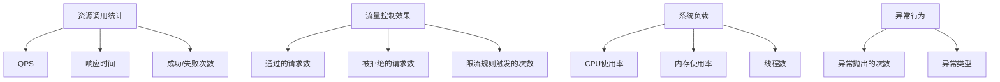

# Sentinel 监控数据收集

在现代分布式系统中，监控是确保系统稳定性和性能的关键环节。Sentinel作为一款轻量级的流量控制组件，不仅提供了强大的流量控制功能，还内置了丰富的监控数据收集能力。本文将详细介绍Sentinel的监控数据收集机制，帮助初学者快速掌握这一重要功能。

## 什么是Sentinel监控数据收集？

Sentinel监控数据收集是指Sentinel在运行时自动收集并记录系统资源的使用情况、流量控制的效果以及异常行为等信息。这些数据可以帮助开发者实时了解系统的运行状态，及时发现潜在问题，并为后续的优化提供依据。

## 监控数据的类型

Sentinel主要收集以下几类监控数据：

1. **资源调用统计**：包括QPS（每秒查询数）、响应时间、成功/失败次数等。
2. **流量控制效果**：包括通过的请求数、被拒绝的请求数、限流规则触发的次数等。
3. **系统负载**：包括CPU使用率、内存使用率、线程数等。
4. **异常行为**：包括异常抛出的次数、异常类型等。

## 如何配置Sentinel监控数据收集

Sentinel的监控数据收集是自动开启的，但开发者可以通过配置来调整数据收集的粒度和方式。以下是一个简单的配置示例：

```java
// 初始化Sentinel
Sentinel.init();

// 配置监控数据收集
ClusterStateManager.applyState(ClusterState.CLUSTER_CLIENT);
```

:::note
默认情况下，Sentinel会将监控数据存储在内存中，并定期刷新到日志文件中。如果需要更持久化的存储，可以集成外部存储系统，如Prometheus、InfluxDB等。
:::

## 监控数据的实际应用

### 实时监控

通过Sentinel Dashboard，开发者可以实时查看系统的监控数据。以下是一个简单的Dashboard界面示例：



### 报警机制

Sentinel还支持基于监控数据的报警机制。例如，当某个资源的QPS超过设定的阈值时，可以触发报警通知相关人员。

```java
// 设置QPS报警规则
FlowRule rule = new FlowRule();
rule.setResource("myResource");
rule.setGrade(RuleConstant.FLOW_GRADE_QPS);
rule.setCount(100); // 阈值
rule.setControlBehavior(RuleConstant.CONTROL_BEHAVIOR_DEFAULT);
FlowRuleManager.loadRules(Collections.singletonList(rule));
```

:::caution
报警规则的设置需要根据实际业务场景进行调整，避免误报或漏报。
:::

## 实际案例

假设我们有一个电商系统，其中有一个商品详情页的接口。为了确保该接口在高并发情况下的稳定性，我们可以使用Sentinel进行流量控制，并收集相关监控数据。

1. **配置流量控制规则**：设置商品详情页接口的QPS阈值为1000。
2. **收集监控数据**：实时监控该接口的QPS、响应时间、成功/失败次数等。
3. **分析数据**：通过Dashboard查看监控数据，发现当QPS接近1000时，响应时间明显增加。
4. **优化系统**：根据监控数据，优化商品详情页的数据库查询逻辑，减少响应时间。

## 总结

Sentinel的监控数据收集功能为开发者提供了强大的工具，帮助实时了解系统的运行状态，及时发现并解决问题。通过合理配置和利用监控数据，可以显著提升系统的稳定性和性能。

## 附加资源与练习

- **官方文档**：[Sentinel官方文档](https://sentinelguard.io/zh-cn/docs/introduction.html)
- **练习**：尝试在自己的项目中集成Sentinel，并配置监控数据收集功能，观察系统的运行状态。

:::tip
建议初学者从简单的资源监控开始，逐步深入理解Sentinel的监控数据收集机制。
:::