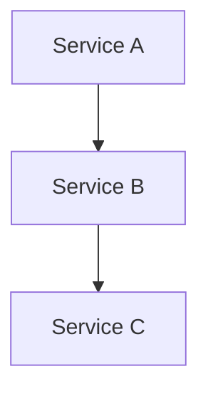

# Sentinel 簇点链路

Sentinel是阿里巴巴开源的一款轻量级流量控制框架，广泛应用于微服务架构中。簇点链路（Cluster Node Link）是Sentinel中的一个核心概念，用于描述资源之间的调用关系。通过簇点链路，Sentinel能够实现对复杂调用链路的监控和流量控制。

## 什么是簇点链路？

簇点链路是指资源之间的调用关系图。在微服务架构中，一个请求可能会经过多个服务节点，每个节点都可以被视为一个资源。Sentinel通过簇点链路来追踪这些资源的调用关系，从而实现对流量的精确控制。

例如，假设有一个用户请求需要经过以下服务节点：`Service A` -> `Service B` -> `Service C`。Sentinel会将这个调用链路记录下来，形成一个簇点链路图。



## 簇点链路的工作原理

Sentinel通过以下步骤来构建和管理簇点链路：

1. **资源定义**：每个服务节点都需要定义一个唯一的资源名称。例如，`Service A`的资源名称可以是`/serviceA`。
2. **调用链追踪**：当一个请求进入系统时，Sentinel会记录该请求经过的所有资源节点，并构建调用链。
3. **流量控制**：根据预先定义的规则，Sentinel可以对调用链中的每个资源节点进行流量控制，例如限流、熔断等。

## 代码示例

以下是一个简单的Java代码示例，展示如何在Sentinel中定义资源并构建簇点链路。

```java
import com.alibaba.csp.sentinel.Entry;
import com.alibaba.csp.sentinel.SphU;
import com.alibaba.csp.sentinel.slots.block.BlockException;

public class ServiceA {
    public void callServiceB() {
        try (Entry entry = SphU.entry("ServiceA")) {
            // 调用Service B
            ServiceB serviceB = new ServiceB();
            serviceB.callServiceC();
        } catch (BlockException e) {
            // 处理被限流或熔断的情况
            System.out.println("ServiceA is blocked");
        }
    }
}

public class ServiceB {
    public void callServiceC() {
        try (Entry entry = SphU.entry("ServiceB")) {
            // 调用Service C
            ServiceC serviceC = new ServiceC();
            serviceC.processRequest();
        } catch (BlockException e) {
            // 处理被限流或熔断的情况
            System.out.println("ServiceB is blocked");
        }
    }
}

public class ServiceC {
    public void processRequest() {
        try (Entry entry = SphU.entry("ServiceC")) {
            // 处理请求
            System.out.println("Request processed by ServiceC");
        } catch (BlockException e) {
            // 处理被限流或熔断的情况
            System.out.println("ServiceC is blocked");
        }
    }
}
```

在这个示例中，`ServiceA`、`ServiceB`和`ServiceC`分别定义了各自的资源，并通过`SphU.entry()`方法进行资源调用。Sentinel会自动追踪这些调用，并构建簇点链路。

## 实际应用场景

簇点链路在微服务架构中有广泛的应用场景，以下是一些常见的例子：

1. **流量控制**：通过簇点链路，Sentinel可以对调用链中的每个资源节点进行流量控制，防止某个服务节点过载。
2. **熔断机制**：当某个服务节点出现故障时，Sentinel可以通过簇点链路快速定位问题，并触发熔断机制，避免故障扩散。
3. **调用链监控**：通过簇点链路，开发人员可以实时监控服务之间的调用关系，及时发现性能瓶颈。

## 总结

簇点链路是Sentinel中的一个重要概念，它帮助开发人员更好地理解和控制微服务架构中的调用关系。通过簇点链路，Sentinel能够实现对复杂调用链路的监控和流量控制，确保系统的稳定性和可靠性。

## 附加资源与练习

- **官方文档**：阅读[Sentinel官方文档](https://sentinelguard.io/)以获取更多详细信息。
- **练习**：尝试在一个简单的微服务项目中集成Sentinel，并观察簇点链路的构建过程。

:::tip
如果你在集成Sentinel时遇到问题，可以参考官方文档中的示例代码，或者加入Sentinel的社区论坛寻求帮助。
:::