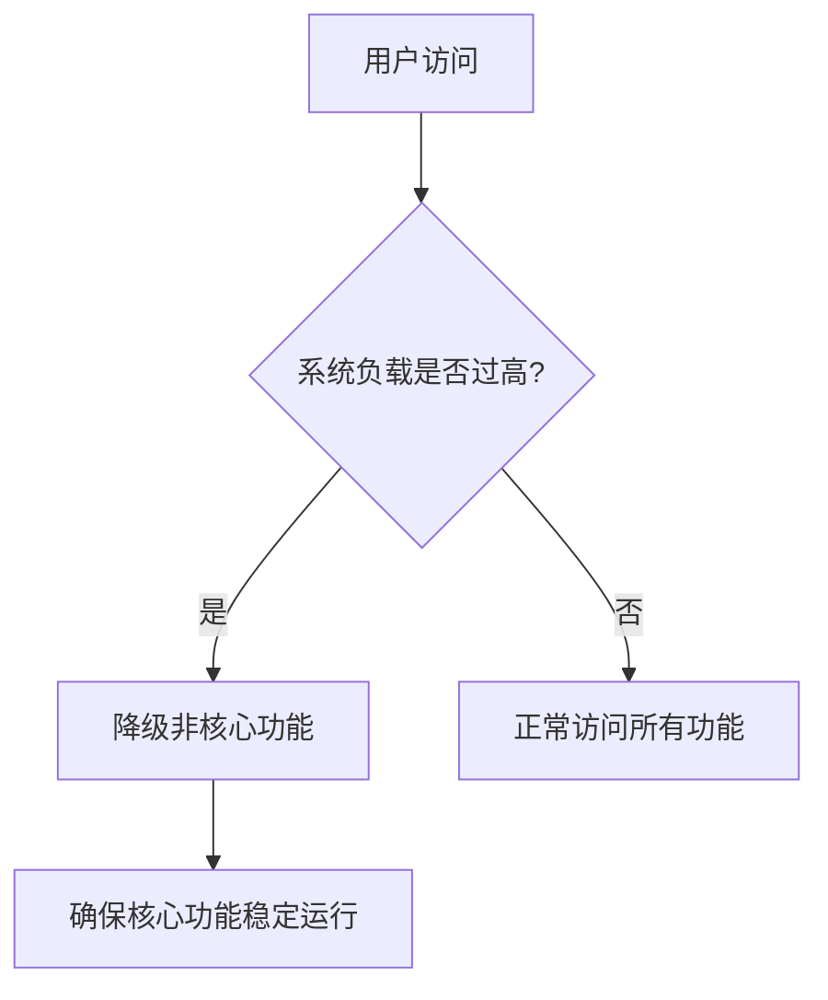

# Sentinel 主动降级

## 介绍

Sentinel是阿里巴巴开源的一款流量控制组件，广泛应用于微服务架构中，用于保护系统免受高并发、异常流量等问题的侵害。**主动降级**是Sentinel的一项重要功能，它允许系统在检测到异常或高负载时，主动降低某些非核心功能的优先级，从而确保核心功能的稳定运行。

主动降级的核心思想是：**在系统资源紧张时，优先保障核心业务，牺牲部分非核心业务**。这种策略可以有效避免系统崩溃，提升整体稳定性。

## 主动降级的工作原理

Sentinel的主动降级功能基于以下几个关键点：

1. **资源定义**：Sentinel将系统中的每个功能或服务定义为一个资源（Resource），并为每个资源设置相应的降级规则。
2. **指标监控**：Sentinel会实时监控资源的运行状态，包括响应时间、异常比例、QPS（每秒查询率）等指标。
3. **降级触发**：当某个资源的指标超过预设阈值时，Sentinel会触发降级策略，暂时关闭或限制该资源的访问。
4. **恢复机制**：在降级期间，Sentinel会持续监控资源状态。当资源恢复正常后，Sentinel会自动解除降级，恢复对该资源的正常访问。

## 主动降级的配置

以下是一个简单的Sentinel主动降级配置示例：

```java
// 定义资源
@SentinelResource(value = "exampleResource", blockHandler = "handleBlock")
public String exampleResource() {
    // 业务逻辑
    return "Hello, Sentinel!";
}

// 降级处理逻辑
public String handleBlock(BlockException ex) {
    return "Resource is degraded due to high load.";
}

// 配置降级规则
DegradeRule rule = new DegradeRule();
rule.setResource("exampleResource");
rule.setGrade(RuleConstant.DEGRADE_GRADE_RT); // 基于响应时间降级
rule.setCount(100); // 响应时间超过100ms时触发降级
rule.setTimeWindow(10); // 降级持续10秒

DegradeRuleManager.loadRules(Collections.singletonList(rule));
```

### 代码解释

- `@SentinelResource`：用于定义资源，并指定降级处理逻辑。
- `DegradeRule`：用于配置降级规则，包括降级条件（如响应时间、异常比例等）和降级持续时间。
- `DegradeRuleManager`：用于加载和管理降级规则。

## 实际应用场景

### 场景1：电商系统的高并发场景

在电商系统中，用户下单和支付是核心功能，而商品推荐和评论展示是非核心功能。在高并发场景下，如果系统负载过高，Sentinel可以主动降级商品推荐和评论展示功能，确保下单和支付功能的稳定运行。



### 场景2：API网关的异常处理

在API网关中，某些外部服务可能由于网络问题或服务故障而响应缓慢。Sentinel可以监控这些服务的响应时间，并在响应时间超过阈值时主动降级，避免影响整个系统的稳定性。

## 总结

Sentinel的主动降级功能是保护系统稳定性的重要手段。通过合理配置降级规则，系统可以在高负载或异常情况下自动降级非核心功能，确保核心业务的正常运行。对于初学者来说，理解并掌握主动降级的概念和配置方法，是构建高可用系统的关键一步。

## 附加资源与练习

- **练习1**：尝试在本地环境中配置Sentinel，并模拟高负载场景，观察主动降级的效果。
- **练习2**：阅读Sentinel官方文档，了解更多关于降级规则的配置选项。
- **资源**：[Sentinel GitHub仓库](https://github.com/alibaba/Sentinel) 和 [官方文档](https://sentinelguard.io/zh-cn/docs/introduction.html)。

:::tip
在实际生产环境中，建议结合监控系统（如Prometheus）和日志系统（如ELK）一起使用，以便更好地分析和优化降级策略。
:::