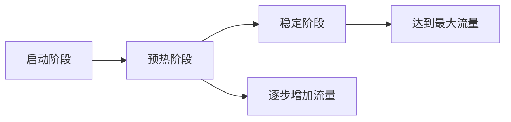

# Sentinel 系统启动预热

## 介绍

Sentinel是阿里巴巴开源的一款流量控制组件，广泛应用于微服务架构中，用于保护系统免受突发流量的冲击。**系统启动预热**是Sentinel的一项重要功能，旨在帮助系统在启动时逐步适应流量，避免因突然的高流量导致系统崩溃。

在系统刚启动时，资源（如线程池、数据库连接池等）可能尚未完全初始化，此时如果突然涌入大量请求，可能会导致系统过载。Sentinel的预热功能通过逐步增加流量，让系统有时间“热身”，从而平稳过渡到正常状态。

## 工作原理

Sentinel的预热功能基于**令牌桶算法**实现。在预热阶段，系统会限制请求的通过速率，随着时间的推移，逐步增加允许通过的请求数量，直到达到设定的阈值。

### 预热曲线

预热过程可以用一条曲线来描述，曲线的斜率决定了流量增长的速率。以下是一个典型的预热曲线：



- **启动阶段**：系统刚启动，流量限制非常严格。
- **预热阶段**：流量逐步增加，系统逐渐适应。
- **稳定阶段**：流量达到预设的最大值，系统进入稳定运行状态。

## 配置预热规则

在Sentinel中，预热规则可以通过`FlowRule`进行配置。以下是一个简单的预热规则配置示例：

```java
FlowRule rule = new FlowRule();
rule.setResource("myResource"); // 资源名称
rule.setGrade(RuleConstant.FLOW_GRADE_QPS); // 限流类型，QPS
rule.setCount(100); // 最大QPS
rule.setWarmUpPeriodSec(10); // 预热时间，单位为秒
FlowRuleManager.loadRules(Collections.singletonList(rule));
```

### 参数说明

- `resource`：需要保护的资源名称。
- `grade`：限流类型，通常为`FLOW_GRADE_QPS`（基于QPS的限流）。
- `count`：最大允许的QPS。
- `warmUpPeriodSec`：预热时间，单位为秒。

## 实际案例

假设我们有一个电商系统，在双十一大促期间，系统需要处理大量的订单请求。为了避免系统在启动时被瞬间的高流量击垮，我们可以使用Sentinel的预热功能。

### 场景描述

- **系统启动时**：订单服务的QPS限制为10。
- **预热时间**：10秒。
- **最大QPS**：100。

在系统启动后的10秒内，Sentinel会逐步将QPS从10提升到100，确保系统能够平稳过渡到高流量状态。

### 代码示例

```java
FlowRule rule = new FlowRule();
rule.setResource("orderService"); // 订单服务资源
rule.setGrade(RuleConstant.FLOW_GRADE_QPS); // 基于QPS的限流
rule.setCount(100); // 最大QPS为100
rule.setWarmUpPeriodSec(10); // 预热时间为10秒
FlowRuleManager.loadRules(Collections.singletonList(rule));
```

### 运行效果

- **0秒**：QPS限制为10。
- **5秒**：QPS限制逐步增加到50。
- **10秒**：QPS限制达到100，系统进入稳定运行状态。

## 总结

Sentinel的**系统启动预热**功能通过逐步增加流量，帮助系统在启动时平稳过渡到高流量状态，避免因突发流量导致系统崩溃。通过合理配置预热规则，可以有效保护系统的稳定性。

:::tip
在实际应用中，预热时间的设置需要根据系统的具体情况进行调整。预热时间过短可能导致系统无法充分“热身”，而过长则可能影响用户体验。
:::

## 附加资源

- [Sentinel官方文档](https://sentinelguard.io/)
- [Sentinel GitHub仓库](https://github.com/alibaba/Sentinel)

## 练习

1. 尝试在自己的项目中配置Sentinel的预热规则，观察系统启动时的流量变化。
2. 调整预热时间，观察系统在不同预热时间下的表现。
3. 结合实际业务场景，设计一个适合的预热策略。