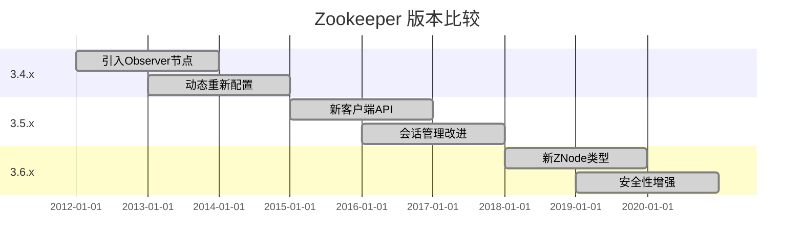

# Zookeeper 版本比较

Apache Zookeeper 是一个分布式协调服务，广泛用于分布式系统中。随着时间推移，Zookeeper 发布了多个版本，每个版本都引入了新特性、性能优化和问题修复。本文将比较 Zookeeper 的主要版本，帮助初学者理解其演进过程，并选择适合的版本。

## 1. Zookeeper 简介

Zookeeper 是一个开源的分布式协调服务，用于管理分布式应用中的配置信息、命名服务、分布式同步和组服务。它通过一个简单的接口提供高性能的分布式协调服务，广泛应用于 Hadoop、Kafka 等分布式系统中。

## 2. Zookeeper 版本演进

Zookeeper 的版本号通常遵循 `主版本号.次版本号.修订号` 的格式。主版本号表示重大更新，次版本号表示功能增强，修订号表示问题修复。以下是 Zookeeper 的主要版本及其关键特性：

### 2.1 Zookeeper 3.4.x

- **主要特性**：
  - 引入了 Observer 节点，用于扩展读性能。
  - 支持动态重新配置集群。
  - 提供了更强大的 ACL（访问控制列表）功能。
- **适用场景**：
  - 适用于需要高可用性和扩展性的分布式系统。
- **示例代码**：
  ```java
  ZooKeeper zk = new ZooKeeper("localhost:2181", 3000, null);
  zk.create("/myNode", "data".getBytes(), ZooDefs.Ids.OPEN_ACL_UNSAFE, CreateMode.PERSISTENT);
  ```

### 2.2 Zookeeper 3.5.x

- **主要特性**：
  - 引入了新的客户端 API（`ZooKeeperAdmin`），支持更细粒度的管理操作。
  - 改进了会话管理，支持会话超时时间的动态调整。
  - 增强了监控和诊断工具。
- **适用场景**：
  - 适用于需要更精细控制和监控的分布式系统。
- **示例代码**：
  ```java
  ZooKeeperAdmin zkAdmin = new ZooKeeperAdmin("localhost:2181", 3000, null);
  zkAdmin.reconfigure(null, null, null, -1, null);
  ```

### 2.3 Zookeeper 3.6.x

- **主要特性**：
  - 引入了新的 `ZNode` 类型 `Container` 和 `TTL`，用于自动清理临时节点。
  - 改进了事务处理性能。
  - 增强了安全性，支持 TLS 加密通信。
- **适用场景**：
  - 适用于需要更高安全性和自动清理功能的分布式系统。
- **示例代码**：
  ```java
  ZooKeeper zk = new ZooKeeper("localhost:2181", 3000, null);
  zk.create("/myContainer", "data".getBytes(), ZooDefs.Ids.OPEN_ACL_UNSAFE, CreateMode.CONTAINER);
  ```

## 3. 版本比较表

以下表格总结了 Zookeeper 主要版本的关键特性：



## 4. 实际案例

### 4.1 动态重新配置

在一个分布式系统中，随着业务增长，可能需要动态扩展 Zookeeper 集群。Zookeeper 3.4.x 引入了动态重新配置功能，允许在不重启集群的情况下添加或移除节点。

```java
ZooKeeperAdmin zkAdmin = new ZooKeeperAdmin("localhost:2181", 3000, null);
zkAdmin.reconfigure(null, null, "server.4=localhost:2888:3888", -1, null);
```

### 4.2 自动清理临时节点

在 Zookeeper 3.6.x 中，引入了 `Container` 和 `TTL` 类型的 `ZNode`，可以自动清理不再需要的临时节点，减少手动维护的工作量。

```java
ZooKeeper zk = new ZooKeeper("localhost:2181", 3000, null);
zk.create("/myTempNode", "data".getBytes(), ZooDefs.Ids.OPEN_ACL_UNSAFE, CreateMode.EPHEMERAL);
```

## 5. 总结

Zookeeper 的每个版本都带来了新的特性和改进，帮助用户更好地管理分布式系统。初学者应根据自己的需求选择合适的版本，并理解其关键特性。随着 Zookeeper 的不断发展，未来版本可能会引入更多强大的功能。

## 6. 附加资源

- [Zookeeper 官方文档](https://zookeeper.apache.org/doc/current/)
- [Zookeeper GitHub 仓库](https://github.com/apache/zookeeper)
- [Zookeeper 入门教程](https://zookeeper.apache.org/doc/current/zookeeperStarted.html)

:::tip
建议初学者从 Zookeeper 3.5.x 或 3.6.x 开始学习，因为这些版本提供了更丰富的功能和更好的性能。
:::