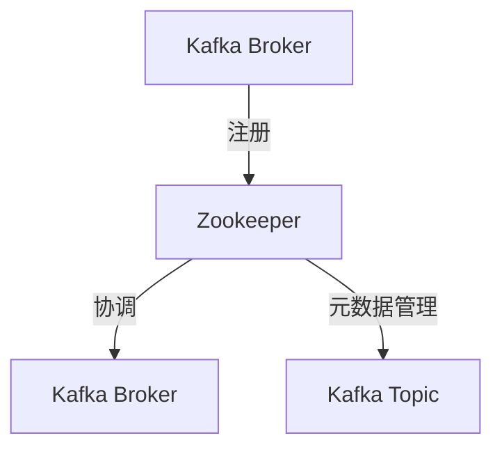

## 介绍

Zookeeper 是一个开源的分布式协调服务，广泛用于管理分布式系统中的配置信息、命名服务、分布式同步和组服务。它提供了一个简单而强大的接口，使得开发者可以轻松构建高可用性和一致性的分布式应用。

Zookeeper 生态系统不仅仅包括 Zookeeper 本身，还涵盖了与之相关的工具、库和框架。这些工具和框架共同构成了一个完整的生态系统，帮助开发者更好地利用 Zookeeper 的功能。

## Zookeeper 的核心概念

### 1. ZNode

Zookeeper 中的数据以树形结构存储，每个节点称为 ZNode。ZNode 可以存储数据，并且可以有子节点。ZNode 的类型包括持久节点、临时节点和顺序节点。

- **持久节点**：一旦创建，除非显式删除，否则会一直存在。
- **临时节点**：与客户端会话绑定，会话结束时节点自动删除。
- **顺序节点**：Zookeeper 会自动在节点名称后追加一个单调递增的数字。

### 2. Watcher

Zookeeper 提供了 Watcher 机制，允许客户端监听 ZNode 的变化。当 ZNode 发生变化时，Zookeeper 会通知客户端。这种机制非常适合用于实现分布式锁、配置管理等场景。

### 3. 一致性

Zookeeper 通过 ZAB（Zookeeper Atomic Broadcast）协议保证数据的一致性。ZAB 协议确保所有更新操作按顺序执行，并且在任何时刻，集群中的大多数节点都有一致的视图。

## 实际应用场景

### 1. 分布式锁

Zookeeper 可以用于实现分布式锁。通过创建临时顺序节点，客户端可以竞争锁资源。当锁释放时，Zookeeper 会自动通知下一个等待的客户端。

```java
// 伪代码示例
public void acquireLock() {
    String lockPath = "/locks/lock_";
    String myNode = zk.create(lockPath, null, ZooDefs.Ids.OPEN_ACL_UNSAFE, CreateMode.EPHEMERAL_SEQUENTIAL);
    List<String> children = zk.getChildren("/locks", false);
    Collections.sort(children);
    if (myNode.equals(children.get(0))) {
        // 获取锁
    } else {
        // 等待锁
    }
}
```

### 2. 配置管理

Zookeeper 可以用于集中管理分布式系统的配置信息。当配置发生变化时，Zookeeper 会通知所有监听该配置的客户端。

```java
// 伪代码示例
public void watchConfig() {
    zk.getData("/config", new Watcher() {
        @Override
        public void process(WatchedEvent event) {
            if (event.getType() == Event.EventType.NodeDataChanged) {
                // 配置发生变化，重新加载配置
            }
        }
    }, null);
}
```

## Zookeeper 生态系统中的工具和框架

### 1. Curator

Curator 是 Netflix 开源的一个 Zookeeper 客户端库，提供了更高层次的抽象和工具类，简化了 Zookeeper 的使用。Curator 提供了分布式锁、选举、缓存等功能。

```java
// 使用 Curator 实现分布式锁
InterProcessMutex lock = new InterProcessMutex(client, "/locks/my_lock");
lock.acquire();
try {
    // 执行临界区代码
} finally {
    lock.release();
}
```

### 2. Kafka

Kafka 是一个分布式流处理平台，使用 Zookeeper 来管理集群的元数据和协调。Kafka 依赖于 Zookeeper 来实现高可用性和一致性。



## 总结

Zookeeper 生态系统为分布式系统提供了强大的协调和管理能力。通过 Zookeeper，开发者可以轻松实现分布式锁、配置管理、命名服务等功能。同时，Zookeeper 生态系统中的工具和框架（如 Curator 和 Kafka）进一步简化了开发过程，提高了系统的可靠性和可维护性。

## 附加资源

- [Zookeeper 官方文档](https://zookeeper.apache.org/doc/current/)
- [Curator 官方文档](https://curator.apache.org/)
- [Kafka 官方文档](https://kafka.apache.org/documentation/)

## 练习

1. 使用 Zookeeper 实现一个简单的分布式锁。
2. 使用 Curator 实现一个分布式计数器。
3. 研究 Kafka 如何使用 Zookeeper 进行集群管理，并尝试搭建一个 Kafka 集群。

:::tip
建议初学者从 Zookeeper 的基本操作开始，逐步深入到分布式锁和配置管理等高级功能。通过实践，你将更好地理解 Zookeeper 在分布式系统中的作用。
:::